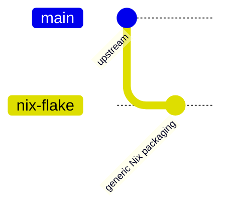

# Fork branch maintenance

This fork is maintained as two downstream branches:



## Branch roles

| Branch | Role | Allowed original commits |
|---|---|---|
| `main` | Upstream mirror plus the tiny fork-maintenance scheduler workflow | `.github/workflows/fork-maintenance.yml` only |
| `nix-flake` | `main` plus generic Nix packaging, docs, and CI | Only reusable Nix packaging changes |

All flow is downstream only:

1. Recreate `main` from `upstream/master` plus `.github/workflows/fork-maintenance.yml`.
2. Rebase `nix-flake` onto `main`.

Never merge `nix-flake` back into `main`.

## Safe status check

Run this before changing branches:

```sh
scripts/branch-model-status.sh
```

It fetches `origin` and `upstream`, then reports:

- whether `origin/main` only differs from `upstream/master` by the scheduler workflow
- the commits carried by `origin/nix-flake` beyond `origin/main`
- remote pull requests targeting each maintained branch
- recent Nix workflow runs

The script is read-only apart from `git fetch`.

## Updating `main` from upstream

Automated upstream sync runs every six hours through the default-branch
`Fork maintenance` scheduler. To trigger it manually:

```sh
gh workflow run "Fork maintenance" --repo jerudnik/jcode -f task=sync-upstream
```

That dispatches the `Nix` workflow on `nix-flake`, which rebuilds `main` from
`upstream/master` plus `.github/workflows/fork-maintenance.yml`, then rebases and
pushes `nix-flake`. The `nix-flake` push triggers normal Nix validation, so
upstream breakage surfaces before the next lock update.

Manual equivalent:

```sh
git fetch origin upstream
git log --oneline upstream/master..origin/main -- . ':(exclude).github/workflows/fork-maintenance.yml'
```

The log must be empty before force-updating `main`.

## Rebasing `nix-flake`

After `main` moves:

```sh
git fetch origin upstream
git switch nix-flake
git rebase origin/main
nix flake show
nix build .#packages.x86_64-linux.jcode --dry-run --print-build-logs
nix flake check --accept-flake-config --no-build --all-systems --option eval-cores 1
git push --force-with-lease origin nix-flake
```

The Nix branch should contain only packaging-related changes. Audit with:

```sh
git log --oneline origin/main..nix-flake
git diff --stat origin/main..nix-flake
```

Expected touched areas are `flake.nix`, `flake.lock`, `nix/**`, Nix docs, and Nix-specific workflows.

## CI ownership

- Upstream Rust and product CI belongs to upstream/default workflows.
- Nix reproducibility, supported platform builds, Cachix publishing, and flake.lock update PRs belong to `nix-flake`.
- Branch-local Nix validation runs automatically on `push` and PR events for
  `nix-flake`. Lock updates are invoked through the registered Nix workflow:
  `gh workflow run Nix --repo jerudnik/jcode --ref nix-flake -f task=update-flake-lock`.
- The default-branch `Fork maintenance` workflow dispatches upstream sync every
  six hours and flake.lock updates weekly on Monday at 06:47 UTC.
- `x86_64-darwin` is intentionally unsupported.
