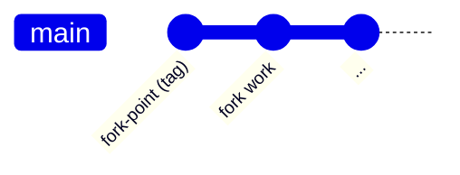

# Hard-fork branch maintenance

This is an independently maintained **hard fork** descended from
`1jehuang/jcode`. It has a single authoritative rail, `main`. It does not track,
mirror, or periodically review upstream, and it maintains no downstream patch
stack or patch ledger.


```mermaid
gitGraph
  commit id: "fork-point (tag)"
  commit id: "fork work"
  commit id: "..."
```

## The `fork-point` tag

`fork-point` is an annotated tag on `631935dd1d`, the `1jehuang/jcode` commit
this fork diverged from. It is immutable and must never be moved.

It is load-bearing, not commemorative. The fork-touched clippy and rustfmt
gates compute their file set as `git diff fork-point HEAD -- '*.rs'`, so lints
are blocking in code this fork owns and merely advisory in untouched upstream
code. Moving or deleting the tag silently changes what those gates measure, and
the failure is quiet: the gate keeps passing while measuring the wrong thing.
`scripts/fork-health.sh` check 1 exists to make that loud.

## Why the fork is hard

The fork previously maintained three rails. `vendor/upstream` was a
byte-identical mirror of upstream `master`, fast-forwarded every six hours, and
`distro/nix` was a packaging layer between that mirror and `main`, so a sync
could rebase the stack without packaging changes colliding with fork work every
time. Both were retired for reasons that were measured rather than assumed:

- **It had already stopped working.** `sync.yml` failed 29 of its last 30 runs;
  the last success was July 4. It was blocked for roughly three weeks on a
  one-line conflict in `release.yml`. The failure alert *itself* failed
  (`Resource not accessible by integration`), so it failed silently.
- **The cost was large and growing.** A sync at retirement time meant 247
  conflicted files across 651 hunks, 387 of them semantic Rust conflicts.
- **The accounting cost exceeded the benefit.** `.rerere-cache`, the recorded
  conflict resolutions that made repeated rebases survivable, had grown to
  202k lines: 60% of every new file in the fork, and pure scar tissue.
- **The benefit was small.** Of 678 upstream commits at retirement, only 52
  touched files this fork had never modified, and only 20 cherry-picked
  cleanly. Those 20 were triaged and the worthwhile 8 were taken; see the
  harvest commits preceding `c91cb4bac`.

`distro/nix` followed `vendor/upstream` out because its whole purpose was
surviving that rebase. With no sync, a packaging rail is a second branch to
keep ancestral, three fork-health invariants to enforce, and a rule about which
files may live where, all to solve a problem that no longer exists. Its payload
was already fully contained in `main`, so retiring it moved no code.

Divergence is intentional. This fork has substantially rewritten storage,
telemetry consent, session handling, and CI policy, and has quality gates
(warning budget, swallowed-error and panic ratchets, code-size ceilings,
dependency boundaries) that upstream code does not satisfy.

An `upstream` remote may remain configured as optional **read-only lineage and
reference material**. It is not a maintained relationship or source of work.
Never rebase the rail onto it.

## Reusing a specific external fix

There is no sync cadence or upstream review obligation. Pull requests are the
normal integration path for changes in this fork. If a specific change in the
lineage project is independently useful, it may be imported like any other
external change:

```sh
git fetch upstream
git log --oneline fork-point..upstream/master   # browse
git cherry-pick -x <sha>                        # record provenance
```

Then run `scripts/preflight.sh`. Imported code frequently does not satisfy this
repository's gates (oversized files, swallowed errors, clippy lints), and it
must be brought up to local standards rather than admitted by raising a budget.
Applying cleanly says a patch does not textually conflict; it says nothing about
whether the result is correct here. There is no obligation to review other
upstream changes or record adopted and skipped commits in a ledger.

## Local development

Work on `main`. Topic branches should start from `main`, go through pull
requests, and be folded back into it. Do not keep durable remote topic branches
in this fork.

Use `--force-with-lease`, never plain `--force`, when updating `main`.

The dev shell installs a pre-push guard that unconditionally refuses to
recreate `vendor/upstream` or `distro/nix`.

## Server-side rulesets

Two GitHub repository rulesets enforce the model on the server, independent of
the local hook. Neither has any bypass actors: the rules bind the owner-admin
too, so changes to `main` go through pull requests like everyone else's.

| Ruleset | Rules | Applies to |
|---|---|---|
| `protect-fork-rails` | `deletion`, `non_fast_forward`, `pull_request` (zero required approvals, merge commits only, review-thread resolution), required status checks from `scripts/required-checks.json` | `refs/heads/main` |
| `no-stray-branches` | `creation` | everything except `main` and `automation/**` |

The repository itself allows merge commits only (squash and rebase merging are
disabled), matching the merge-commit-only contract above. The legacy classic
branch-protection rule on `main` was removed when the rulesets took over; the
rulesets are the only server-side protection.

These are repository configuration, not files, so nothing in a clone reveals
them. The live required-check names are mirrored only in
`scripts/required-checks.json`; print them with `jq -r '.required_checks[].context' scripts/required-checks.json`.
`scripts/fork-health.sh` compares a live or fixture governance snapshot against
that manifest and fails closed on any drift.

Governance and workflow changes now land through ordinary pull requests. When a
ruleset, required check, or workflow name changes, update the manifest and the
checker together with the settings change. There is no separate maintenance-
window procedure for retired ideal-base rails.

## Audits

```sh
python3 scripts/generate_governance_fixture.py --output target/fork-health/governance-valid.json
scripts/fork-health.sh --fixture target/fork-health/governance-valid.json   # offline
scripts/fork-health.sh --live                                                                      # compares live GitHub state
```

Checks that `fork-point` is still an ancestor of `main` (so the fork-touched
gates measure the right base), and that the rail exists on GitHub. Topic
branches are reported, and ones already contained in `main` are flagged as
residue worth deleting. A governance source (`--fixture` or `--live`) is
mandatory: the check fails closed rather than warning when the governance
state cannot be observed, so an unobserved state can never report green.

## CI

Every workflow lives on `main` with everything else.

| Workflow | Role | Trigger |
|---|---|---|
| `pr.yml` | The whole pull-request surface: classifier routing, docs lint, Rust checks, smoke, the advisory DOX packet, the Governance Root audit gate, and the required `PR Gate` summary | PR to `main` |
| `security.yml` | Reusable secret-scan + triaged cargo-audit helper; weekly full advisory report | workflow_call from `pr.yml` and `scheduled.yml` |
| `nix.yml` | Reusable flake validation + maintained-system build helper, plus Cachix publication when requested | workflow_call from `pr.yml`, `main.yml`, and `scheduled.yml` |
| `main.yml` | Main-branch publish and smoke checks | push to `main` |
| `scheduled.yml` | Everything on a clock: weekly broad checks (Rust, security, Nix, smoke, metrics, coverage, performance), daily rail-invariant health check, weekly `flake.lock` bump PR | schedules, manual dispatch |
| `release.yml` | Metadata-only GitHub release notes; rejects attached assets | tag push matching `v*` |

All workflows are fork-owned and linted by actionlint in `nix.yml` and the
flake workflow-syntax check.
Reusable-workflow call sites are policy-checked by
`scripts/check_reusable_workflow_calls.py`.

## Platforms

This independent hard fork builds and tests on macOS and Linux and distributes
end-user binaries exclusively through the flake and public Cachix cache. Tagged
GitHub releases contain notes and source metadata only. Shell/PowerShell
installers, executable release assets, Homebrew, AUR, Cargo registry
publication, and the native iOS application are retired. The packaged
`web/jcode-mobile` browser surface remains the mobile control foundation.

Windows CI was removed (issue #19): the build/test job, the PowerShell syntax
job, the `cargo-xwin` cross-target check, the Windows release matrix, and
`windows-smoke.yml`. Nothing consumed the artifacts and no maintainer runs
Windows, so the jobs produced only unactionable noise. The `cfg(windows)` code
and architecture notes remain for developers, but this fork does not currently
claim or publish an end-user Windows package. See `docs/WINDOWS.md`.
