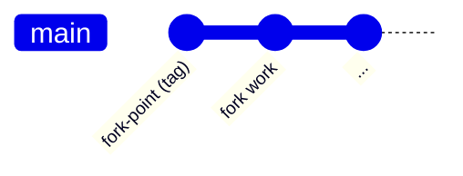

# Fork branch maintenance

This is a **hard fork** of `1jehuang/jcode`. It does not track upstream, and it
has a single rail: `main`.


```mermaid
gitGraph
  commit id: "fork-point (tag)"
  commit id: "fork work"
  commit id: "..."
```

## The `fork-point` tag

`fork-point` is an annotated tag on `631935dd1d`, the `1jehuang/jcode` commit
this fork diverged from. It is immutable and must never be moved.

It is load-bearing, not commemorative. The fork-touched clippy and rustfmt
gates compute their file set as `git diff fork-point HEAD -- '*.rs'`, so lints
are blocking in code this fork owns and merely advisory in untouched upstream
code. Moving or deleting the tag silently changes what those gates measure, and
the failure is quiet: the gate keeps passing while measuring the wrong thing.
`scripts/fork-health.sh` check 1 exists to make that loud.

## Why the fork is hard

The fork previously maintained three rails. `vendor/upstream` was a
byte-identical mirror of upstream `master`, fast-forwarded every six hours, and
`distro/nix` was a packaging layer between that mirror and `main`, so a sync
could rebase the stack without packaging changes colliding with fork work every
time. Both were retired for reasons that were measured rather than assumed:

- **It had already stopped working.** `sync.yml` failed 29 of its last 30 runs;
  the last success was July 4. It was blocked for roughly three weeks on a
  one-line conflict in `release.yml`. The failure alert *itself* failed
  (`Resource not accessible by integration`), so it failed silently.
- **The cost was large and growing.** A sync at retirement time meant 247
  conflicted files across 651 hunks, 387 of them semantic Rust conflicts.
- **The accounting cost exceeded the benefit.** `.rerere-cache`, the recorded
  conflict resolutions that made repeated rebases survivable, had grown to
  202k lines: 60% of every new file in the fork, and pure scar tissue.
- **The benefit was small.** Of 678 upstream commits at retirement, only 52
  touched files this fork had never modified, and only 20 cherry-picked
  cleanly. Those 20 were triaged and the worthwhile 8 were taken; see the
  harvest commits preceding `c91cb4bac`.

`distro/nix` followed `vendor/upstream` out because its whole purpose was
surviving that rebase. With no sync, a packaging rail is a second branch to
keep ancestral, three fork-health invariants to enforce, and a rule about which
files may live where, all to solve a problem that no longer exists. Its payload
was already fully contained in `main`, so retiring it moved no code.

Divergence is intentional. This fork has substantially rewritten storage,
telemetry consent, session handling, and CI policy, and has quality gates
(warning budget, swallowed-error and panic ratchets, code-size ceilings,
dependency boundaries) that upstream code does not satisfy.

`upstream` remains configured as a **read-only reference remote**. Fetch it to
read code or cherry-pick a specific fix; never rebase the rail onto it.

## Taking a specific fix from upstream

There is no automated sync. To adopt an individual upstream fix:

```sh
git fetch upstream
git log --oneline fork-point..upstream/master   # browse
git cherry-pick -x <sha>                        # -x records the origin
```

Then run `scripts/preflight.sh`. Upstream code frequently does not satisfy this
fork's gates (oversized files, swallowed errors, clippy lints), and the
harvested commit must be brought up to standard rather than the budget raised
to accommodate it. Applying cleanly says a patch does not textually conflict;
it says nothing about whether the result is correct here.

See [fork-sync-policy.md](fork-sync-policy.md) for the harvest ledger of what
has been adopted and skipped.

## Local development

Work on `main`. Topic branches should start from `main` and be folded back into
it. Do not keep durable remote topic branches in this fork.

Use `--force-with-lease`, never plain `--force`, when updating `main`.

The dev shell installs a pre-push guard that unconditionally refuses to
recreate `vendor/upstream` or `distro/nix`.

## Server-side rulesets

Two GitHub repository rulesets enforce the model on the server, independent of
the local hook:

| Ruleset | Rule | Applies to |
|---|---|---|
| `protect-fork-rails` | `deletion` | `refs/heads/main` |
| `no-stray-branches` | `creation` | everything except `main` and `automation/**` (admins bypass) |

These are repository configuration, not files, so nothing in a clone reveals
them. They listed the retired rails until the fork collapsed to one, and the
stale entries blocked their own deletion. `scripts/fork-health.sh` check 4
compares them against the rail set so they cannot drift out of sight again.

## Audits

```sh
scripts/fork-health.sh
```

Checks that `fork-point` is still an ancestor of `main` (so the fork-touched
gates measure the right base), and that the rail exists on GitHub. Topic
branches are reported, and ones already contained in `main` are flagged as
residue worth deleting.

## CI

Every workflow lives on `main` with everything else.

| Workflow | Role | Trigger |
|---|---|---|
| `docs-impact.yml` | Advisory branch-wide DOX review packet derived from APM scopes | PR open/update/reopen/ready-for-review |
| `fork-ci.yml` | The fork's real gate: quality + macOS build/test, advisory Linux tests | push/PR to `main`, weekly strict run |
| `nix.yml` | Flake validation + x86_64-linux/aarch64-darwin builds + Cachix | push/PR touching build inputs |
| `security.yml` | Secret scan + triaged cargo-audit gate; weekly full advisory report | push/PR touching deps, weekly |
| `fork-health.yml` | Rail invariant enforcement via `scripts/fork-health.sh` | daily, manual |
| `nix-update.yml` | Weekly `flake.lock` bump PR against `main` | weekly, manual |
| `ios-testflight.yml` | iOS TestFlight upload | manual dispatch |
| `ci.yml`, `freebsd-smoke.yml`, `release.yml` | Inherited upstream workflows; dispatch-only or trigger-neutered | manual dispatch |

The inherited upstream workflows are dispatch-only. They do not gate anything;
`fork-ci.yml` does.

## Platforms

This fork builds and tests on macOS and Linux, and ships through Nix. It
publishes no GitHub releases; `scripts/install.sh` and `scripts/install.ps1`
fetch upstream's.

Windows CI was removed (issue #19): the build/test job, the PowerShell syntax
job, the `cargo-xwin` cross-target check, the Windows release matrix, and
`windows-smoke.yml`. Nothing consumed the artifacts and no maintainer runs
Windows, so the jobs produced only unactionable noise. Windows remains a
supported *runtime* target: the `cfg(windows)` code, `docs/WINDOWS.md`, and
`scripts/install.ps1` are all still here, and `cargo check` for an MSVC target
can be run on demand. It is simply untested by this fork's CI.
