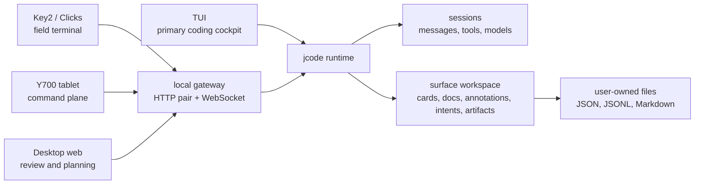

# Interaction Surfaces Implementation Map

Status: Implementation guide, 2026-06-30

This is the starting point for the jcode surface project. It links the design language, product requirements, and native workspace substrate into one implementation map.

## Docs in this pack

| Doc | Use it for | Stable output |
| --- | --- | --- |
| [`PERSONAL_INTERACTION_SURFACES.md`](./PERSONAL_INTERACTION_SURFACES.md) | Visual language, device feel, mockups, density, typography | UI decisions and design checklist |
| [`INTERACTION_SURFACE_REQUIREMENTS.md`](./INTERACTION_SURFACE_REQUIREMENTS.md) | Requirements, phases, command verbs, protocol hooks, tests | Work items with acceptance criteria |
| [`SURFACE_WORKSPACE_SUBSTRATE_PLAN.md`](~/notes/projects/jcode/proposals/surface-workspace-substrate-plan.md) | Cards/docs/annotations/intents/artifacts object graph | Data model, storage plan, operation log |
| [`INTERACTION_SURFACE_IMPLEMENTATION_PROMPT.md`](~/notes/projects/jcode/proposals/interaction-surface-implementation-prompt.md) | Next-session execution prompt | Research, implementation, tests, troubleshooting, cleanup, commit |

## Product thesis

jcode should have several surfaces over one runtime, not several competing clients.



## Surface roles

| Surface | Role | Primary interactions | Do not make it |
| --- | --- | --- | --- |
| TUI | Fastest coding cockpit | Chat, tools, edits, builds, commits | A touch dashboard |
| Key2 / Clicks | Field terminal | Capture intent, route work, terse status, cancel | A mini desktop |
| Y700 | Command plane | Drawers, cards, diffs, annotations, agent steering | A full IDE |
| Desktop web | Review table | Artifact review, planning, annotations, workspace management, meta-agent interactions | A TUI/IDE replacement |

## First coherent implementation slice

1. Pair browser surface to local gateway.
2. Render session status, transcript, composer, cancel.
3. Add command palette with text fallback verbs.
4. Add browser-local surface workspace store.
5. Render board/docs/annotations from one object graph.
6. Treat mobile background disconnects as normal: reconnect, resubscribe, and recover from runtime history.
7. Lift store to server-local files under `~/.jcode/surface_workspaces/`.

## Visual direction

```text
jcode surface feel
  dark graphite shell
  deep green identity panels
  mint live state
  blue links and artifacts
  orange degraded/pending state
  red destructive/failed state
  dense but not noisy
  keyboard-first, touch-capable
```

## Mockups at a glance

### Key2 field terminal

```text
┌────────────────────────────┐
│ jcode  live  haiku  ~/repo │
├────────────────────────────┤
│ swarm: 3 running 1 blocked │
│ last: tests passed         │
│                            │
│ > fix the pairing bug      │
│ /route y700-review         │
├────────────────────────────┤
│ [send] [route] [status]    │
└────────────────────────────┘
```

### Y700 command plane

```text
portrait                         landscape
┌────────────────────┐           ┌──────────┬─────────────┬──────────┐
│ status + command        │      │ sessions │ chat        │ artifact │
├─────────────────────────┤      │ cards    │ command     │ notes    │
│ active session          │      │ intents  │ stream      │ links    │
│ interactive chat        │      └──────────┴─────────────┴──────────┘
├─────────────────────────┤
│ drawer: cards/docs/diffs│
└─────────────────────────┘
```

Landscape panes should be user-composable: reorder panes, expand to one-third, two-thirds, or full width, and persist the layout as surface-local state.

### Desktop review surface

```text
┌──────────────┬───────────────────────────────┬──────────────┐
│ workspace    │ artifact / diff / rendered doc │ annotations  │
│ board        │ meta-agent prompt              │ cards        │
│ sessions     │ command palette                │ intents      │
└──────────────┴───────────────────────────────┴──────────────┘
```

## What not to build first

- Backlog.md adapter.
- GitHub Issues sync.
- CRDT collaboration.
- Milkdown or tldraw.
- Heavy drag/drop framework in P0. Lightweight card/node rearrangement can come after the simple button path works.
- Heavy rich-text editor in P0. Folding and formatting-selection affordances are useful later, but textarea plus preview comes first.
- Cloud-hosted dependency for local use.

## Connectivity and auth direction

Mobile browsers will suspend background pages and close WebSockets. Surfaces must recover by storing local drafts/intents, reconnecting with backoff on visibility/network changes, resubscribing, and fetching runtime history.

Auth should progress from local pairing tokens directly to Kanidm OIDC with Authorization Code + PKCE and Kanidm WebAuthn/passkey support for YubiKey. Do not build a separate device-scoped refresh/revocation layer unless Kanidm fails. The important mobile capability is safe suspend/reconnect: the browser may disconnect, then re-auth or resume and resubscribe without losing local work.

Networking should use the existing `~/infrastructure/nix-config` Kanidm and mesh infrastructure. Public exposure is acceptable only after a security review shows very low risk. Otherwise, use the ZeroTier mesh and DNS so clients can reach `jcode.mesh.rudnik.online`.

## Future session starting prompt

```text
Use ~/notes/projects/jcode/proposals/interaction-surface-implementation-prompt.md for the next implementation session. Preserve the zero-build web path, keep TUI primary, use the surface workspace object model, and satisfy the requirement IDs for the selected phase before expanding scope.
```
