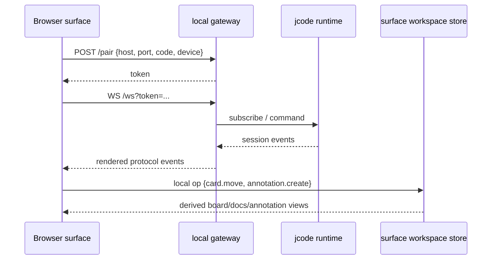
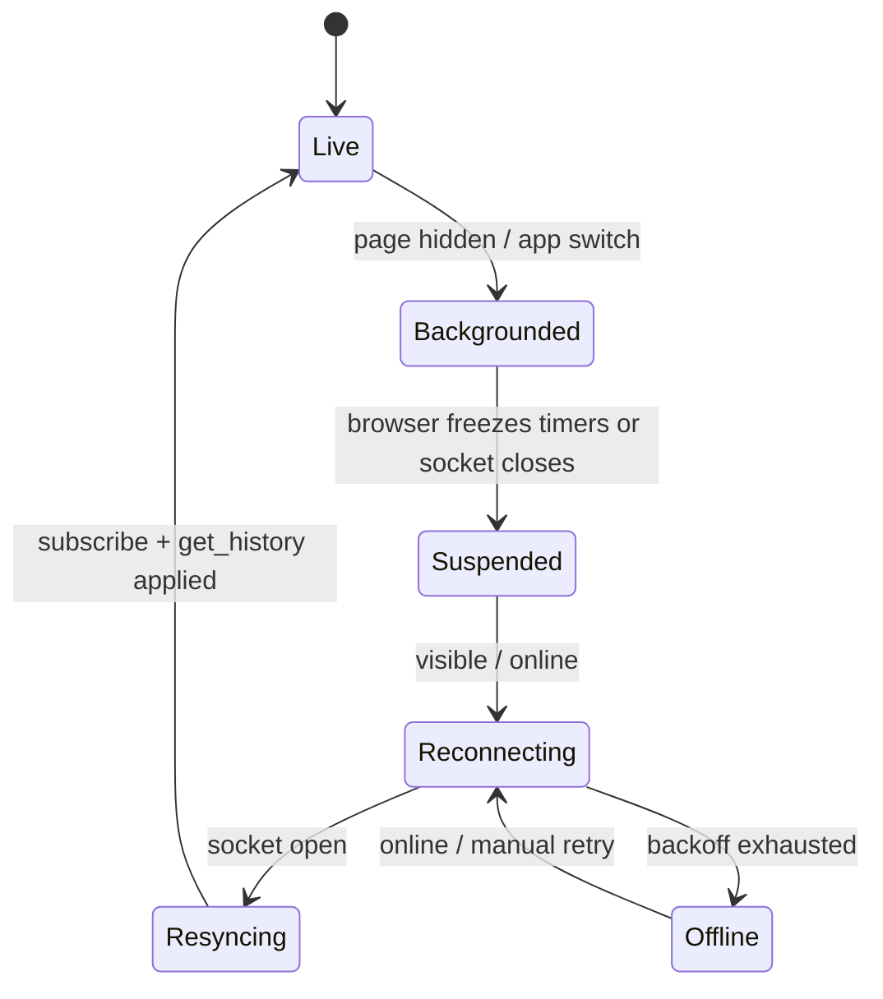

# Interaction Surface Product Requirements

Status: Implementation contract, 2026-06-30

Entry point: [`INTERACTION_SURFACES.md`](./INTERACTION_SURFACES.md)

Companions:

- Design language: [`PERSONAL_INTERACTION_SURFACES.md`](./PERSONAL_INTERACTION_SURFACES.md)
- Surface workspace substrate: [`SURFACE_WORKSPACE_SUBSTRATE_PLAN.md`](./SURFACE_WORKSPACE_SUBSTRATE_PLAN.md)

## Scope

Build device-specific surfaces over the same jcode runtime:

- **Key2 / Clicks:** capture intent, route work, check status.
- **Y700:** steer sessions, review artifacts, manipulate cards/docs/annotations.
- **Desktop web:** review, annotate, plan, supervise, and run meta-agent interactions.
- **TUI:** remains the primary coding cockpit.

## Architecture target



## Canonical decisions

1. TUI remains primary for coding and full chat.
2. Web P0 stays zero-build: ArrowJS/plain CSS/JS, no bundler requirement.
3. Surface-local state stays local until explicitly persisted.
4. Session state stays runtime-owned.
5. Cards, docs, annotations, intents, and artifact refs use the native surface workspace substrate.
6. Every rich action has a command/text fallback.
7. No cloud dependency for local-first use.
8. No Backlog.md adapter, Milkdown, tldraw, heavyweight drag/drop, or heavyweight rich-text editor in P0. Lightweight card/node rearrangement, folding, and formatting selection are valid later enhancements.

## Global requirements

| ID | Requirement | Acceptance criteria |
| --- | --- | --- |
| SURF-G-001 | Pair and reconnect | Fresh browser can pair. Saved workstation reconnects. Bad host/code/token produce actionable errors. Credentials can be forgotten. |
| SURF-G-002 | Session header | Active session ID/title, model, cwd/project, turn state, latest tool, and live/idle/error are visible before send. |
| SURF-G-003 | Transcript baseline | History, streamed text, reasoning, tool calls, notifications, errors, cancel, and unknown event tolerance work without blocking input. |
| SURF-G-004 | Command palette | Core actions are available as typed verbs and buttons. Commands can be logged and replayed in tests. |
| SURF-G-005 | Local recovery | Drafts, captured intents, unsynced annotations, selected session/model, and open drawers survive reload. |
| SURF-G-006 | Safety gates | Credential deletion, destructive file actions, external posting, broad agent stops, and pushes require confirmation. |
| SURF-G-007 | Performance budget | Key2 works on low-power mode. Y700 orientation change is under 120 ms. Desktop can render 500 cards and 1,000 annotations with responsive input. |
| SURF-G-008 | Mobile lifecycle recovery | Backgrounding, lock-screening, app switching, network changes, and browser WebSocket closure are expected. On foreground, the surface reconnects with backoff, resubscribes, fetches history, restores drafts/intents, and clearly marks any unsent commands. |
| SURF-G-009 | Auth path | P0 local pairing tokens work. P1 moves directly to Kanidm OIDC using Authorization Code + PKCE with Kanidm WebAuthn/passkey support for YubiKey. Do not add a separate device-scoped refresh/revocation layer unless Kanidm proves unreliable. |
| SURF-G-010 | Network exposure policy | Prefer the existing ZeroTier mesh plus DNS name `jcode.mesh.rudnik.online` unless a security review shows public HTTPS exposure has very low risk. Infrastructure changes may be made in `~/infrastructure/nix-config`. |

## Protocol baseline

Existing inbound events that surfaces must tolerate:

```text
ack history session session_renamed state available_models_updated model_changed
tokens status_detail notification reasoning_delta reasoning_done text_delta
text_replace tool_start tool_input tool_exec tool_done message_end done
interrupted error
```

Existing outbound requests:

```text
subscribe get_history message cancel resume_session set_model
```

Future surface events should use newline-delimited JSON over the existing WebSocket bridge. Browser implementations must assume the WebSocket can disappear while the page is backgrounded and recover through reconnect plus `get_history`.

## Command verbs

All controls should map to command envelopes.

```json
{
  "id": "cmd_01J...",
  "verb": "annotation.create",
  "surface_id": "surface_y700",
  "target_session_id": "sess_...",
  "payload": {
    "target": { "kind": "file_range", "uri": "repo://docs/plan.md" },
    "body": "Clarify P0 acceptance criteria."
  },
  "created_at": "2026-06-30T17:00:00Z"
}
```

| Verb | Payload |
| --- | --- |
| `message.send` | `session_id`, `content` |
| `turn.cancel` | `session_id` |
| `history.sync` | `session_id` |
| `session.attach` | `session_id` |
| `session.switch` | `session_id` |
| `model.set` | `model` |
| `intent.capture` | `body`, optional `target`, `urgency` |
| `intent.route` | `intent_id` or `body`, optional `target` |
| `agent.spawn` | `prompt`, optional `role` |
| `agent.assign` | `task_id`, `agent_id` or `role` |
| `artifact.open` | `artifact_id` or `path` |
| `annotation.create` | `target`, `body`, `kind` |
| `card.create` | `title`, optional `body`, `acceptance` |
| `card.move` | `card_id`, `status`, optional `ordinal` |
| `surface.handoff` | `target_surface`, `context` |
| `summary.request` | `scope` |
| `agent.meta` | `agent_id` or `session_id`, `instruction`, optional linked artifacts/cards |

## Surface requirements

### Key2 / Clicks field terminal

Primary jobs:

1. Capture intent quickly.
2. Route work to an orchestrator/session/agent.
3. Check status while away from the desk.
4. Cancel or pause runaway work.

P0 requirements:

| ID | Requirement | Acceptance criteria |
| --- | --- | --- |
| KEY2-P0-001 | Lite responsive layout | Single column, no persistent side rail, no canvas, minimal transitions. |
| KEY2-P0-002 | Hardware keyboard flow | Send, newline, command mode, cancel, status, and route can be run from keyboard. |
| KEY2-P0-003 | Terse status | Shows active session, model, cwd/project, running state, current tool, and swarm/task summary when available. |
| KEY2-P0-004 | Intent capture | Unsynced intent survives reload and can become message, card, or route request. |
| KEY2-P0-005 | Low-power mode | Disables non-essential animation and heavy previews. |

Happy path:

```text
open phone -> type "fix the pairing bug" -> /route -> orchestrator asks one clarification -> user selects "current repo" -> intent becomes card + agent prompt -> phone shows running status
```

### Y700 tablet command plane

Primary jobs:

1. Steer running sessions and swarms.
2. Review artifacts and annotate with touch/stylus.
3. Move cards and triage intents.
4. Handoff focused work to desktop or TUI.

P0 requirements:

| ID | Requirement | Acceptance criteria |
| --- | --- | --- |
| Y700-P0-001 | Orientation-aware shell | Portrait uses stacked interactive chat + drawer. Landscape uses sessions/cards, chat/command, artifact/annotation panes. |
| Y700-P0-002 | Command drawer | Cards, docs, diffs, annotations, agents, and intents are reachable from a drawer or rail. |
| Y700-P0-003 | Artifact preview | File/diff/markdown/image placeholder preview with open/reveal action. |
| Y700-P0-004 | Annotation capture | Text selection or artifact-level note creates an annotation object with target JSON. |
| Y700-P0-005 | Card manipulation | Create, move, block, and link cards without requiring drag/drop. Lightweight drag/drop can be added later after button/command paths work. |
| Y700-P0-006 | Composable landscape panes | User can reorder panes and switch each pane between one-third, two-thirds, and full-width presets. Layout persists locally per surface. |

Happy path:

```text
open Y700 -> see 3 active agents -> tap artifact -> select paragraph -> annotate "needs benchmark" -> convert annotation to card -> assign to idle agent
```

### Desktop web review surface

Primary jobs:

1. Review implementation output and evidence.
2. Annotate files, diffs, docs, images, and transcript messages.
3. Plan future work with cards/docs/intent inbox.
4. Run meta-agent interactions such as critique, summary, route, compare, and review.
5. Supervise multiple sessions without replacing the TUI or IDE.

P0 requirements:

| ID | Requirement | Acceptance criteria |
| --- | --- | --- |
| DWEB-P0-001 | Three-pane review layout | Workspace/nav, artifact inspector, annotations/cards pane. |
| DWEB-P0-002 | Artifact-linked annotations | Annotation target opens the artifact and restores best-effort selection or fallback quote. |
| DWEB-P0-003 | Board/docs views | Board, docs, annotations, and intent inbox derive from the same surface workspace store. |
| DWEB-P0-004 | Planning handoff | Selected cards/docs/annotations can generate a session prompt or future-session prompt. |
| DWEB-P0-005 | TUI coexistence | Clear state indicates when desktop web is controlling a session versus only observing. |
| DWEB-P0-006 | Meta-agent interactions | User can ask an agent to critique, summarize, compare, route, or review selected artifacts/cards without entering a code-editor workflow. |

Happy path:

```text
open desktop web -> inspect diff -> add 4 annotations -> convert 2 to cards -> generate next-session prompt -> continue coding in TUI
```

## Orchestrator behavior

The orchestrator is a role, not necessarily a new process.

| ID | Requirement | Acceptance criteria |
| --- | --- | --- |
| ORCH-P0-001 | Clarify intent | Ask at most two targeted questions when an intent is ambiguous. |
| ORCH-P0-002 | Route work | Convert intent to message, card, agent assignment, or plan. |
| ORCH-P0-003 | Preserve evidence | Link routed work back to source intent and relevant artifacts. |
| ORCH-P0-004 | Report status | Return terse summaries suitable for Key2 and expanded summaries for tablet/desktop. |

Routing policy:

```text
urgent + running issue -> active session or cancel/status command
specific code work -> TUI/session message or agent assignment
review/comment -> annotation + card if actionable
large vague goal -> plan doc + cards + orchestrator clarification
```

## Connectivity requirements

Mobile browser backgrounding is not a failure. iOS and Android may suspend timers, freeze pages, and close WebSockets when the surface is not foregrounded.

Implementation requirements:

- Persist drafts, captured intents, pending local commands, active credential ID, active session ID, and last seen event/history marker before sending or on each edit.
- Listen for `visibilitychange`, `pageshow`, `pagehide`, `online`, and `offline`.
- On foreground or network return, reconnect with capped exponential backoff plus jitter.
- After reconnect, send `subscribe` and `get_history`, then reconcile local pending commands against runtime state.
- Keep unsent commands visible instead of pretending they were delivered.
- Never rely on a background WebSocket for correctness.



## Auth roadmap

| Phase | Method | Notes |
| --- | --- | --- |
| P0 | Pairing code + bearer token | Current prototype. Browser uses `POST /pair`, stores token locally, and connects with `WS /ws?token=...` because browser WebSockets cannot set Authorization headers. Use only on LAN/Tailscale or HTTPS. |
| P1 | Kanidm OIDC + passkey | Browser uses Authorization Code + PKCE against Kanidm. Gateway validates issuer, audience, expiry, and groups via JWKS, then issues a short-lived WebSocket ticket or secure same-site session cookie. YubiKey/passkey support should come through Kanidm WebAuthn. |
| P1b | Safe mobile suspend/reconnect | No separate device-token system. Persist local drafts/intents/pending commands, allow WebSocket suspension, then re-auth or resume, resubscribe, and `get_history` on foreground. |
| P2 | Direct jcode WebAuthn fallback | Only if Kanidm is unreliable for this use case. Requires HTTPS, stable RP ID, challenge storage, device registration, and a focused security review. |

Guidance:

- Prefer Kanidm as the source of truth for endgame auth and passkeys.
- Skip a bespoke device-scoped refresh/revocation layer unless Kanidm fails in practice.
- Prefer short-lived WebSocket tickets or secure same-site cookies after OIDC login.
- Avoid OAuth implicit flow.
- Do not put provider API keys or long-lived secrets in the browser.
- Keep local pairing as a fallback for prototypes and offline personal LAN use.
- Public exposure is allowed only after threat modeling, auth verification, TLS/origin/rate-limit review, and endpoint audit.
- If public exposure is not clearly low-risk, use ZeroTier mesh access and DNS `jcode.mesh.rudnik.online`.
- Kanidm and mesh/DNS infrastructure live in `~/infrastructure/nix-config`, which future implementation sessions may edit for jcode setup.

## Storage requirements

P0 browser-local keys:

```text
jcode.surface.identity
jcode.surface.pairing
jcode.surface.session.<session_id>.draft
jcode.surface.workspace.<workspace_id>.snapshot
jcode.surface.workspace.<workspace_id>.ops
jcode.surface.preferences
jcode.surface.pending_commands
jcode.surface.auth.oidc
```

P1 durable home:

```text
~/.jcode/surface_workspaces/<workspace_id>/
```

Rules:

- Runtime/session history stays canonical in jcode runtime storage.
- Surface workspace objects become canonical in P1 server-local storage.
- Repo export is explicit and user-directed, not automatic.
- Conflicts in P0 are last-writer-wins plus visible unsynced warnings.
- P2 can add explicit conflict objects if multi-device writes demand it.

## Implementation phases

| Phase | Goal | Main requirement IDs | Exit criteria |
| --- | --- | --- | --- |
| 0 | Stabilize current web client boundary | SURF-G-001 to G-003, G-008 | Pairing, history, stream, cancel, reconnect/resync, model switch, errors are fixture-tested. |
| 1 | Key2 lite + intent capture | KEY2-P0, SURF-G-004 to G-010 | Phone layout captures, routes, reload-recovers, reconnects after backgrounding, and shows terse status. |
| 2 | Y700 drawer shell | Y700-P0 | Portrait/landscape layouts work with cards/docs/diffs/annotations local store and composable pane presets. |
| 3 | Server-local workspace | Storage P1, substrate P1 | JSON/JSONL/Markdown store exists with atomic writes and recovery. |
| 4 | Desktop review | DWEB-P0 | Three-pane review creates artifact-linked annotations and cards. |
| 5 | Richer anchors and previews | P1/P2 substrate targets | Image/SVG/DOM anchors, better preview, optional lightweight editor. |

## Test matrix

| Area | Fixtures |
| --- | --- |
| Viewports | 390x844, 412x915, 600x1024, 800x1280, 1280x800, 1440x1000 |
| Protocol | history, streaming, tool call lifecycle, interruption, error, reconnect, background/foreground resync, unknown event |
| Persistence | reload with draft, reload with unsynced intent, backgrounded socket close, corrupted snapshot, quota failure |
| Auth | bad pairing code, expired OIDC session, OIDC callback failure, WebAuthn unavailable, mesh DNS failure |
| Accessibility | keyboard-only, focus rings, reduced motion, visible labels, touch target sizing |
| Performance | 500 cards, 1,000 annotations, 20 active sessions, long streamed response |

## Future implementation prompts

Use [`INTERACTION_SURFACE_IMPLEMENTATION_PROMPT.md`](./INTERACTION_SURFACE_IMPLEMENTATION_PROMPT.md) for the next full implementation session. The smaller prompts below are slice-specific shortcuts.

### Key2 slice

```text
Implement Phase 1 from docs/INTERACTION_SURFACE_REQUIREMENTS.md. Preserve zero-build web, add Key2 lite layout, command palette verbs for intent.capture and intent.route, and local reload recovery. Validate KEY2-P0-* and SURF-G-004 to SURF-G-010, including foreground reconnect after phone backgrounding.
```

### Y700 slice

```text
Implement Phase 2 from docs/INTERACTION_SURFACE_REQUIREMENTS.md. Build orientation-aware tablet shell, composable landscape panes, drawers for cards/docs/diffs/annotations/intents, and local surface workspace views. Validate Y700-P0-* with viewport fixtures.
```

### Desktop review slice

```text
Implement Phase 4 from docs/INTERACTION_SURFACE_REQUIREMENTS.md. Build the three-pane review surface using the surface workspace substrate. Support artifact-linked annotations, card conversion, and planning handoff. Validate DWEB-P0-*.
```
