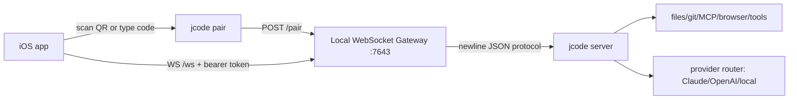

# jcode Mobile MVP

## Goal

Ship the smallest useful phone client for controlling a live jcode session running on a laptop or workstation.

The MVP is intentionally **local-first**:

- jcode continues to run tools, providers, files, git, MCP, and safety checks on the workstation.
- The phone is a thin Swift UI over the existing gateway protocol.
- Reachability is LAN or Tailscale. Jade Cloud relay is a later remote-away-from-home path.

## MVP workflow



1. On the workstation, enable the gateway:

   ```toml
   [gateway]
   enabled = true
   port = 7643
   bind_addr = "0.0.0.0"
   ```

2. Restart jcode so the gateway is listening.
3. Run `jcode pair` on the workstation.
4. In the mobile app, scan the QR code or enter host, port, and pairing code.
5. The app stores the bearer token, connects to `ws://host:7643/ws`, subscribes, syncs history, and sends chat messages.

## MVP scope

### Included

- Pair with one or more workstations via QR or manual entry.
- Store paired server credentials locally.
- Auto-connect to the most recently paired server.
- Send messages and soft-interrupts to a live session.
- Stream assistant text, reasoning, tool status, errors, and token metadata.
- Cancel a running turn.
- Switch and rename sessions when the server reports session IDs.
- Select models from the server-provided model list.

### Not included yet

- Hosted web/Jade Cloud UI.
- Push notifications.
- APNs, Live Activities, widgets, voice, images, or tool approval UX.
- Full offline transcript cache.
- Public internet exposure without Tailscale.

## Validation loop

This checkout includes a framework-free check runner because the local Swift toolchain used by agents may not provide either Apple's new `Testing` module or `XCTest`.

Run from the repo root:

```bash
./ios/check.sh
```

The runner exercises the mobile core's minimum contract:

- gateway URL construction and pairing URI parsing
- request JSON encoding
- server event decoding
- reducer behavior for streaming text and tools
- WebSocket connection startup behavior with a fake transport

## Next implementation slices

1. **Live gateway smoke test**
   - Add an optional integration check that pairs against a locally running jcode gateway using a supplied pairing code.

2. **App target build automation**
   - Install or vendor XcodeGen, generate the Xcode project from `ios/project.yml`, and add a repeatable simulator build command.

3. **Session UX polish**
   - Replace raw session IDs in Settings with display titles when available.
   - Add reconnect and stale-history banners.

4. **Mobile relay mode**
   - Add a second transport profile for Jade Cloud relay once the cloud API/frontend is documented enough to target.
