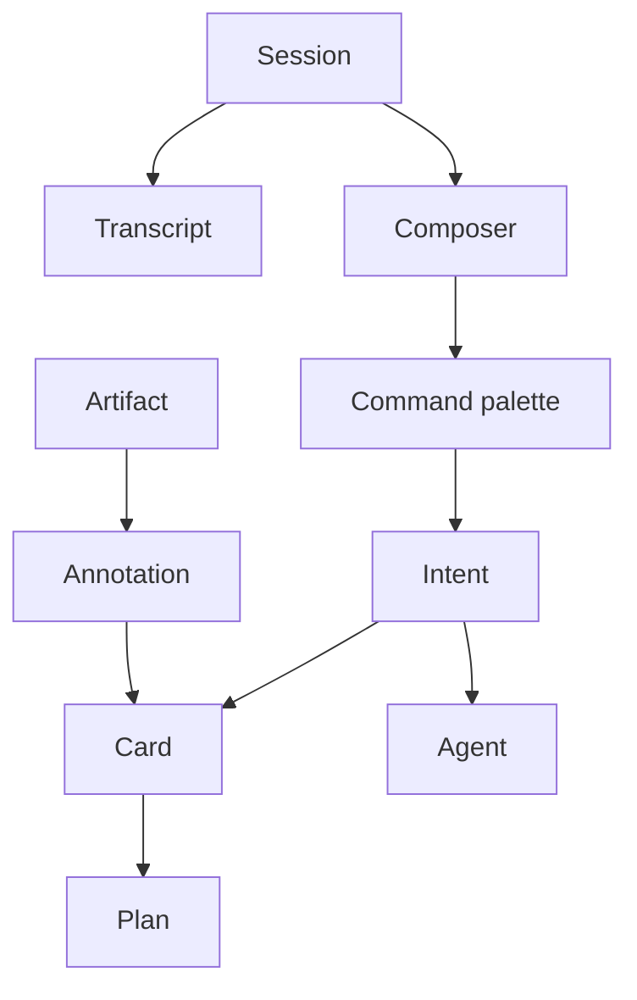

# Personal Interaction Surface Design Language

Status: Implementation guide, 2026-06-30

Start here for visual and interaction decisions. Use [`INTERACTION_SURFACES.md`](./INTERACTION_SURFACES.md) as the project map, [`INTERACTION_SURFACE_REQUIREMENTS.md`](./INTERACTION_SURFACE_REQUIREMENTS.md) for implementation work, and [`SURFACE_WORKSPACE_SUBSTRATE_PLAN.md`](./SURFACE_WORKSPACE_SUBSTRATE_PLAN.md) for cards/docs/annotations storage.

## Design target

Every jcode surface should feel like the same instrument viewed through a device-specific lens.

- **TUI:** primary coding cockpit.
- **Key2 / Clicks:** field terminal for intent capture and status.
- **Y700 tablet:** command plane for steering, cards, artifacts, and annotations.
- **Desktop web:** review, annotation, planning, meta-agent interaction, and control plane beside the TUI.

## Principles

| Principle | Implementation meaning |
| --- | --- |
| Transcript and intent first | Chrome exists to reduce friction around messages, commands, and captured intent. |
| Surface-local, session-global | Drafts, UI focus, pane layout, and reconnect hints are local. Sessions, tools, models, and history stay runtime-owned. |
| Rich views degrade to text | Every card move, annotation, and handoff has a command or text representation. |
| Functional cypherpunk | Dark, precise, inspectable, performant, not decorative retro cosplay. |
| Local-first | Drafts, intents, annotations, and card changes survive reload and offline use. |
| One grammar | Reuse nouns: session, agent, task, artifact, annotation, plan, workspace, surface. |

## Visual system

### Typography

| Token | Family | Use |
| --- | --- | --- |
| `--font-display` | Space Grotesk | Surface title, drawer title, board name, mode label |
| `--font-sans` | Geist Sans | Forms, buttons, labels, cards, web transcript prose |
| `--font-mono` | Geist Mono | Code, tool output, IDs, telemetry, shortcuts |
| `--font-serif` | Source Serif 4 | Long-form reading and docs mode only |

```css
:root {
  --font-display: "Space Grotesk", "Geist", ui-sans-serif, system-ui, sans-serif;
  --font-sans: "Geist", ui-sans-serif, system-ui, sans-serif;
  --font-mono: "Geist Mono", ui-monospace, SFMono-Regular, Menlo, Consolas, monospace;
  --font-serif: "Source Serif 4", Charter, Georgia, serif;
}
```

Prototype rule: keep zero-build web. Use system fonts or vendored subsets. Do not rely on runtime font services.

### Color tokens

| Token | Use |
| --- | --- |
| Graphite | Background, low power, focus shell |
| Deep green | jcode identity, primary panel field |
| Mint | Live, connected, success, primary action |
| Blue | Link, artifact, navigable reference |
| Purple | Reasoning, alternate path, agent context |
| Orange | Pending, degraded, attention |
| Red | Failed, destructive, stop |

```css
:root {
  --surface-bg: #070b09;
  --surface-panel: #0d1712;
  --surface-panel-2: #10241b;
  --surface-border: #244535;
  --surface-text: #dcefe5;
  --surface-muted: #88a395;
  --surface-live: #55f0a5;
  --surface-link: #73a7ff;
  --surface-reasoning: #b591ff;
  --surface-warn: #ffb45c;
  --surface-danger: #ff6b6b;
}
```

### Glyphs

Use **Phosphor Icons** as inline SVG or a tiny vendored subset. Prefer text labels until an icon is part of repeated muscle memory.

| Concept | Glyph direction |
| --- | --- |
| Session | `terminal-window`, `chat-circle-text` |
| Workspace | `squares-four`, `layout` |
| Agent | `robot`, `tree-structure` |
| Card/task | `kanban`, `check-square`, `list-checks` |
| Artifact | `file-text`, `file-code`, `image` |
| Annotation | `note-pencil`, `highlighter-circle` |
| Link/pair | `link`, `plugs-connected`, `qr-code` |
| Danger | `stop-circle`, `warning-diamond`, `x-circle` |

### Motion and density

| Interaction | Target |
| --- | --- |
| Button response | 80 to 120 ms transform or color change |
| Drawer slide | 140 to 180 ms transform-only |
| Resize/orientation | Immediate or under 120 ms |
| Streamed text | No animation |
| Card drag/drop | Immediate hover/lift, persist on release |

Respect `prefers-reduced-motion`. Disable non-essential transitions on Key2 and in lite mode.

## Shared UI primitives



| Primitive | Minimum UI |
| --- | --- |
| Session chip | title/ID, model, cwd, live/idle/error, running tool |
| Composer | multiline input, send, cancel, command mode, target session |
| Intent | raw body, target, urgency, route action, status |
| Artifact | type, path/ID, provenance, preview, open/reveal, linked annotations |
| Annotation | target, selector, body, status, convert-to-card |
| Card | title, status, priority, body, acceptance, linked artifacts |
| Command | typed verb, visible preview, reversible local log |
| Meta-agent interaction | critique, plan, summarize, route, and supervise another agent without pretending the web UI is an IDE |

## Device mockups

### Key2 / Clicks field terminal

Use a single-column, hardware-keyboard-first layout. Avoid canvas, side rails, and dense touch controls.

```text
┌────────────────────────────┐
│ jcode ● live   sonnet ~/jc │
├────────────────────────────┤
│ now                         │
│ 3 agents running            │
│ 1 needs review              │
│ tests passed 2m ago         │
│                             │
│ intent                      │
│ > check cloudflare plan     │
│ /route desktop-review       │
├────────────────────────────┤
│ send  route  status  cancel │
└────────────────────────────┘
```

Required feel: terse, durable, fast under thumb or keyboard. It should work while walking or away from the desk.

### Y700 tablet command plane

Portrait favors stacked focus with drawers. Landscape favors three panes.

```text
portrait
┌─────────────────────────────┐
│ status rail + command       │
├─────────────────────────────┤
│ active interactive chat     │
│ tool stream                 │
├─────────────────────────────┤
│ drawer: cards/docs/diffs    │
└─────────────────────────────┘
```

```text
landscape
┌──────────────┬────────────────────────┬──────────────┐
│ sessions     │ transcript + composer  │ artifact     │
│ cards/intents│ interactive chat       │ annotations  │
│ agents       │ live tool stream       │ linked cards │
└──────────────┴────────────────────────┴──────────────┘
```

Required feel: command surface, not a desktop clone. Drawers and direct manipulation should have command equivalents. In landscape, panes should be user-composable with one-third, two-thirds, and full-width presets persisted as surface-local state.

### Desktop web review surface

Desktop web optimizes review, annotation, planning, meta-agent interaction, and workspace visibility. The TUI remains primary for coding.

```text
┌────────────────┬─────────────────────────────────┬────────────────┐
│ workspace      │ artifact inspector              │ annotations    │
│ board lanes    │ meta-agent prompt               │ linked cards   │
│ sessions       │ command palette                 │ intent inbox   │
└────────────────┴─────────────────────────────────┴────────────────┘
```

Required feel: high-signal review table for planning, critique, comparison, and supervision. Avoid becoming a slower chat UI or IDE clone.

## Implementation-ready component inventory

| Component | First version | Later version |
| --- | --- | --- |
| Shell | CSS grid, responsive panes, no framework requirement | Saved user-composable layouts with pane order and widths |
| Command palette | Text input with filtered commands | Hotkeys, command history |
| Board | CSS columns, buttons for move | Lightweight pointer drag/drop for cards/nodes if needed |
| Docs editor | `textarea` + markdown preview | Folding and formatting-selection affordances, then CodeJar only if textarea fails |
| Annotation capture | Native selection + target JSON | Image/SVG region selection |
| Icons | Inline SVG subset | Tokenized icon package |
| Persistence | `localStorage` snapshot + op log | Server-local JSON/JSONL/Markdown |

## Design checklist

Before shipping a slice:

- Does the action have a text command fallback?
- Does the UI survive reload, backgrounding, and reconnect without losing drafts or annotations?
- Is the active session/model visible before send?
- Is live/idle/error distinguishable from connection state?
- Are destructive actions gated?
- Does it work without cloud services?
- Does reduced motion disable non-essential transitions?
- Does Key2 lite mode avoid heavy layout and animation?

## Decision status

No P0-blocking design questions remain.

Locked defaults:

- Zero-build web first, ArrowJS/plain CSS/JS acceptable.
- Phosphor glyph direction, not emoji chrome.
- Space Grotesk, Geist Sans, Geist Mono, and Source Serif 4.
- Native surface workspace substrate for cards/docs/annotations/intents/artifacts.
- No Backlog.md adapter, Milkdown, tldraw, heavy drag/drop framework, or heavy rich-text editor in P0. Lightweight card/node rearrangement, folding, and formatting selection remain valid later enhancements.
