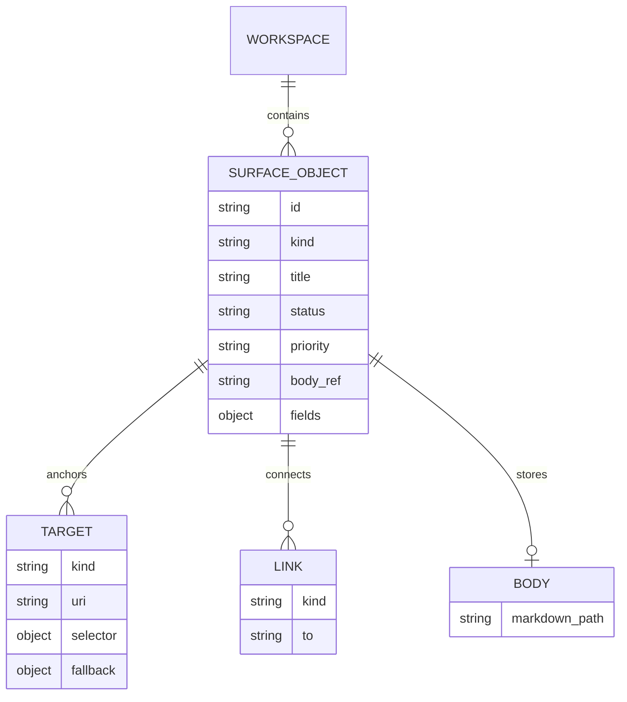
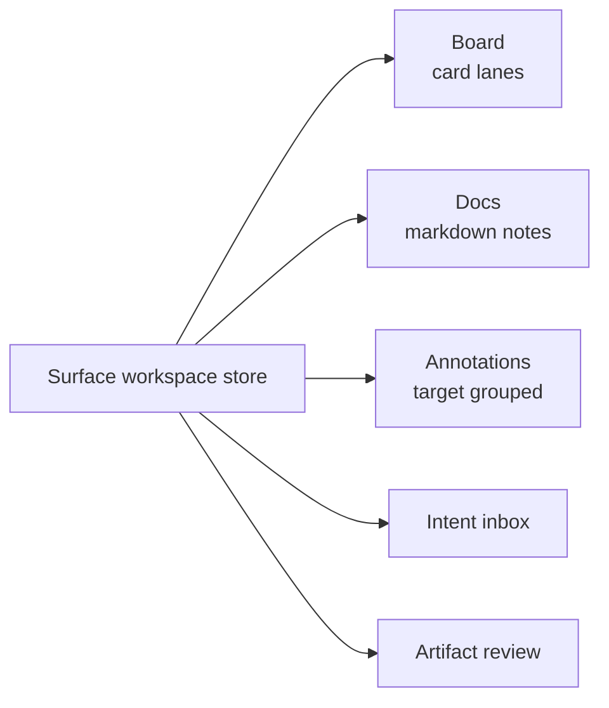

# Surface Workspace Substrate Plan

Status: Implementation spec, 2026-06-30

Entry point: [`INTERACTION_SURFACES.md`](./INTERACTION_SURFACES.md)

Companions:

- Design language: [`PERSONAL_INTERACTION_SURFACES.md`](./PERSONAL_INTERACTION_SURFACES.md)
- Requirements: [`INTERACTION_SURFACE_REQUIREMENTS.md`](./INTERACTION_SURFACE_REQUIREMENTS.md)

## Decision

Use a jcode-native **surface workspace** object graph for cards, docs, annotations, intents, and artifact references.

Do not start with Backlog.md, GitHub Issues, Milkdown, tldraw, CRDTs, or a task-manager adapter. Those can become explicit import/export paths later.

## Borrowed ideas

| Source | Borrow | Do not borrow for P0 |
| --- | --- | --- |
| W3C Web Annotation | `body + target + selector`, target kinds, fallback selectors | JSON-LD, RDF, broad interoperability machinery |
| Local-first software | Local writes, user-owned files, explicit sync/export | CRDTs, peer-to-peer, complex conflicts |
| jcode storage patterns | Atomic JSON, JSONL append, markdown bodies, `.bak` recovery | A new database dependency |
| Lightweight web packages | `textarea`, native selection, CSS/SVG/Pointer Events | Milkdown, tldraw, heavy drag/drop |

## Core model

Cards, docs, and annotations are one graph rendered as several views.



Derived views:

```text
board view       = objects where kind=card grouped by status
annotation view  = objects where kind=annotation grouped by target/status
docs view        = objects where kind=doc ordered by links or workspace order
artifact review  = artifact_ref + linked annotations/cards/docs
intent inbox     = objects where kind=intent and status is captured/triaged
```

## Object kinds

P0:

```text
card doc annotation intent artifact_ref
```

Reserved:

```text
canvas_mark diagram_node diagram_edge review handoff
```

## Minimal JSON shapes

### SurfaceWorkspace

```json
{
  "schema_version": 1,
  "workspace_id": "sw_01J...",
  "title": "jcode surfaces",
  "scope": { "kind": "project", "root": "/Users/me/src/jcode" },
  "created_at": "2026-06-30T17:00:00Z",
  "updated_at": "2026-06-30T17:00:00Z",
  "active_view_id": "view_board_default"
}
```

### SurfaceObject

```json
{
  "id": "obj_01J...",
  "kind": "annotation",
  "title": "Clarify acceptance criteria",
  "status": "open",
  "priority": "normal",
  "body_ref": "body/obj_01J....md",
  "created_at": "2026-06-30T17:00:00Z",
  "updated_at": "2026-06-30T17:00:00Z",
  "created_by": "user",
  "tags": ["review"],
  "targets": [
    {
      "kind": "file_range",
      "uri": "repo://docs/INTERACTION_SURFACE_REQUIREMENTS.md",
      "selector": { "type": "line_range", "start": 141, "end": 162 },
      "fallback": { "type": "text_quote", "exact": "Every surface SHOULD expose" }
    }
  ],
  "links": [
    { "kind": "created_from", "to": "obj_intent_01J..." }
  ],
  "fields": {}
}
```

### Operation

```json
{
  "op_id": "op_01J...",
  "workspace_id": "sw_01J...",
  "kind": "object.update",
  "object_id": "obj_01J...",
  "patch": { "status": "resolved" },
  "created_at": "2026-06-30T17:00:00Z",
  "source": { "surface_id": "surface_desktop" }
}
```

## Targets and selectors

Targets identify what an object refers to. Selectors identify the region.

| P0 target kind | Example |
| --- | --- |
| `workspace` | Whole workspace note |
| `session` | Session summary or control note |
| `message` | Transcript annotation |
| `file` | Whole file annotation |
| `file_range` | Code/doc line or text range |
| `artifact` | Generated image, diff, result, screenshot |
| `url` | External reference |

| P0 selector | Use |
| --- | --- |
| `whole_resource` | Whole file, message, artifact, or URL |
| `line_range` | Stable for code/docs while line numbers remain close |
| `text_position` | Fast local anchoring |
| `text_quote` | Fallback repair when positions drift |
| `message_id` | Transcript targets |

P1 selectors: `xywh`, `css_selector`, `svg_selector`, `data_position`.

## Link kinds

```text
relates_to blocks blocked_by parent child implements annotates
created_from assigned_to references supersedes
```

Rules:

- Use links for relationships, not duplicated fields.
- Keep links typed and inspectable.
- If a link has workflow impact, render it in the UI.

## Storage layout

### P0 browser-local

```text
localStorage:
  jcode.surface.workspace.<workspace_id>.snapshot
  jcode.surface.workspace.<workspace_id>.ops
  jcode.surface.workspace.<workspace_id>.bodies
```

Use this only for zero-build prototypes and reload recovery.

### P1 server-local

```text
~/.jcode/surface_workspaces/<workspace_id>/
  workspace.json
  objects.json
  views.json
  ops.jsonl
  body/
    obj_01J....md
  artifact_cache/
    preview_....json
  snapshots/
    2026-06-30T17-00-00Z.json
```

Rules:

- Write JSON atomically with `.tmp` + rename.
- Keep `.bak` recovery for primary indexes.
- Append operations as JSONL.
- Store body markdown separately from object indexes.
- Never make repo export the canonical storage by default.

### P2 explicit repo export

```text
.jcode-surface/<workspace_id>/
  README.md
  workspace.json
  objects.json
  views.json
  ops.jsonl
  body/*.md
```

Export is user-directed, useful for review packets and repo durability.

## Operation kinds

P0:

```text
workspace.create
object.create
object.update
object.delete_soft
object.restore
body.update
link.create
link.delete
view.create
view.update
```

P1:

```text
target.reanchor
snapshot.create
export.create
import.apply
```

## UI projections



| View | Query | First UI |
| --- | --- | --- |
| Board | `kind=card` | CSS columns, move buttons |
| Docs | `kind=doc` | list + textarea + preview |
| Annotations | `kind=annotation` | grouped list + target jump |
| Intent inbox | `kind=intent` and open | capture, route, convert |
| Artifact review | selected artifact_ref + inbound links | preview + annotations/cards |

## Protocol path

P0 can stay browser-local. P1 adds surface workspace requests/events over the existing WebSocket bridge.

Requests:

```text
surface_workspace_open
surface_workspace_apply_ops
surface_workspace_get_snapshot
surface_workspace_export
```

Events:

```text
surface_workspace_snapshot
surface_workspace_ops_applied
surface_workspace_conflict
surface_workspace_error
```

## Rust crate path

Suggested crate/module name:

```text
jcode-surface-workspace
```

Responsibilities:

- serde types for workspace/object/target/link/view/op
- load/save server-local layout
- apply operation log to snapshot
- atomic writes and backup recovery via `jcode-storage` patterns
- markdown body read/write helpers
- export/import pack helpers

Do not put UI layout or web-specific state in this crate.

## Implementation phases

| Phase | Goal | Exit criteria |
| --- | --- | --- |
| 0 | Browser-local object store | `surface-store.js` supports CRUD, op log, snapshot, board/docs/annotation projections. |
| 1 | Server-local store | Rust types and file layout persist workspaces under `~/.jcode/surface_workspaces/`. |
| 2 | Repo export pack | User can export/import `.jcode-surface/<workspace_id>/` explicitly. |
| 3 | Richer anchors | Image regions, SVG/DOM selectors, text quote repair, optional CodeJar. |

## P0 implementation checklist

- [ ] Define JS object shapes matching this doc.
- [ ] Implement local operation append and snapshot compaction.
- [ ] Render board/docs/annotations/intents from selectors over one array.
- [ ] Add command verbs for `card.create`, `card.move`, `annotation.create`, `intent.capture`, `intent.route`.
- [ ] Make reload recovery visible and testable.
- [ ] Add fixtures for 500 cards and 1,000 annotations.

## Recommendation

Implement the smallest useful surface workspace first: browser-local objects, markdown bodies, operation log, and derived board/docs/annotation views. Lift the same model into Rust storage only after the UI proves the workflows.
