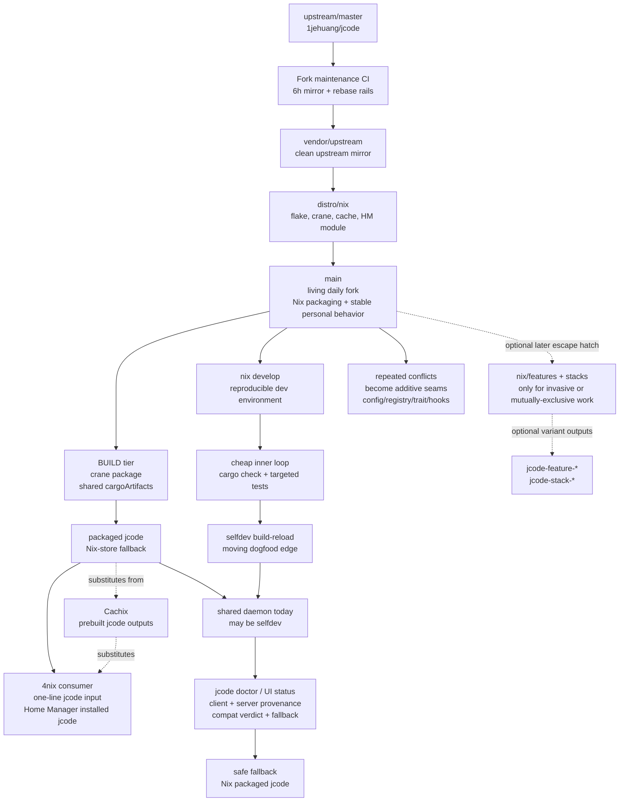

# Fork Sustainability Model

Date: 2026-06-27
Status: draft for John review, do not delete the self-destruct Serena memory until this draft is signed off
Scope: keeping a fast-moving upstream fork, in-repo Nix packaging, and large downstream personal feature work sustainable without turning 4nix into the control plane.

## 0. Current recommendation after review

Use the simple direct workflow first. Do not begin by implementing a full Nix-composable feature-stack system.

The short-term model is:

> **Main is the living fork. Nix is the fallback and environment. Selfdev is the dogfood edge. Doctor explains which world is running. Repeated conflicts become seams.**

In practice:

- `main` is John's real daily fork: upstream + Nix packaging + stable personal downstream behavior.
- 4nix installs and manages jcode as a flake input. It consumes the packaged fork and remains boring.
- `nix develop` is the reproducible development environment for hacking jcode.
- the Home-Manager installed `jcode`, or `nix run .`, is the stable packaged fallback.
- `selfdev build-reload` is the moving dogfood edge.
- `jcode doctor` should become the primary visibility tool for client/server binary identity, source provenance, branch drift, and fallback instructions.
- Nix feature variants and explicit feature stacks are an escape hatch, not the default workflow. Use them later only for unusually invasive, mutually exclusive, or separate-binary-identity work.

The long-term model adds stronger rails without changing the daily mental model:

- build provenance stamping first (NS4)
- protocol/capability compatibility gates
- conflict-surface reports and repeated-conflict-to-extension-seam work
- optional named daemon instances, such as `stable` and `selfdev`, only if one shared daemon remains confusing or risky after provenance is visible

## 1. The problem

John is carrying three pressures in one repository.

First, upstream `1jehuang/jcode` moves fast. It changes regularly, sometimes deeply. A downstream fork that wants to stay close to that upstream cannot treat reconciliation as an occasional heroic event. It needs a routine, legible, low-drama update loop.

Second, John's fork is not just a personal code checkout. It is also the packaging source that 4nix consumes as a flake input. The fork must expose a stable package, overlay, Home Manager module, cacheable builds, and a clear upgrade path so `~/infrastructure/4nix` can consume `jcode` without learning all of jcode's internal maintenance machinery.

Third, John is doing substantial personal feature and experiment work inside jcode. This is not mostly maintenance work. It is not mostly a queue of intended upstream PRs. Much of it is customization, extension, dogfooding, and local harness integration that may never be upstreamable. Some of it may live forever as actively used fork behavior, while still feeling experimental because John keeps developing it in place. The model must therefore support permanent downstream work without pretending every patch is on a path to upstream, and without pretending every experiment eventually graduates into upstream or disappears.

The lived goal is to dogfood the moving local build while keeping a Nix-packaged version available as the safe fallback. In that sense, the fork is always living within bounded selfdev mode: daily use happens close to the moving edge, but the edge has rails, provenance, checks, named variants, and a boring fallback. The failure mode to avoid is familiar: upstream churn plus personal experiments plus packaging drift becomes too confusing, the fork hardens into an accidental hard fork, or John abandons the tool.

The sustainability target is not "never diverge." The target is controlled divergence: know what is local, know why it exists, know how it is validated, know how expensive it is to test, and know which tier owns it.

This model must satisfy John's four explicit success criteria:

1. **Generalize.** The pattern should work for other fast upstreams, not only jcode.
2. **Dead-easy.** Adding or carrying a feature should be close to one obvious operation.
3. **Idiot-proof / me-proof.** The workflow should fail loudly and locally, not silently across 4nix, the daemon, or CI.
4. **Transparent.** The state of the fork, the patch stack, the package, and the running binary should be inspectable by a human.

## 2. The two hard constraints

Two constraints decide the shape of the model.

### Constraint A: repo containment

The rule is:

> **jcode owns everything thick; 4nix owns one line.**

4nix is a fan-in repository. Every host and many programs meet there. When too much application-specific machinery moves into 4nix, failures have the widest blast radius and the worst signal. The jcode fork should therefore own the reusable packaging and fork mechanics:

- package definition
- overlay
- Home Manager module
- wrapper policy
- dev shell and dogfood launcher policy
- feature variants
- patch metadata
- per-feature checks
- branch rails and sync scripts

4nix should consume the result with a small, boring surface:

```nix
jcode.url = "github:jerudnik/jcode/main";
# and then either pkgs.jcode or inputs.jcode.packages.${system}.jcode
```

This keeps the app-specific system inside the app fork. 4nix pins one revision and benefits from the cache. It does not become the patch-stack manager.

### Constraint B: compute frugality

The workflow must climb the cost ladder only as far as the question requires:

1. **Does it compile?** Use `cargo check -p <crate>` or `cargo check --workspace`.
2. **Does this behavior hold?** Use a targeted `cargo test -p <crate> <name>`.
3. **Does it work live in the dogfood daemon?** Use `selfdev build` or `selfdev build-reload` for the TUI target.
4. **Does it compose against the pinned Nix base and pass the integration gate?** Use `nix build .#<variant>` or `nix flake check`, preferably with cache hits.

Most questions belong on rungs 1 and 2. John was often jumping to rungs 3 and 4, which made development feel expensive and also worsened the "which binary is the daemon running?" confusion documented in `SELFDEV_NIX_DAEMON_DIVERGENCE.md`.

The important Nix fact is that the existing crane packaging already separates dependency artifacts from the final package. The `cargoArtifacts` dependency build is reused by the package and checks. The patch-ledger row about keeping the git stamp out of `buildDepsOnly` exists to preserve this cache stability. Therefore, Nix is not the inner edit loop, but it can be a frugal integration tier: unchanged dependencies and unchanged feature inputs should produce cache hits, and each variant can have its own store path and check.

## 3. Ground-truth divergence facts

The scary branch numbers were misleading.

`git cherry github/main main` showed that, of 35 local "ahead" commits, 27 were already present on `github/main` under different hashes. The 6-hour CI rebase rewrites history, so normal ahead/behind counts exaggerate real divergence. Only 8 commits were genuinely local-only: the current session's work. The real reconciliation job is to rebase those 8 onto `github/main`; duplicate patch-ids evaporate. `scripts/sync-local.sh` already implements this local reader model.

The real conflict surface is not the count of local commits. It is the files those commits edit. The prior analysis found 104 touched files:

- 44 new additive files
- 60 edits to files that also exist upstream

The 44 additive files are low-risk. They generally do not conflict on rebase. The 60 invasive edits are the real surface area. They touch deep internals such as `agent.rs`, `prompt.rs`, `session.rs`, `config.rs`, and `tool/mod.rs`. Every invasive edit converted into an additive seam, such as a hook, trait implementation in a new file, registry registration, config-provided adapter, or plugin-like boundary, moves work out of the conflict column.

The branch rails already exist:

- `vendor/upstream` is a clean upstream mirror.
- `distro/nix` is upstream plus reusable Nix packaging.
- `main` is stable fork behavior and features.
- `stack/<nn>-<topic>` is ordered downstream patch work.
- `pr/<topic>` is work intended for upstream PRs.
- `exp/<topic>` is disposable experimentation.

The automation already exists too. GitHub CI is the only writer of the authoritative fork rails. It mirrors upstream, rebases `distro/nix`, rebases `main`, and force-pushes with lease. The local clone is a reader that reconciles with `scripts/sync-local.sh`. Forgejo is currently best treated as a mirror/backup role until its intended authority is decided.

The Nix surface also already exists. `flake.nix` uses flake-parts and crane. It exposes:

- `packages.${system}.jcode`
- `packages.${system}.default`
- `overlays.default`
- `homeManagerModules.default`
- `homeModules.default`
- `devShells.${system}.default`

`docs/fork/patch-ledger.md` is the embryo of the next model. It already records each downstream patch's class, status, upstream reference, retire condition, and validation command. That table should become more than documentation. It should become an executable index of patch intent and validation.

## 4. The tiered model, simplified

The earlier design question was whether to make features themselves into composable Nix patch artifacts. The review conclusion is simpler: do not make that the first abstraction. The default should be a normal living fork on `main`, with Nix providing the environment, package, cache, and fallback. Use explicit Nix feature variants only as an escape hatch.

Do not choose globally between a thin fork and a thick fork. Split by concern. Each tier should be only as thick as its job requires, but the short-term implementation should keep the number of moving parts small.

### Tier 1: BUILD

The build tier compiles Rust from a source tree. In this repo that means the crane package in `nix/package.nix`, called from `flake.nix`.

Proposed names:

- `packages.${system}.jcode-base`: the base package for the current fork source.
- `packages.${system}.jcode`: alias to the recommended stable daily package.
- `packages.${system}.default`: alias to `jcode`.
- internal `cargoArtifacts`: dependency artifacts shared by the base package, variants, and checks.

This tier is coupled to source. It is allowed to be thick because building is inherently coupled. Its job is to make the base package reproducible and cacheable, not to express every experiment.

Why the constraints pick this shape:

- Repo containment: all package logic stays in jcode.
- Compute frugality: crane dependency artifacts are reused, and CI/Cachix can populate the expensive outputs before 4nix consumes them.

### Tier 2: COMPOSE

The compose tier wraps or selects an already-built binary without editing upstream source.

Short term, this tier should stay almost boring. It owns:

- `overlays.default`
- `homeManagerModules.default`
- `homeModules.default`
- `apps.${system}.default` or equivalent `nix run .`
- wrapper policy
- safe fallback launcher policy

This tier should be thin and non-forking. It should touch zero Rust source. It is the 4nix-facing seam. The consumer should be able to say, "use the jcode fork's overlay/module/package," without learning how the fork is maintained.

Minimal flake app surface:

- `nix develop`: enter the reproducible Rust/Nix development environment.
- `nix run .`: run the packaged fallback from the checkout.

Do not add separate `.#stable`, `.#dev`, `.#dogfood`, `.#preflight`, or `.#session` apps at first. They sound clear in isolation, but together they create another surface to remember. Dogfood is selfdev, not Nix. The daily dogfood command should remain `selfdev build-reload` plus normal `jcode` usage, with provenance shown by the program itself.

Why the constraints pick this shape:

- Repo containment: 4nix does not own the wrapper semantics.
- Compute frugality: selecting or wrapping an existing binary should not rebuild Rust.
- Idiot-proofing: dogfood and fallback become explicit commands, not accidental `$PATH` ordering.

### Tier 3: FEATURE-EXPERIMENT escape hatch

This tier is deliberately not the default first implementation.

The feature-experiment tier is for keepable, actively used, not-necessarily-upstreamable work that must ride a moving base. The name includes "experiment" not because the work is disposable, but because the fork is allowed to keep evolving these features while John uses them. A feature can be temporary, permanent-downstream, planned-upstream, or permanently experimental.

The preferred first home for daily-used personal features is `main`, expressed as normal code with additive seams wherever possible. Reach for this tier only when a feature is unusually invasive, mutually exclusive with another feature, needs a separate binary identity, or repeatedly makes rebases confusing enough that isolation pays for itself.

The proposed artifact is a feature directory:

```text
nix/features/<name>/
  feature.toml      # metadata: status, owner, base pin, dependencies, retire condition
  patch             # git-format patch or patch series, if the feature is invasive
  check.nix         # feature-specific validation derivation
  README.md         # short human explanation and dogfood notes
```

Features can build on each other, so dependency and stack order must be explicit. The important object is not only a patch, but a named layer in a stack:

```text
base jcode
  -> feature/a
  -> feature/b, depends on a
  -> feature/c, intentionally overrides behavior from b
  -> dogfood stack
```

That stack needs machine-readable answers to questions that otherwise become impossible to hold in a human head:

- Which feature must apply before this one?
- Which files, modules, commands, settings, or behavior surfaces does it claim?
- Which earlier feature does it intentionally override?
- Which earlier feature is it incompatible with?
- Which validation proves the combined stack still behaves?

A feature variant is a Nix function from base to base-prime:

```nix
base -> base.overrideAttrs (old: {
  patches = (old.patches or []) ++ [ ./nix/features/<name>/patch ];
})
```

Optional output names if this escape hatch is implemented:

- `packages.${system}.jcode-feature-<name>` for a single isolated feature.
- `packages.${system}.jcode-stack-<name>` for a deliberately selected stack.
- `checks.${system}.feature-<name>` for the feature's validation.
- `checks.${system}.stack-<name>` for the selected stack's validation.

This tier is "more than a patch, less than a package." It is pinned, composable, cacheable, and produces its own store path. It can be disposable, but it does not have to be. A permanent personal feature can live here indefinitely if that is the clearest way to keep it named, validated, and separable from the base. It can coexist with `jcode` and `jcode-fallback`, which sidesteps launcher-shadowing confusion. If a feature breaks against upstream churn, the failure happens at the variant/check boundary with a named feature, not as a mystery inside 4nix.

This tier is honest about its limits. Patches over source are as brittle to upstream churn as a rebase. Stacked patches are additionally vulnerable to semantic shadowing: feature B can change a line, function, default, prompt, or configuration assumption that feature A also depends on. Nix can make the stack explicit and cacheable, but it cannot magically understand intent. Therefore every stack needs declared dependencies, declared conflicts, declared intentional overrides, and a combined validation check. The value is not that conflicts disappear. The value is that they are named, localized, cached, and tested.

This tier is also slower than the cargo inner loop. Therefore it is not the place to edit minute-by-minute. It is the integration and dogfood tier for features that cannot yet be expressed as additive seams, plus the long-lived feature registry for permanent personal behavior that must remain legible.

Why the constraints pick this shape:

- Repo containment: feature definitions live in jcode, not 4nix.
- Compute frugality: variants share the crane dependency cache and get their own cached checks.
- Transparency: each feature has a directory, metadata, patch, check, stack position, dependency/conflict declarations, and retirement or permanence story.
- Idiot-proofing: deleting or disabling a feature is removing one directory or one registry entry, not unwinding scattered edits.

### Tier 4: VALIDATION

The validation tier turns the patch ledger into executable gates.

Today `docs/fork/patch-ledger.md` has rows like:

- patch name
- class
- status
- upstream ref
- retire condition
- validation command

The next step is to give each durable feature or shim a machine-checkable validation surface:

- `checks.${system}.feature-<name>` runs its `check.nix`.
- `checks.${system}.patch-ledger` verifies metadata completeness.
- `checks.${system}.stack-<name>` validates a selected feature stack if the escape hatch is implemented.

The patch ledger remains the human index, but feature metadata and checks become the machine index. A patch without a validation command is allowed only if explicitly marked research or draft. A permanent downstream feature must say how it is validated. A temporary shim must say when it retires.

Why the constraints pick this shape:

- Repo containment: validation lives beside the feature.
- Compute frugality: cheap validations run before expensive builds, and Nix checks can be cached.
- Transparency: the merge gate is visible in one table plus one flake check namespace.

## 5. The new VCS model framing

The model is not merely "use branches better." It is a new operating discipline:

> **agent-maintained patch stack + machine-checkable patch metadata + automated semantic validation as the merge gate.**

The old bottleneck for a large downstream patch stack on a fast upstream was merge labor. Agents make that labor cheaper. That changes the constraint. The hard question becomes not "can I afford to rebase?" but "can I verify that the rebase preserved semantics?"

This is the same force behind the drive-by-PR controversy, pointed inward. If patches are trivial to generate, review labor cannot be the only safety gate. The gate must be provenance, metadata, tests, evals, and checks.

In this model, patches become first-class objects. Each carries:

- intent
- provenance
- upstream relationship
- retire condition
- validation command
- optional base pin
- optional feature dependencies

An agent can restack them against moving upstream. The machine-checkable gates decide whether the restack is acceptable. Human review remains important for product judgment, but not as the only line of defense against mechanical churn.

Jujutsu (`jj`) is a serious option for the restacked stack. It stores conflicts instead of blocking the whole operation, makes a series of changes easier to reorder and rebase, and treats mutable patch stacks as a first-class workflow. The model does not require `jj` on day one, but it should remain an open implementation option for `stack/*` work.

## 6. End-to-end workflow map

## 6A. Daily life with 4nix, selfdev, and a shared daemon

Daily life should have two clearly named worlds, even if they initially share one daemon:

1. **Installed/fallback world.** 4nix installs the Nix-packaged fork from `github:jerudnik/jcode/main`. This is the boring, cached, declarative fallback.
2. **Dogfood/selfdev world.** While hacking jcode in `~/infrastructure/jcode`, John enters `nix develop`, uses `cargo check` and targeted tests, then uses `selfdev build-reload` to run the moving edge.

The confusing case is normal and should be supported: John may use jcode to modify jcode while also using jcode in other repositories. Since jcode currently uses a shared daemon by default, another client session can attach to a daemon built from the selfdev checkout. That is not inherently bad. It is dogfooding. It becomes bad only when invisible, incompatible, or state/schema-breaking.

The short-term rule is:

> **Selfdev daemon is allowed. Invisible selfdev daemon is not.**

Therefore `jcode doctor` and the normal UI/status surface should show:

```text
Client binary:
  path: /nix/store/.../bin/jcode or ~/.jcode/builds/current/jcode
  origin: nix | selfdev | source
  commit: <rev>

Server daemon:
  socket: $JCODE_RUNTIME_DIR/jcode.sock or $JCODE_SOCKET
  path: /nix/store/.../bin/jcode or ~/.jcode/builds/current/jcode
  origin: nix | selfdev | source
  checkout: ~/infrastructure/jcode
  commit: <rev>-dirty?

Compatibility:
  protocol: compatible | warning | incompatible
  verdict: safe | warn | reconnect required

Fallback:
  command: nix run . or Home-Manager installed jcode
```

The daily loop becomes:

```sh
# keep the local fork close to upstream
cd ~/infrastructure/jcode
scripts/sync-local.sh --check
scripts/sync-local.sh          # only when drift exists

# hack jcode
nix develop
cargo check --workspace
cargo test -p <crate> <test>
selfdev build-reload
jcode doctor

# work elsewhere
cd ~/other/repo
jcode                         # allowed to attach to selfdev daemon, but must say so
```

If a selfdev daemon feels scary in another repo, the fix is not to ban it. The fix is to make the server identity and fallback obvious, and to add a compatibility gate so truly incompatible combinations fail loudly.

## 6B. Longer-term named daemon instances

Current code already points toward how two daemons could coexist: the socket defaults to `runtime_dir()/jcode.sock`, can be overridden by `$JCODE_SOCKET`, and the daemon lock lives in the same runtime directory. Since `runtime_dir()` can be overridden by `$JCODE_RUNTIME_DIR`, separate runtime directories can support separate daemon instances.

Conceptual future shape:

```sh
# stable instance
JCODE_RUNTIME_DIR="$XDG_RUNTIME_DIR/jcode-stable" jcode

# selfdev instance
JCODE_RUNTIME_DIR="$XDG_RUNTIME_DIR/jcode-selfdev" ~/.jcode/builds/current/jcode
```

Each instance would have its own:

```text
jcode.sock
jcode-debug.sock
jcode-daemon.lock
```

The productized version should not rely on ad-hoc environment variables. It should expose named instances:

```sh
jcode --instance stable
jcode --instance selfdev
jcode doctor --instances
```

or explicit wrappers:

```sh
jcode-stable
jcode-selfdev
```

This is a medium-term improvement, not the first step. It solves a real problem, stable clients attaching to stable daemon and selfdev clients attaching to selfdev daemon, but it also introduces new questions about session ownership, reload targeting, active PID tracking, shared `~/.jcode` state, and doctor visibility. Do it only after provenance and compatibility checks make the one-daemon model legible.



## 7. Concrete proposed layout

### Branches

Keep the existing rails and make feature stack usage more explicit:

```text
vendor/upstream              # exact mirror of upstream/master, no edits
distro/nix                   # reusable Nix packaging, cache, flake, HM module
main                         # stable daily fork behavior, safe to pin from 4nix
stack/00-ledger              # optional metadata-only stack groundwork
stack/10-<feature>           # ordered downstream feature work
stack/20-<feature>           # next ordered feature
pr/<topic>                   # work intended for upstream PR
shim/<topic>                 # temporary compatibility workaround
exp/<topic>                  # disposable experiment over main
archive/<name>               # safety copy of old branch tips
```

Recommended policy:

- `main` contains stable downstream behavior that John is willing to carry continuously.
- `stack/*` contains ordered, restackable feature work. Some stack entries may graduate to `main`; some may graduate to `nix/features/<name>` and live there forever as active personal layers.
- `exp/*` contains work that may be thrown away, but an experiment can also become a permanent experimental layer if John keeps using it.
- `pr/*` is kept clean enough to submit upstream.

### Directories

Short-term additions should be minimal:

```text
docs/architecture/FORK_SUSTAINABILITY_MODEL.md          # this report
docs/architecture/FORK_SUSTAINABILITY_REVIEW_SYNTHESIS.md # concise review synthesis
docs/architecture/FORK_SUSTAINABILITY_PRIOR_ART.md      # post-signoff research
docs/fork/patch-ledger.md                               # human index of durable patches

scripts/fork-doctor.sh                                  # optional script prototype for jcode doctor
scripts/fork-preflight.sh                               # optional cheap checks, likely folded into doctor later
```

Later escape-hatch additions, only if needed:

```text
docs/fork/feature-schema.md                             # metadata contract for Nix feature variants
nix/features/default.nix                                # feature registry
nix/features/<name>/feature.toml                        # metadata
nix/features/<name>/patch                               # patch or series entrypoint
nix/features/<name>/check.nix                           # validation derivation
nix/features/<name>/README.md                           # human explanation
nix/stacks/<name>.toml                                  # ordered active feature stack, e.g. dogfood
nix/variants.nix                                        # compose selected feature sets
nix/checks.nix                                          # patch-ledger and feature checks
scripts/fork-add-feature.sh                             # one-step feature skeleton
```

### Flake outputs

Short-term stable output namespace:

```text
packages.${system}.jcode
packages.${system}.default

overlays.default
homeManagerModules.default
homeModules.default

devShells.${system}.default

# app equivalent, if exposed by the flake:
apps.${system}.default or nix run .
```

Do not add separate `.#stable`, `.#dev`, `.#dogfood`, `.#preflight`, or `.#session` apps in the first pass. Use:

```sh
nix develop      # reproducible dev environment
nix run .        # packaged fallback from the checkout
selfdev build-reload # dogfood edge, not a Nix app
jcode doctor     # eventual identity/provenance/status command
```

Later escape-hatch output namespace, only if the need becomes real:

```text
packages.${system}.jcode-feature-<name>
packages.${system}.jcode-stack-<name>
checks.${system}.feature-<name>
checks.${system}.stack-<name>
```

### Optional feature metadata, deferred

If the Nix feature-variant escape hatch becomes necessary, a `feature.toml` can look like this:

```toml
name = "example"
status = "permanent-downstream" # or temporary-shim, planned-upstream-pr, experiment
class = "feature(agent-tools)"
base = "main"
owner = "john"
summary = "One-sentence human explanation."
retire_condition = "Keep unless upstream exposes equivalent extension seam."
validation = "nix build .#checks.x86_64-linux.feature-example"
claims = ["tool-registry", "prompt-defaults"]
depends_on = []
conflicts_with = []
intentionally_overrides = []
```

This is not the first implementation. The first implementation is provenance, doctor visibility, cheap validation, and repeated-conflict-to-seam work.

## 8. Recommended sequence

### Step 1: NS4 provenance stamping first

Do NS4 first because it is cheap, legible, and unlocks safer use of the cheap cargo loop.

NS4 means stamping build provenance into the binary and surfacing it in self-dev status/chrome:

- source checkout path
- commit
- dirty state
- build time or manifest ID
- whether the binary came from Nix, self-dev, or another source

This addresses the most confusing daily problem: "which binary is the daemon actually running, and from which checkout was it built?" It also supports repo containment because the fix lives in jcode, and compute frugality because it can be developed with `cargo check` and targeted tests before any live reload.

### Step 2: `jcode doctor` / visibility surface

Make the current world explain itself. `jcode doctor` should report:

- client binary path, origin, version, commit, and dirty/build metadata
- server daemon socket, binary path, origin, source checkout, commit, and dirty/build metadata
- whether client and server are the same binary, compatible binaries, or an unsafe mismatch
- current branch and drift from `github/main`
- selfdev channel state: current, stable, shared-server, canary if relevant
- fallback command: Home-Manager installed jcode or `nix run .`

This can begin as a script or internal command and later become a first-class TUI/status surface. It is the me-proofing layer for the shared daemon.

### Step 3: protocol/capability compatibility gate

After provenance is visible, add an explicit compatibility verdict to the client/server handshake. The system should distinguish:

- compatible selfdev daemon, safe to use
- newer/different daemon, warn but allow
- protocol or state-incompatible daemon, refuse or reconnect cleanly

This makes a selfdev daemon safe by policy instead of safe by hope.

### Step 4: drive the 60-file conflict surface toward zero

Audit the 60 invasive edits and classify each one:

- already additive
- can become an additive seam now
- needs a small upstreamable seam
- genuinely invasive downstream behavior
- should move into config, MCP, tool registration, or another existing extension surface
- only if necessary, should move into a Nix feature variant

The long-term objective is to shrink the conflict surface, not to eliminate local features. Every feature moved behind an additive seam makes upstream churn cheaper forever.

### Step 5: optional named daemon instances

If one shared daemon remains confusing after provenance and compatibility checks, add named instances:

- `stable`: Nix-store binary, stable runtime dir/socket
- `selfdev`: mutable selfdev binary, selfdev runtime dir/socket

This should be productized as `jcode --instance stable`, `jcode --instance selfdev`, and `jcode doctor --instances`, not left as ad-hoc environment-variable lore.

### Step 6: optional Nix feature proof slice

Only after the simpler workflow is working, consider converting one unusually invasive or mutually exclusive downstream feature into a Nix feature variant. The proof question should be narrow: does this particular feature become more transparent, cacheable, and me-proof when isolated as a named variant?

## 9. Open questions for John

These need human decisions before the draft is final:

1. **Is the short-term recommendation accepted?** Default to `main` as the living fork, Nix as fallback/environment, selfdev as dogfood edge, and defer Nix feature stacks.
2. **What should `jcode doctor` be first?** A quick script, a CLI subcommand, a TUI status panel, or all of those in sequence?
3. **What exact provenance must be shown everywhere?** Minimum likely set: client path/origin/commit, server path/origin/socket/source checkout/commit/dirty, compatibility verdict, fallback command.
4. **When do named daemon instances become worth it?** Immediately after doctor, or only if the one-daemon selfdev model still causes real confusion?
5. **What is Forgejo's role?** Is it only a backup/mirror, or should it become the local authoritative copy for all three rails?
6. **Do we adopt Jujutsu for stack work later?** Git is enough now, but `jj` may help if restacking remains painful.

## 10. Decision section placeholder

After this draft is signed off, run the wide prior-art and alternatives exploration and save it as `docs/architecture/FORK_SUSTAINABILITY_PRIOR_ART.md`. Then fold a short decision section back here summarizing:

- which tools or workflows are promising
- which are tried-and-fails for this use case
- which remain unknown
- which sidestep reframes John accepts or rejects

Do not delete the self-destruct memory until this report is finalized and saved. Do not run the wide exploration until John signs off on this draft.
