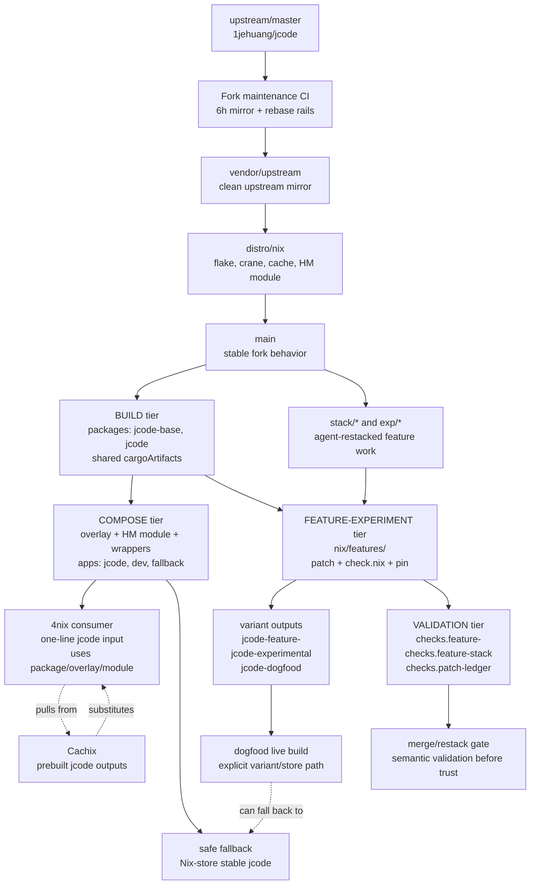

# Fork Sustainability Model

Date: 2026-06-27
Status: draft for John review, do not delete the self-destruct Serena memory until this draft is signed off
Scope: keeping a fast-moving upstream fork, in-repo Nix packaging, and large downstream personal feature work sustainable without turning 4nix into the control plane.

## 1. The problem

John is carrying three pressures in one repository.

First, upstream `1jehuang/jcode` moves fast. It changes regularly, sometimes deeply. A downstream fork that wants to stay close to that upstream cannot treat reconciliation as an occasional heroic event. It needs a routine, legible, low-drama update loop.

Second, John's fork is not just a personal code checkout. It is also the packaging source that 4nix consumes as a flake input. The fork must expose a stable package, overlay, Home Manager module, cacheable builds, and a clear upgrade path so `~/infrastructure/4nix` can consume `jcode` without learning all of jcode's internal maintenance machinery.

Third, John is doing substantial personal feature and experiment work inside jcode. This is not mostly maintenance work. It is not mostly a queue of intended upstream PRs. Much of it is customization, extension, dogfooding, and local harness integration that may never be upstreamable. The model must therefore support permanent downstream work without pretending every patch is on a path to upstream.

The lived goal is to dogfood the moving local build while keeping a Nix-packaged version available as the safe fallback. The failure mode to avoid is familiar: upstream churn plus personal experiments plus packaging drift becomes too confusing, the fork hardens into an accidental hard fork, or John abandons the tool.

The sustainability target is not "never diverge." The target is controlled divergence: know what is local, know why it exists, know how it is validated, know how expensive it is to test, and know which tier owns it.

This model must satisfy John's four explicit success criteria:

1. **Generalize.** The pattern should work for other fast upstreams, not only jcode.
2. **Dead-easy.** Adding or carrying a feature should be close to one obvious operation.
3. **Idiot-proof / me-proof.** The workflow should fail loudly and locally, not silently across 4nix, the daemon, or CI.
4. **Transparent.** The state of the fork, the patch stack, the package, and the running binary should be inspectable by a human.

## 2. The two hard constraints

Two constraints decide the shape of the model.

### Constraint A: repo containment

The rule is:

> **jcode owns everything thick; 4nix owns one line.**

4nix is a fan-in repository. Every host and many programs meet there. When too much application-specific machinery moves into 4nix, failures have the widest blast radius and the worst signal. The jcode fork should therefore own the reusable packaging and fork mechanics:

- package definition
- overlay
- Home Manager module
- wrapper policy
- dev shell and dogfood launcher policy
- feature variants
- patch metadata
- per-feature checks
- branch rails and sync scripts

4nix should consume the result with a small, boring surface:

```nix
jcode.url = "github:jerudnik/jcode/main";
# and then either pkgs.jcode or inputs.jcode.packages.${system}.jcode
```

This keeps the app-specific system inside the app fork. 4nix pins one revision and benefits from the cache. It does not become the patch-stack manager.

### Constraint B: compute frugality

The workflow must climb the cost ladder only as far as the question requires:

1. **Does it compile?** Use `cargo check -p <crate>` or `cargo check --workspace`.
2. **Does this behavior hold?** Use a targeted `cargo test -p <crate> <name>`.
3. **Does it work live in the dogfood daemon?** Use `selfdev build` or `selfdev build-reload` for the TUI target.
4. **Does it compose against the pinned Nix base and pass the integration gate?** Use `nix build .#<variant>` or `nix flake check`, preferably with cache hits.

Most questions belong on rungs 1 and 2. John was often jumping to rungs 3 and 4, which made development feel expensive and also worsened the "which binary is the daemon running?" confusion documented in `SELFDEV_NIX_DAEMON_DIVERGENCE.md`.

The important Nix fact is that the existing crane packaging already separates dependency artifacts from the final package. The `cargoArtifacts` dependency build is reused by the package and checks. The patch-ledger row about keeping the git stamp out of `buildDepsOnly` exists to preserve this cache stability. Therefore, Nix is not the inner edit loop, but it can be a frugal integration tier: unchanged dependencies and unchanged feature inputs should produce cache hits, and each variant can have its own store path and check.

## 3. Ground-truth divergence facts

The scary branch numbers were misleading.

`git cherry github/main main` showed that, of 35 local "ahead" commits, 27 were already present on `github/main` under different hashes. The 6-hour CI rebase rewrites history, so normal ahead/behind counts exaggerate real divergence. Only 8 commits were genuinely local-only: the current session's work. The real reconciliation job is to rebase those 8 onto `github/main`; duplicate patch-ids evaporate. `scripts/sync-local.sh` already implements this local reader model.

The real conflict surface is not the count of local commits. It is the files those commits edit. The prior analysis found 104 touched files:

- 44 new additive files
- 60 edits to files that also exist upstream

The 44 additive files are low-risk. They generally do not conflict on rebase. The 60 invasive edits are the real surface area. They touch deep internals such as `agent.rs`, `prompt.rs`, `session.rs`, `config.rs`, and `tool/mod.rs`. Every invasive edit converted into an additive seam, such as a hook, trait implementation in a new file, registry registration, config-provided adapter, or plugin-like boundary, moves work out of the conflict column.

The branch rails already exist:

- `vendor/upstream` is a clean upstream mirror.
- `distro/nix` is upstream plus reusable Nix packaging.
- `main` is stable fork behavior and features.
- `stack/<nn>-<topic>` is ordered downstream patch work.
- `pr/<topic>` is work intended for upstream PRs.
- `exp/<topic>` is disposable experimentation.

The automation already exists too. GitHub CI is the only writer of the authoritative fork rails. It mirrors upstream, rebases `distro/nix`, rebases `main`, and force-pushes with lease. The local clone is a reader that reconciles with `scripts/sync-local.sh`. Forgejo is currently best treated as a mirror/backup role until its intended authority is decided.

The Nix surface also already exists. `flake.nix` uses flake-parts and crane. It exposes:

- `packages.${system}.jcode`
- `packages.${system}.default`
- `overlays.default`
- `homeManagerModules.default`
- `homeModules.default`
- `devShells.${system}.default`

`docs/fork/patch-ledger.md` is the embryo of the next model. It already records each downstream patch's class, status, upstream reference, retire condition, and validation command. That table should become more than documentation. It should become an executable index of patch intent and validation.

## 4. The tiered model

Do not choose globally between a thin fork and a thick fork. Split by concern. Each tier should be only as thick as its job requires.

### Tier 1: BUILD

The build tier compiles Rust from a source tree. In this repo that means the crane package in `nix/package.nix`, called from `flake.nix`.

Proposed names:

- `packages.${system}.jcode-base`: the base package for the current fork source.
- `packages.${system}.jcode`: alias to the recommended stable daily package.
- `packages.${system}.default`: alias to `jcode`.
- internal `cargoArtifacts`: dependency artifacts shared by the base package, variants, and checks.

This tier is coupled to source. It is allowed to be thick because building is inherently coupled. Its job is to make the base package reproducible and cacheable, not to express every experiment.

Why the constraints pick this shape:

- Repo containment: all package logic stays in jcode.
- Compute frugality: crane dependency artifacts are reused, and CI/Cachix can populate the expensive outputs before 4nix consumes them.

### Tier 2: COMPOSE

The compose tier wraps or selects an already-built binary without editing upstream source.

It owns:

- `overlays.default`
- `homeManagerModules.default`
- `homeModules.default`
- `apps.${system}.jcode`
- `apps.${system}.dev`
- wrapper policy
- dogfood launcher policy
- safe fallback launcher policy

This tier should be thin and non-forking. It should touch zero Rust source. It is the 4nix-facing seam. The consumer should be able to say, "use the jcode fork's overlay/module/package," without learning how the fork is maintained.

Proposed flake app names:

- `apps.${system}.jcode`: run the Nix-store stable package.
- `apps.${system}.dev`: run the self-dev launcher policy from this checkout or dev shell.
- `apps.${system}.fallback`: explicitly run the cached/stable Nix package even when dogfood paths shadow it.

Why the constraints pick this shape:

- Repo containment: 4nix does not own the wrapper semantics.
- Compute frugality: selecting or wrapping an existing binary should not rebuild Rust.
- Idiot-proofing: dogfood and fallback become explicit commands, not accidental `$PATH` ordering.

### Tier 3: FEATURE-EXPERIMENT

The feature-experiment tier is for keepable but not-yet-upstreamable work that must ride a moving base.

The proposed artifact is a feature directory:

```text
nix/features/<name>/
  feature.toml      # metadata: status, owner, base pin, dependencies, retire condition
  patch             # git-format patch or patch series, if the feature is invasive
  check.nix         # feature-specific validation derivation
  README.md         # short human explanation and dogfood notes
```

A feature variant is a Nix function from base to base-prime:

```nix
base -> base.overrideAttrs (old: {
  patches = (old.patches or []) ++ [ ./nix/features/<name>/patch ];
})
```

Proposed output names:

- `packages.${system}.jcode-feature-<name>` for a single feature.
- `packages.${system}.jcode-experimental` for a selected stack of features.
- `packages.${system}.jcode-dogfood` for the current dogfood selection.
- `checks.${system}.feature-<name>` for the feature's validation.
- `checks.${system}.feature-stack` for the selected stack's validation.

This tier is "more than a patch, less than a package." It is pinned, composable, disposable, cacheable, and produces its own store path. It can coexist with `jcode` and `jcode-fallback`, which sidesteps launcher-shadowing confusion. If a feature breaks against upstream churn, the failure happens at the variant/check boundary with a named feature, not as a mystery inside 4nix.

This tier is honest about its limits. Patches over source are as brittle to upstream churn as a rebase. They only relocate the failure from `git rebase` to `nix build` or `nix flake check`. They are also slower than the cargo inner loop. Therefore this tier is not the place to edit minute-by-minute. It is the integration and dogfood tier for features that cannot yet be expressed as additive seams.

Why the constraints pick this shape:

- Repo containment: feature definitions live in jcode, not 4nix.
- Compute frugality: variants share the crane dependency cache and get their own cached checks.
- Transparency: each feature has a directory, metadata, patch, check, and retirement story.
- Idiot-proofing: deleting or disabling a feature is removing one directory or one registry entry, not unwinding scattered edits.

### Tier 4: VALIDATION

The validation tier turns the patch ledger into executable gates.

Today `docs/fork/patch-ledger.md` has rows like:

- patch name
- class
- status
- upstream ref
- retire condition
- validation command

The next step is to give each durable feature or shim a machine-checkable validation surface:

- `checks.${system}.feature-<name>` runs its `check.nix`.
- `checks.${system}.patch-ledger` verifies metadata completeness.
- `checks.${system}.feature-stack` validates the selected dogfood or experimental stack.

The patch ledger remains the human index, but feature metadata and checks become the machine index. A patch without a validation command is allowed only if explicitly marked research or draft. A permanent downstream feature must say how it is validated. A temporary shim must say when it retires.

Why the constraints pick this shape:

- Repo containment: validation lives beside the feature.
- Compute frugality: cheap validations run before expensive builds, and Nix checks can be cached.
- Transparency: the merge gate is visible in one table plus one flake check namespace.

## 5. The new VCS model framing

The model is not merely "use branches better." It is a new operating discipline:

> **agent-maintained patch stack + machine-checkable patch metadata + automated semantic validation as the merge gate.**

The old bottleneck for a large downstream patch stack on a fast upstream was merge labor. Agents make that labor cheaper. That changes the constraint. The hard question becomes not "can I afford to rebase?" but "can I verify that the rebase preserved semantics?"

This is the same force behind the drive-by-PR controversy, pointed inward. If patches are trivial to generate, review labor cannot be the only safety gate. The gate must be provenance, metadata, tests, evals, and checks.

In this model, patches become first-class objects. Each carries:

- intent
- provenance
- upstream relationship
- retire condition
- validation command
- optional base pin
- optional feature dependencies

An agent can restack them against moving upstream. The machine-checkable gates decide whether the restack is acceptable. Human review remains important for product judgment, but not as the only line of defense against mechanical churn.

Jujutsu (`jj`) is a serious option for the restacked stack. It stores conflicts instead of blocking the whole operation, makes a series of changes easier to reorder and rebase, and treats mutable patch stacks as a first-class workflow. The model does not require `jj` on day one, but it should remain an open implementation option for `stack/*` work.

## 6. End-to-end workflow map



## 7. Concrete proposed layout

### Branches

Keep the existing rails and make feature stack usage more explicit:

```text
vendor/upstream              # exact mirror of upstream/master, no edits
distro/nix                   # reusable Nix packaging, cache, flake, HM module
main                         # stable daily fork behavior, safe to pin from 4nix
stack/00-ledger              # optional metadata-only stack groundwork
stack/10-<feature>           # ordered downstream feature work
stack/20-<feature>           # next ordered feature
pr/<topic>                   # work intended for upstream PR
shim/<topic>                 # temporary compatibility workaround
exp/<topic>                  # disposable experiment over main
archive/<name>               # safety copy of old branch tips
```

Recommended policy:

- `main` contains stable downstream behavior that John is willing to carry continuously.
- `stack/*` contains ordered, restackable feature work before it graduates to `main` or to `nix/features/<name>`.
- `exp/*` contains work that may be thrown away.
- `pr/*` is kept clean enough to submit upstream.

### Directories

Proposed additions:

```text
docs/architecture/FORK_SUSTAINABILITY_MODEL.md      # this report
docs/architecture/FORK_SUSTAINABILITY_PRIOR_ART.md  # post-signoff research
docs/fork/patch-ledger.md                           # human index of durable patches
docs/fork/feature-schema.md                         # metadata contract for features

nix/features/default.nix                            # feature registry
nix/features/<name>/feature.toml                    # metadata
nix/features/<name>/patch                           # patch or series entrypoint
nix/features/<name>/check.nix                       # validation derivation
nix/features/<name>/README.md                       # human explanation

nix/variants.nix                                    # compose selected feature sets
nix/checks.nix                                      # patch-ledger and feature checks
nix/apps.nix                                        # dev/fallback app wrappers

scripts/fork-add-feature.sh                         # one-step feature skeleton
scripts/fork-feature-check.sh                       # run one feature's cheap gate
scripts/fork-restack.sh                             # future agent/jj/git restack helper
```

### Flake outputs

Proposed stable output namespace:

```text
packages.${system}.jcode-base
packages.${system}.jcode
packages.${system}.default
packages.${system}.jcode-feature-<name>
packages.${system}.jcode-experimental
packages.${system}.jcode-dogfood
packages.${system}.jcode-fallback

overlays.default
homeManagerModules.default
homeModules.default

apps.${system}.jcode
apps.${system}.dev
apps.${system}.fallback
apps.${system}.feature-<name>
apps.${system}.dogfood

checks.${system}.patch-ledger
checks.${system}.feature-<name>
checks.${system}.feature-stack
checks.${system}.nix-eval-surfaces

devShells.${system}.default
devShells.${system}.dogfood
```

The exact set can be smaller in the first prototype. The important naming rule is that stable, dogfood, fallback, and feature variants are separate names and, when built, separate store paths.

### Minimal feature metadata

Proposed `feature.toml` shape:

```toml
name = "example"
status = "permanent-downstream" # or temporary-shim, planned-upstream-pr, experiment
class = "feature(agent-tools)"
base = "main"                   # or a commit/pin if needed
owner = "john"
summary = "One-sentence human explanation."
retire_condition = "Keep unless upstream exposes equivalent extension seam."
validation = "nix build .#checks.x86_64-linux.feature-example"

[deps]
features = []

[dogfood]
default = false
```

### One-step add-a-feature recipe

The desired human workflow should be:

```sh
scripts/fork-add-feature.sh example --class feature(agent-tools) --status experiment
$EDITOR nix/features/example/README.md
$EDITOR nix/features/example/patch
scripts/fork-feature-check.sh example
```

What the script should do:

1. Create `nix/features/example/{feature.toml,patch,check.nix,README.md}`.
2. Add the feature to `nix/features/default.nix`.
3. Add or update the row in `docs/fork/patch-ledger.md`.
4. Expose `packages.${system}.jcode-feature-example`.
5. Expose `checks.${system}.feature-example`.
6. Print the cheap validation ladder:
   - `cargo check ...` if the patch is already applied in the worktree
   - `cargo test ...` if a test is named
   - `nix build .#jcode-feature-example --dry-run`
   - `nix build .#jcode-feature-example`

The first prototype should not implement the whole model. A good proof slice is one existing patch-ledger row converted into one feature directory, one variant output, and one check.

## 8. Recommended sequence

### Step 1: NS4 provenance stamping first

Do NS4 first because it is cheap, legible, and unlocks safer use of the cheap cargo loop.

NS4 means stamping build provenance into the binary and surfacing it in self-dev status/chrome:

- source checkout path
- commit
- dirty state
- build time or manifest ID
- whether the binary came from Nix, self-dev, or another source

This addresses the most confusing daily problem: "which binary is the daemon actually running, and from which checkout was it built?" It also supports repo containment because the fix lives in jcode, and compute frugality because it can be developed with `cargo check` and targeted tests before any live reload.

### Step 2: one Nix proof slice

After NS4, convert one existing downstream patch into the proposed feature-variant shape. Do not build the whole system at once. Choose one small row from `docs/fork/patch-ledger.md`, give it:

- `nix/features/<name>/feature.toml`
- `nix/features/<name>/patch`
- `nix/features/<name>/check.nix`
- `packages.${system}.jcode-feature-<name>`
- `checks.${system}.feature-<name>`

The proof question is not "can every feature move today?" It is "does one feature become more transparent, cacheable, and me-proof when expressed this way?"

### Step 3: drive the 60-file conflict surface toward zero

Audit the 60 invasive edits and classify each one:

- already additive
- can become an additive seam now
- needs a small upstreamable seam
- genuinely invasive downstream behavior
- should move into a Nix feature variant
- should move into config, MCP, tool registration, or another existing extension surface

The long-term objective is to shrink the conflict surface, not to eliminate local features. Every feature moved behind an additive seam makes upstream churn cheaper forever.

## 9. Open questions for John

These need human decisions before the draft is final:

1. **Where do the 8 real local commits live?** Should they stay on `main`, or should research/docs remain on `main` while non-upstreamable feature work moves to `stack/*` or `exp/*` until promoted?
2. **What is Forgejo's role?** Is it only a backup/mirror, or should it become the local authoritative copy for all three rails?
3. **Do we adopt Jujutsu for the patch stack?** Git is enough for the current rails, but `jj` may make restacking less painful and more transparent.
4. **What is the minimal feature triple?** Is `{patch, check.nix, feature.toml}` the right required set, or should the first version be even smaller?
5. **What should 4nix see?** Should 4nix always consume `packages.${system}.jcode`, or should it have an explicit option to select `jcode-dogfood` while retaining `jcode-fallback`?
6. **Which feature is the proof slice?** Candidates include a small compatibility shim with an existing targeted validation command.

## 10. Decision section placeholder

After this draft is signed off, run the wide prior-art and alternatives exploration and save it as `docs/architecture/FORK_SUSTAINABILITY_PRIOR_ART.md`. Then fold a short decision section back here summarizing:

- which tools or workflows are promising
- which are tried-and-fails for this use case
- which remain unknown
- which sidestep reframes John accepts or rejects

Do not delete the self-destruct memory until this report is finalized and saved. Do not run the wide exploration until John signs off on this draft.
