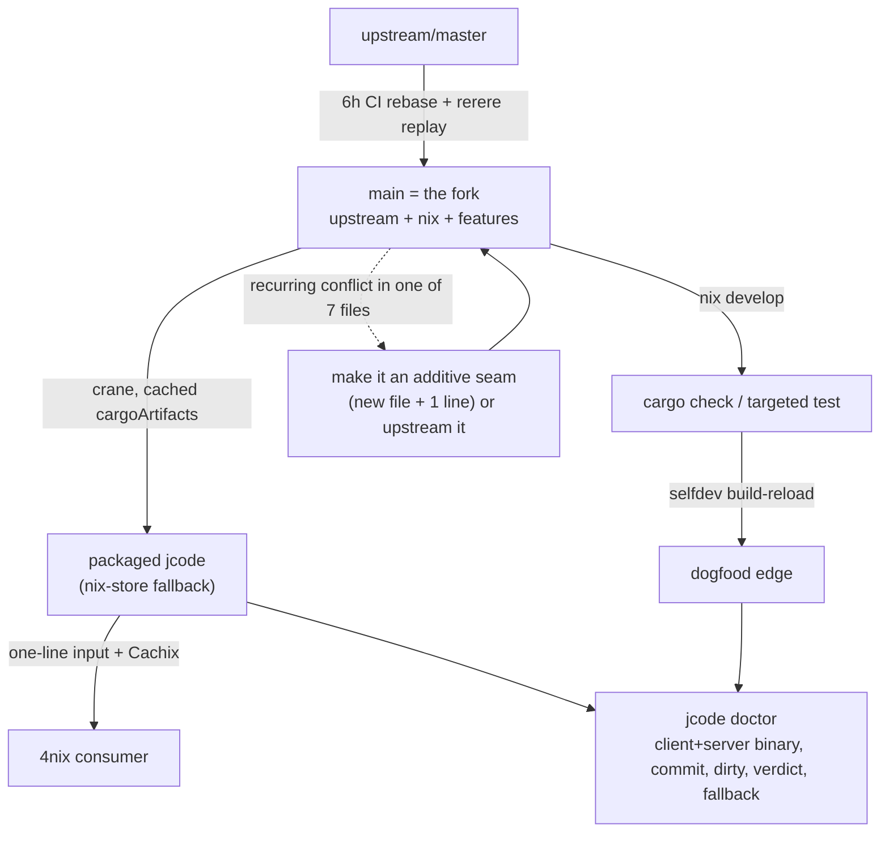

# Fork Sustainability Model

Date: 2026-06-27
Status: cut-down target. Supersedes the prior tiered/feature-variant draft.
Scope: keep a fast-moving upstream fork + in-repo Nix packaging + personal feature
work sustainable, with the *minimum* machinery that actually pays for itself.

## TL;DR

> **`main` is the fork. CI rebases it on upstream. `rerere` remembers your conflict
> fixes. New features add files; they don't edit upstream. `doctor` says which
> binary is running. That's the whole model.**

Everything else the earlier draft proposed (BUILD/COMPOSE/FEATURE/VALIDATION tiers,
Nix "feature variants" and "stacks", named daemon instances, an "executable patch
ledger") is deleted. It was machinery for a problem this fork does not have.

## The reframe: you don't have a patch-stack problem

The earlier draft modelled this as "carrying a large downstream patch stack on a
fast upstream" and reached for patch-queue tooling (quilt/StGit/jj), Nix patch
composition, and provenance gates. The repo's own numbers say that framing is wrong:

| Claimed problem | Ground truth (measured 2026-06-27) |
|---|---|
| "large divergent patch stack" | 30 feature commits on `main` over `distro/nix`; 9 packaging commits. Small. |
| "104-file conflict surface" | 107 files touched, but 47 are **new files** (cannot conflict) and most of the 60 "edits" are **pure insertions** (0 deletions). |
| "deep invasive edits to agent.rs/prompt.rs/session.rs" | Those files are touched by **adding** lines (hooks/registrations), not rewriting them. Only **7 source files** delete >5 upstream lines: `provider-anthropic/lib.rs` (58), `mcp/protocol.rs` (17), `skill.rs` (18), `acp.rs` (19), `terminal-launch/lib.rs` (10), `config.rs` (8), `tui/mod.rs` (7). |
| "scary 35-ahead divergence" | `git cherry` showed 27 of 35 were already upstream under new hashes; the 6h CI rebase rewrites history so ahead/behind always lies. |

A fork whose divergence is "30 commits, mostly additive, 7 files with real
rewrites" is not a patch-queue problem. It is a **routine rebase with a handful of
recurring conflict points**. The correct tool for that is not a new abstraction.
It is `git rerere` plus discipline about where new code goes.

## The two constraints still hold (they just need less)

1. **Repo containment.** jcode owns packaging; 4nix owns one line
   (`jcode.url = github:jerudnik/jcode/main`). Already true. Keep it.
2. **Compute frugality.** Climb the cost ladder only as far as the question needs:
   `cargo check` -> targeted `cargo test` -> `selfdev build-reload` -> `nix build`.
   Nix is the environment and the fallback, never the inner loop.

Neither constraint requires tiers or feature variants. They're satisfied by the
flake that already exists.

## What you already have (don't rebuild it)

- **CI rebase rails** (`vendor/upstream` -> `distro/nix` -> `main`, every 6h,
  `--force-with-lease`). This is the writer of record.
- **`scripts/sync-local.sh`** reconciles the local clone (rebase, auto-stash,
  abort-clean on conflict).
- **Crane package** with `cargoArtifacts` split out, so deps stay cached across
  builds and across 4nix; Cachix serves prebuilt binaries.
- **`jcode-build-meta`** already stamps `VERSION`, `GIT_HASH`, `GIT_DATE`,
  `GIT_TAG`, dirty state into every binary at compile time.
- **`docs/fork/patch-ledger.md`** records intent/retire/validation per patch.
- **`.fork.toml`** drives the fork tooling.

That is ~90% of a sustainable fork. The gaps are two cheap things.

## The two changes worth making

### Change 1 (do first): turn on `rerere`. It is the missing piece.

The whole pain of "fast upstream + recurring conflicts in the same 7 files" is
exactly what `git rerere` ("reuse recorded resolution") was built for: it records
how you resolved a conflict hunk and **replays it automatically** next time the
same hunk reappears. On a branch you rebase every 6 hours, you resolve each
recurring conflict *once*, ever.

- Enable it in the repo and, crucially, **in the CI rebase job** so the bot's
  rebases self-heal instead of failing into manual reconciliation.
- Optionally persist/share the `rr-cache` so local and CI agree on resolutions.
- This is one `git config rerere.enabled true` + caching the resolution store. No
  new files, no new concepts, no jj migration required.

Source: Git Pro book, "Rerere" (git-scm.com/book/en/v2/Git-Tools-Rerere) -- the
documented use case is *exactly* "keep a branch rebased without re-resolving the
same conflicts each time."

### Change 2: a `jcode doctor` line that names the running binary.

The real daily confusion (documented in `SELFDEV_NIX_DAEMON_DIVERGENCE.md`) is
"which binary is the daemon, from which checkout?". `build-meta` already holds the
answer; nothing surfaces it together with origin (nix vs selfdev vs source) and
the daemon's socket/commit. Add one `doctor` view:

```
client:  <path>  origin=<nix|selfdev|source>  <version> <hash><-dirty?>
server:  <socket> <path>  origin=...  checkout=~/infrastructure/jcode  <hash>
verdict: same binary | compatible | RECONNECT (build mismatch)
fallback: nix run .   (or Home-Manager jcode)
```

Build it as a CLI subcommand (cheap, cargo-testable in a sandbox). The
"verdict/reconnect" line is the only protocol work, and it is a small handshake
field, not a new negotiation framework. Defer named daemon instances entirely
until/unless this proves insufficient.

## The one durable habit: additive seams, not edits

The measurements show why this is the lever. Conflicts come from the 7 files that
*delete* upstream lines, not from the 47 new files or the insert-only edits.
So the standing rule for every new feature is:

> **Prefer adding a new file + one registration line over editing an upstream
> file. Every upstream line you delete is a future merge conflict; every line you
> add in a new module is free.**

When a feature genuinely needs to change upstream behavior, treat the repeated
conflict as a signal to push a tiny **extension seam** (a hook, a trait impl in a
new file, a registry entry, a config-driven adapter) -- ideally upstreamed, since
upstream merging a 5-line seam removes your conflict forever. This is the
"upstream-first / shrink the patch" discipline that Yocto (`bbappend`), Android
Treble, and the nixpkgs `patches = [...]` idiom all converge on: **don't carry
edits you can carry as additions.**

Concretely, walk the 7 rewrite-files and ask, for each, "can this become an
insert + seam?" That work, not new tooling, is what keeps rebases boring.

## What to do with the personal features

Decision rule (replaces the FEATURE-EXPERIMENT tier):

- **In the fork, as additive code** -> default for anything that needs to run
  inside the agent loop (personas, dynamic context, turn hooks). Keep it on `main`.
- **As an external MCP/ACP tool or config** -> anything that can be a tool surface
  or a setting (the app already loads `.jcode/mcp.json`, skills, MCP servers).
  Zero fork divergence; survives every upstream rebase untouched.
- **Upstreamed** -> any change that is really an extension seam others would want.

There is no fourth "Nix feature variant" home. If a feature ever truly needs a
separate binary identity, `pkgs.jcode.overrideAttrs { patches = [...]; }` is a
one-liner you can add *that day* -- it does not need to be designed now.

## Prior-art verdicts (why the heavy options were cut)

| Option | Verdict for this fork | Why |
|---|---|---|
| `git rerere` | **ADOPT** | Purpose-built for repeated-rebase conflicts; zero new structure. |
| Additive seams + upstream-first | **ADOPT** | Targets the actual 7-file conflict source. |
| Crane cached build + Cachix | **KEEP** | Already gives frugal Nix integration + fallback. |
| `build-meta` provenance in `doctor` | **ADOPT (small)** | Data already exists; just surface it. |
| jj (Jujutsu) for a restacked stack | **DEFER** | Real strength is large reorderable stacks; you have 30 mostly-additive commits. Revisit only if rerere+seams stop coping. |
| quilt / StGit / topgit / patch queues | **REJECT** | Heavyweight patch-series managers for a problem git rebase + rerere already solves. |
| Nix "feature variants"/"stacks", `nix/features/<name>/{patch,check.nix}` | **REJECT** | Invents a patch-composition system to avoid editing source you mostly aren't editing. `overrideAttrs.patches` exists if ever needed. |
| Named daemon instances, compat-negotiation framework | **DEFER** | One `doctor` verdict line covers the real risk; instances add session/state questions you don't have yet. |
| Hard fork (stop pulling) | **REJECT** | Upstream moves fast and you want its work; the cost of staying current is now low. |
| Pure upstream-first (carry ~0 patches) | **PARTIAL** | Right direction for seams; but the personal agent features are the point of the fork, so some stay downstream. |

Sources: Git Pro "Rerere"; nixpkgs manual `overrideAttrs`/`patches` and overlays
(nixos.org/manual/nixpkgs); the repo's own divergence measurements and existing
`flake.nix` / CI / `sync-local.sh`.

## The whole workflow, on one page



Daily loop:

```sh
cd ~/infrastructure/jcode
scripts/sync-local.sh --check     # drift? (rerere auto-replays known conflicts)
nix develop; cargo check; cargo test -p <crate> <test>
selfdev build-reload; jcode doctor
# new feature: add a file + one registration line. Don't delete upstream lines.
```

## Sequence (each step independently shippable, cheapest first)

1. **Enable `rerere`** in the repo and the CI rebase job; persist `rr-cache`.
2. **`jcode doctor`** binary-identity view from `build-meta` (+ a single
   compat-verdict handshake field).
3. **Shrink the 7 rewrite-files** toward additive seams, upstreaming the seams.
4. Keep `patch-ledger.md` as the plain-doc index of why each downstream change
   exists and when it retires. No "executable ledger".
5. Everything else (jj, feature variants, named daemons) stays **deferred** until
   a concrete failure justifies it.

## Open questions for John

1. Accept the reframe: this is a small clean fork, not a patch stack?
2. OK to enable `rerere` in CI and cache `rr-cache` (shared local+CI)?
3. `jcode doctor` as a CLI subcommand first (not a TUI panel)?
4. Want me to do the 7-file additive-seam audit as the next concrete task?
