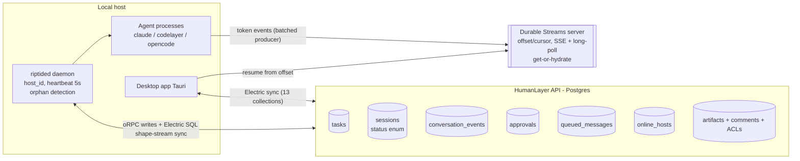

<!-- Promoted 2026-07-10 from the closed notes workstream projects/jcode/proposals/orchestration-hardening/_attachments/ (HumanLayer/riptide prior art). Durable design/runbook home is here; PM history remains in notes archive. -->

---
title: HumanLayer as orchestration prior art for jcode swarm
type: research
created: 2026-07-04
---

# HumanLayer (riptide) orchestration — prior art for jcode swarm

Timeboxed investigation (~35 min) of the installed HumanLayer app (CLI 0.27.23,
riptided v0.126) via `--help` recursion, `~/.humanlayer/riptide/` local state,
daemon JSONL logs, and `strings` on the bundled `riptided` binary. No mutating
API calls were made.

## 1. Architecture sketch

Key mechanics, each observed directly:

- **Daemon owns processes, cloud owns state.** riptided detects the claude
  binary, spawns/resumes agent runs, heartbeats `hosts.heartbeat` every 5s
  with 5-attempt retry, does orphan detection via ppid polling, and on
  SIGTERM interrupts running sessions and pushes a "shutdown notification
  (sessionsUpdated: N)" so cloud state never shows phantom running sessions.
  (Evidence: `riptided-prod-*.jsonl` logs: "Heartbeat started (interval:
  5000ms)", "Orphan detection started", "Received shutdown signal,
  interrupting running sessions", "Shutdown notification sent".)
- **Control plane is replicated state, not RPC.** The daemon subscribes to
  Electric SQL shape streams of the `sessions` table and treats status
  transitions as commands: an update to `status="resuming"` or
  `"interrupt_requested"` triggers local action ("Update for session X synced
  with status changing to resuming" / binary strings matching
  `change.value.status === "interrupt_requested"`). Clients never call the
  daemon directly; they write a row and sync does the rest.
- **Explicit session status enum**: `draft, ready_for_launch, launching,
  running, ready_for_input, needs_approval, failed, interrupt_requested,
  interrupted, resuming` (from `sessions update-status --help` + binary).
- **Durable streams = data plane only.** Token/tool-call events go through a
  producer with batching, 5s flush timeout, detach finalizers, and
  Sentry-tagged failure classes (`durable_stream_producer_batch|finalizer|
  cleanup_flush`). Consumers resume via `offset` + `cursor`
  (`resumingFromPause`, ShapeStream `fetchNext(offset, cursor, ...)`), SSE
  with automatic long-polling fallback. `durable-streams sessions
  get-or-hydrate` rebuilds a missing stream from the DB (`status:
  created|hydrated|exists`; daemon logs "Stream hydration complete").
  Producer failures degrade to lost live-tail, never lost state.
- **Queued messages instead of interrupting.** `queued_messages` table with
  `preferBatchQueueDelivery` ("deliver all queued messages at once vs one per
  ready_for_input cycle") plus a `send-now` escalation. Messages to a busy
  agent are durable rows, not dropped DMs.
- **Approvals are rows + learning.** Daemon creates an approval row and
  awaits resolution via sync ("Approval created, waiting for resolution" /
  "Approval resolved", including idempotent "Approval already resolved
  (initial state check)"). `approvals resolve` carries `--applied-suggestions`
  (addRules / setMode / addDirectories) so a human decision updates the
  permission policy, not just the single call.
- **Sessions sprawl is managed by tasks.** Tasks group sessions, artifacts,
  worktrees; sessions carry `labels` (rpi phase), `structured_summary`
  (summaryHistory), `archived`, fork lineage (`forked_from_session_id`,
  fork-at-event-id, `--archive-source`), and per-session accounting:
  `context_window_tokens/limit`, `total_cost_usd`, `model_usage` per model
  (all visible in `sessions list` output).
- **Local vs cloud split**: any number of hosts register in `online_hosts`
  (heartbeat-backed); `sessions launch --host-id` targets a specific host.
  Same UI on web/desktop/mobile; agents keep working when the laptop UI
  closes because the daemon, not the client, owns the process. Terminal
  Claude sessions are integrated purely via hooks that map lifecycle to the
  same status enum (`hook stop` → ready_for_input, `hook permission-request`
  → waiting approval).

## 2. Borrow / adapt / skip vs jcode swarm pain points

| HumanLayer primitive | jcode pain point | Verdict | Why |
|---|---|---|---|
| Command-as-state (status column transitions drive the daemon) | F1 driver stall, F4 coordinator desync | **Borrow** | No "assign" RPC to fail or race. Coordinator writes desired state; workers reconcile. Desync becomes impossible by construction: there is one table. |
| Explicit status enum incl. `interrupt_requested`/`resuming` | F2 premature wakes | **Borrow** | Wakes stay hints; a truncated report is detectable because status is not `ready_for_input`. Matches our runbook rule "state lives in plan_status". |
| Durable streams w/ offset resume + get-or-hydrate | F2 truncated reports, wedged tails | **Adapt** | Full Electric/durable-streams server is overkill locally. Adapt as: append-only JSONL per session + byte-offset resume + rebuild-from-session-log fallback. |
| Queued messages (`send-now`, batch-vs-per-cycle delivery) | Coordinator DMs lost when worker busy; F3 nudging | **Borrow** | Durable nudge channel. "DM the worker to file complete_node" becomes a queued message delivered at next ready_for_input, guaranteed. |
| Approvals as rows + applied-suggestions policy learning | Human-gate approvals | **Adapt** | Rows + idempotent resolve: yes. Suggestion-driven permission rules: later, nice-to-have. |
| Heartbeat + orphan detection + shutdown status flush | Stale `ready` workers, phantom sessions | **Borrow** | Cheap. Every jcode worker heartbeats; missed N beats → coordinator marks node orphaned and reassigns. Daemon death can't strand `active` nodes. |
| Tasks grouping + archived flag + structured_summary + fork lineage | Session sprawl | **Adapt** | jcode has initiatives/plans; add archive + rolling structured summary + per-session token/cost columns to the swarm store. |
| Per-session `model_usage` / `total_cost_usd` / context window in list API | Token budgets, rate limiting | **Borrow** | Accounting at the session-row level makes budget enforcement a coordinator query, not guesswork. Heartbeat RPC retry-with-backoff pattern doubles as rate-limit hygiene. |
| Cloud-hosted daemons, multi-host `online_hosts` | (none today) | **Skip** | Single-machine swarm. Keep `host_id` concept only if remote workers ever land. |
| Electric SQL sync engine, 13 replicated collections | — | **Skip** | Massive dependency; jcode needs one process + SQLite, not multi-client replication. |
| RPI workflow phases + auto-advance flags | Plan DAG semantics | **Skip/inspiration** | Our DAG is more general; auto-advance-on-completion flags are a nice pattern for gate nodes but not a priority. |

## 3. Top 3 recommendations

1. **Move swarm truth into a single reconciling store (command-as-state).**
   SQLite table per swarm: sessions + nodes with `status` and
   `desired_status` columns. Coordinator writes desired status
   (`assigned`, `interrupt_requested`); a worker-side reconcile loop acts on
   transitions; completion is an idempotent row update (with coordinator
   allowed to finalize on the worker's evidence), killing the F3 owner-only
   deadlock and F4 desync (resync = re-read table). **Effort: ~1-2 weeks**,
   the largest but it structurally removes three of four failure classes.
2. **Durable per-session event log with offset resume + hydrate fallback.**
   Append-only JSONL of typed lifecycle events (status change, report,
   artifact) per session; readers resume from byte offset; a
   `get-or-hydrate` equivalent rebuilds from the session transcript if the
   log is missing. Wake payloads shrink to "session X advanced past offset
   Y, go read". Fixes truncated-report F2 symptoms and makes backstop-timer
   rechecks cheap and idempotent. **Effort: ~3-5 days.**
3. **Queued messages + heartbeat/orphan detection for workers.**
   (a) Durable message queue per worker with deliver-on-ready_for_input and
   send-now escalation, replacing fire-and-forget DMs. (b) 5s-style worker
   heartbeats with coordinator-side orphan marking and status flush on
   graceful shutdown. Together these close the F1 stall (stalled binding is
   observable and retried against live workers only) and stale-`ready`
   ambiguity. **Effort: ~2-4 days.**

## Evidence index

- `humanlayer --help`, `daemon --help`, `api --help`, `api sessions
  {create,launch,fork,continue,interrupt,update-status,list,events,
  queued-messages} --help`, `api durable-streams sessions get-or-hydrate
  --help`, `api approvals resolve --help`, `api tasks create --help`,
  `api sync v2 --help`, `hook --help` (command output, this session).
- `~/.humanlayer/riptide/logs/riptided-prod-*.jsonl` (heartbeat, orphan
  detection, stream hydration, approval lifecycle, resuming-status sync,
  durable-stream flush failures, graceful shutdown).
- `~/.humanlayer/riptide/logs/riptide-native-*.log` (13 Electric-synced
  collections enumerated at app boot).
- `strings /Applications/HumanLayer.app/Contents/Resources/bin/riptided`
  (DurableStream producer/consumer internals, offset/cursor resume,
  queued_messages schema + preferBatchQueueDelivery, status-transition
  watchers, orphan/heartbeat implementation).
- `humanlayer api sessions list --limit 3` (read-only GET: session row shape
  incl. model_usage, cost, context window, labels, structured_summary).
- <https://humanlayer.dev/docs> (local/cloud daemon topology, tasks/artifacts
  model); <https://github.com/humanlayer/humanlayer> (public repo is
  deprecated; current riptide code is closed).

## What I did not check

- Never launched the daemon or created/modified any resource; only `--help`,
  local files, and one `sessions list` GET.
- Did not call `durable-streams get-or-hydrate` (it can create a stream, so
  treated as mutating).
- Bifrost MCP was not connected; no sourcebot/exa search of their code. The
  public GitHub repo is explicitly deprecated, so all internals come from
  binary strings + logs, which show mechanics but not server-side scheduling
  (e.g. how the API arbitrates two daemons claiming one session, exact
  durable-stream server storage/retention, rate-limit specifics).
- Did not inspect the cloud API surface beyond CLI contracts; no view into
  their Postgres schema beyond what leaked into the bundled Drizzle schema
  strings.
- Token-budget enforcement (if any beyond reporting) not observed.
