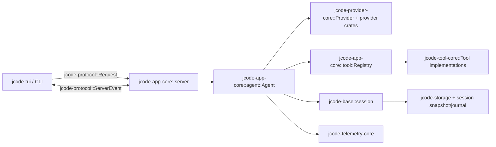

# Jcode Assistant Module Fit Blueprint

This blueprint tightens the assistant/homelab architecture into implementation-ready modules that fit the current Jcode crate boundaries. It intentionally does **not** introduce a gateway-first architecture. The first runtime primitive is an interaction routing engine that runs beside the TUI/interaction loop and chooses direct provider, MCP, tool, local-node, or async-node paths.

## Existing architecture to preserve

Current Jcode flow is already close to the desired shape:



Keep these layering rules:

- Pure shared data types live in `jcode-*-types` crates.
- Session model, session storage paths, and local persistence live in `jcode-base` and `jcode-storage`.
- Runtime orchestration lives in `jcode-app-core`.
- Presentation lives in `jcode-tui` and focused `jcode-tui-*` crates.
- Provider choice uses `jcode-provider-core::Provider`, `RouteSelection`, and provider crates.
- Tool execution uses `jcode-app-core::tool::Registry` and `jcode-tool-core::Tool`.
- Do not make lower layers depend on TUI crates.
- Do not build the first cut around `jcode-gateway-types`; that crate currently models paired-device gateway concepts, not the interaction routing engine.

## Module 1: Session Evidence Spine

### Purpose

Create the durable evidence record that every other module can depend on: turn starts, prompts, provider route choices, tool calls/results, memory reads/writes, context injections, validation runs, task outcomes, git state, node identity, and parent/child session links.

### Fit in existing architecture

- Types: extend `crates/jcode-session-types/src/lib.rs` or split into `crates/jcode-session-types/src/evidence.rs` and re-export.
- Persistence: add `crates/jcode-base/src/session/evidence.rs` plus storage-path helpers near `crates/jcode-base/src/session/storage_paths.rs`.
- Low-level append: reuse `jcode-storage::append_json_line_fast`.
- Instrumentation seams:
  - `jcode-app-core/src/agent/turn_execution.rs` for turn lifecycle.
  - `jcode-app-core/src/agent/turn_loops.rs` and `turn_streaming_mpsc.rs` for provider/tool streaming events.
  - `jcode-app-core/src/tool/mod.rs::Registry::execute` for all native tool execution.
  - `jcode-app-core/src/agent/provider.rs` for provider/model/route changes.
  - `jcode-app-core/src/tool/session_search.rs` for search integration.
- UI seam: add protocol events later through `jcode-protocol::ServerEvent`, then render in `jcode-tui`.

### Minimal API

```rust
pub struct SessionLogEvent {
    pub schema_version: u16,
    pub event_id: String,
    pub sequence: u64,
    pub timestamp: DateTime<Utc>,
    pub session_id: String,
    pub parent_session_id: Option<String>,
    pub node: NodeSnapshot,
    pub git: Option<GitSnapshot>,
    pub correlation: CorrelationIds,
    pub kind: SessionLogEventKind,
}

pub enum SessionLogEventKind {
    TurnStarted { input_chars: usize },
    ProviderRequest { provider: String, model: String, route: Option<String> },
    ProviderResponse { stop_reason: Option<String>, token_usage: Option<StoredTokenUsage> },
    ToolStarted { tool_name: String, tool_call_id: String, input_hash: String },
    ToolFinished { tool_name: String, tool_call_id: String, ok: bool, output_hash: String },
    MemoryAccess { action: String, ids: Vec<String> },
    ContextInjected { source: String, token_estimate: usize, redaction_count: usize },
    ValidationRun { suite: String, ok: bool, artifact: Option<String> },
    TaskOutcome { status: String, summary: String, commit: Option<String> },
}
```

Keep large payloads out of the event row. Store hashes, byte counts, and optional artifact paths so session logs stay cheap to append and safe to search.

### First implementation slices

1. Define event types and JSONL writer/reader.
2. Append `TurnStarted`, `ProviderRequest`, `ToolStarted`, and `ToolFinished` events.
3. Teach `session_search` to include event text when searching current Jcode sessions.
4. Add golden tests for append/read/replay count and search hits.

### Verification

- `cargo test -p jcode-session-types`
- `cargo test -p jcode-base session::evidence`
- `cargo test -p jcode-app-core session_search`

## Module 2: Interaction Routing Engine

### Purpose

Choose where and how work runs for each interaction: direct provider route, MCP/tool route, local foreground execution, background task, swarm/subagent, or later remote homelab node. This is not an LLM gateway. It is a local policy and placement engine beside the interactive loop.

### Fit in existing architecture

- Types: add a small `crates/jcode-routing-types` crate only if shared by app-core, protocol, and TUI. If the first slice stays app-core-only, start in `crates/jcode-app-core/src/routing.rs` and extract later.
- Runtime owner: `jcode-app-core::agent::Agent` owns an `InteractionRouter` field or creates one per turn from config/runtime state.
- Provider route seam: use existing `jcode-provider-core::RouteSelection`, `Provider::set_route_selection`, `Agent::set_route_selection`, and model catalog APIs.
- Tool route seam: wrap or call from `Registry::execute`; do not change `Tool` implementations first.
- Background/async seam: reuse existing background task and swarm/session machinery before adding new daemons.
- TUI seam: expose routing decisions as `ServerEvent::RoutingDecision` only after decisions exist in app-core.

### Minimal API

```rust
pub struct InteractionRouteRequest {
    pub session_id: String,
    pub turn_id: String,
    pub task_class: TaskClass,
    pub latency_budget_ms: Option<u64>,
    pub required_capabilities: Vec<Capability>,
    pub preferred_provider: Option<RouteSelection>,
}

pub struct InteractionRouteDecision {
    pub target: RouteTarget,
    pub reason: String,
    pub confidence: f32,
    pub fallback: Option<RouteTarget>,
}

pub enum RouteTarget {
    LocalForeground,
    LocalBackground,
    Provider(RouteSelection),
    Tool { name: String },
    SwarmWorker,
    HomelabNode { node_id: String },
}
```

### First implementation slices

1. Route only provider/model choices and record decisions into the evidence spine.
2. Add task-class classification for foreground turn, background-safe tool, eval/build, and summarization.
3. Add a node inventory type with only the local node and static config entries.
4. Later add remote-node execution through explicit worker protocols. Do not introduce Bifrost or a gateway dependency in the first cut.

### Verification

- Unit tests for deterministic routing decisions from synthetic capabilities and latency budgets.
- App-core tests proving provider selection still flows through `RouteSelection`.
- Session evidence tests proving every route decision is recorded.

## Module 3: Context Module

### Purpose

Provide bounded, inspectable context accumulation from sources such as session history, git state, shell context, screen capture references, and later Screenpipe-like capture. External tools are inspiration only.

### Fit in existing architecture

- Types: add context-source and context-injection records to `jcode-session-types` if they are persisted, or `jcode-protocol` if only displayed.
- Runtime owner: `jcode-app-core/src/agent/prompting.rs` and turn setup, because prompt construction is the place where context becomes model input.
- Tool surface: optional `context` tool later, implemented as a normal `jcode-tool-core::Tool`.
- Evidence: every injected context bundle emits `SessionLogEventKind::ContextInjected`.
- UI: context inspector panel should render from bounded summaries, not raw captured data.

### First implementation slices

1. Define `ContextProvider` trait in app-core with `collect(ContextBudget) -> ContextBundle`.
2. Implement providers for existing session/git/task context only.
3. Add redaction/budget accounting before model injection.
4. Add Screenpipe-inspired provider later behind explicit config, off by default.

### Verification

- Unit tests for budget enforcement and redaction counts.
- Golden prompt-shape tests that injected context is visible, bounded, and evidenced.

## Module 4: Memory Module

### Purpose

Make memory more robust by adding provenance, review, conflict/supersession, and evidence-backed reads/writes without replacing the current memory manager all at once.

### Fit in existing architecture

- Existing types: `crates/jcode-memory-types/src/lib.rs` already has `MemoryEntry`, `MemoryCategory`, `MemoryScope`, confidence, reinforcement, supersession, source, and prompt formatting.
- Existing tool: `jcode-app-core/src/tool/memory.rs` is the first write/read surface.
- Persistence owner: current `MemoryManager` paths in app-core/base should remain the source of truth until a separate store is justified.
- Evidence: memory tool calls append `MemoryAccess` events with ids/actions.
- UI: add review/inspector surfaces after provenance exists.

### First implementation slices

1. Add provenance fields if missing: source session, source event id, source tool call id, source commit, and review state.
2. Emit evidence on `remember`, `recall`, `search`, `forget`, `tag`, `link`, and `related`.
3. Add a review command/tool mode that lists unreviewed memories and conflicts.
4. Only then consider embeddings or graph upgrades.

### Verification

- `cargo test -p jcode-memory-types`
- App-core memory tool tests for provenance and event emission.
- Regression that prompt memory formatting remains stable.

## Module 5: Computer-use Module

### Purpose

Generalize computer use into provider-backed observation/action/trace without making it proactive or unsafe.

### Fit in existing architecture

- Existing implementation: `jcode-app-core/src/tool/computer/` is a macOS-specific tool behind `cfg(target_os = "macos")`.
- First refactor: split platform mechanisms into provider traits within that module or a future `jcode-computer-use-types` crate.
- Keep execution through the normal `Tool` registry. Do not create a parallel actuator path.
- Evidence: every observe/action emits tool events plus optional computer trace events.
- TUI: trace panel later consumes evidence/protocol summaries.

### First implementation slices

1. Add an internal `ComputerProvider` trait for observe, locate, and act.
2. Move current macOS code behind `MacosComputerProvider` without changing tool schema.
3. Add `ComputerTraceEvent` summaries for observe/action/result.
4. Add Linux/browser providers only after the trace model is stable.

### Verification

- Existing computer tests still pass.
- Dry-run and mutating-action gating remain intact.
- Trace event tests do not require macOS.

## Module 6: Local Durable Object Substrate

### Purpose

Give long-lived harness entities stable identities and append-only state transitions without introducing a distributed database too early.

### Fit in existing architecture

- Start with typed logs adjacent to existing session and background-task persistence.
- Candidate objects: SessionObject, TaskObject, MemoryObject, ContextStreamObject, AgentObject, ToolRunObject.
- Type definitions can live in a new `jcode-durable-types` crate only after at least two modules share them.
- Runtime manager starts in `jcode-app-core`, not as a separate service.
- Homelab sync comes later as export/import or worker replication, after local object logs are stable.

### First implementation slices

1. Treat the session evidence spine as the first durable object log.
2. Add object id conventions and snapshot helpers only when a second object log appears.
3. Keep object logs local-first JSONL with snapshot compaction.
4. Add remote sync as a separate milestone, not a prerequisite.

### Verification

- Append/read/snapshot tests.
- Migration tests from old session records to object-backed records if a migration is introduced.

## Module 7: Evaluation and Self-improvement Harness

### Purpose

Make harness changes measurable: replay sessions, run prompt/tool/eval suites, attach outcomes to commits, and use evidence logs to decide whether a change improved the harness.

### Fit in existing architecture

- Existing seams: `crates/jcode-app-core/src/replay/`, `session_search`, `selfdev`, background tasks, and session persistence.
- Types: add eval run summaries to `jcode-session-types` or a future `jcode-eval-types` only when shared with protocol/TUI.
- Runtime: start as CLI/dev tooling and `selfdev` integration, not an always-on service.
- Promptfoo is an external inspiration/reference runner. First-class Jcode eval records should be independent of Promptfoo.

### First implementation slices

1. Define `EvaluationRun` and `EvaluationCaseOutcome` records.
2. Add a local eval runner that replays stored session fixtures and checks deterministic invariants.
3. Record eval outcomes as session evidence and git/task outcomes.
4. Add Promptfoo export/import only after Jcode-native records exist.

### Verification

- Reproducible fixture tests.
- `selfdev test` or targeted cargo tests that produce evidence events.
- Commit/task outcome records include git SHA and dirty marker.

## Module 8: Observability Export

### Purpose

Export evidence and runtime metrics to OpenTelemetry/OpenObserve-like stacks without making observability storage the source of truth.

### Fit in existing architecture

- Existing local telemetry: `jcode-telemetry-core` already records session, turn, provider, memory, tool, token, and error information.
- Local truth: evidence logs and session journals stay authoritative.
- Exporter: add an optional app-core exporter or telemetry-core sink that tails structured evidence and emits OTel-compatible payloads.
- Homelab: high-capacity nodes can retain and query exported telemetry later.

### First implementation slices

1. Add a file exporter from evidence JSONL to newline-delimited OTel-ish JSON.
2. Add OpenObserve HTTP sink later behind config.
3. Include correlation ids shared with evidence events.

### Verification

- Exporter unit tests from fixture evidence logs.
- No network dependency in default tests.

## PR-sized implementation order

1. **Evidence types and writer**: `jcode-session-types`, `jcode-base`, `jcode-storage` reuse.
2. **Tool/provider/turn instrumentation**: `jcode-app-core` emits first evidence events.
3. **Session search over evidence**: extend `session_search` with event text.
4. **Interaction router MVP**: app-core-only router that records route decisions and still calls existing provider/tool APIs.
5. **Context provider MVP**: session/git/task context with budgets and evidence.
6. **Memory provenance/review**: extend current memory model/tool, not a rewrite.
7. **Computer-use trace refactor**: provider trait inside current computer tool.
8. **Eval runner MVP**: replay fixtures and attach outcomes to evidence.
9. **Optional observability export**: file first, OpenObserve later.
10. **Homelab remote workers**: only after local routing/evidence contracts are stable.

## Non-goals for the first cut

- No LLM/MCP gateway as a mandatory runtime component.
- No distributed database or CRDT dependency before local object logs exist.
- No Screenpipe raw capture injection without budget, redaction, and inspect-before-inject UI.
- No proactive computer control.
- No Promptfoo-only eval data model.
- No TUI dependency from `jcode-base` or `jcode-app-core` lower layers.

## Definition of done for the tightened architecture

A module is implementation-ready only when it names:

- the owning crate and file seam,
- the shared type location,
- the persistence location,
- the protocol/TUI surface, if any,
- the first PR-sized slice,
- tests that prove it works without requiring homelab infrastructure.
