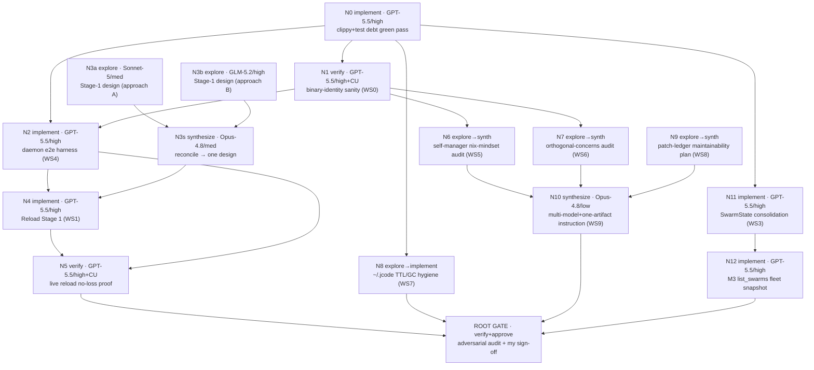

# Curatorial Workplan — Deep Task-Graph (DRAFT for review)

Status: **draft, not seeded**. This is a dry-run of the `swarm task_graph`
(deep mode) plan for the post-rescue curatorial workstream described in
`~/notes/projects/jcode/project.md`. Each node below maps 1:1 to a real
`task_graph` seed node (kind ∈ explore|implement|verify|synthesize, plus
`depends_on` edges), so once John approves this it can be seeded verbatim.

The plan is **not run** until sign-off. Review target: node set, edges, model
routing, and the gate contract.

## Model roster (per John's directive)

| Role | Route | Effort | subagent_type | Responsibility |
|---|---|---|---|---|
| Coder | `gpt-5.5` | high | `implement` | Write code to spec. Given explicit how-to-write instructions per node. |
| Researcher A | `claude-sonnet-5` | medium | `explore` | Research/docs, own approach. |
| Researcher B | `glm-5.2` | high | `explore` | Research/docs, deliberately different approach from A. |
| Synth/Checker | `claude-opus-4.8` | low–medium | `synthesize` | Check A+B, reconcile, produce one polished artifact. Effort scales with node complexity. |
| Validator | `gpt-5.5` | high | `verify` | Test/validate with computer use; adversarial, read-mostly. |
| Approver | (me / coordinator) | — | — | Final approval + advance to next unit. |

Routing note: `swarm list_models` is run first to confirm each route resolves;
any unavailable route falls back to the coordinator model with the assignment
recorded. Fable-5 remains the implicit default for un-pinned children.

## Sequencing rationale (from project.md)

1. **Clear cruft first** (project.md §3): the clippy/test-debt green pass and the
   binary-identity sanity check are cheap and unblock trust in everything after.
2. **Then the highest-value deferred work** (§2): Reload Stage 1, but only after
   the e2e harness (§5) exists to prove it live.
3. **Curatorial hygiene / learnings** (§34 learnings 13) run in parallel; they
   are mostly audits that feed global instructions and small fixes.
4. **Workstream continuation**: SwarmState consolidation (§4, toward upstream's
   service split) and the M3 `list_swarms` fleet snapshot (resume point).

## DAG

## Node detail

Each node carries: kind, assigned route/effort/subagent_type, the concrete task,
`depends_on`, and the typed-artifact close contract (findings / evidence
[file:line] / validation / open_questions / confidence / what_i_did_not_check).

### Phase A — clear cruft

- **N0 · implement · gpt-5.5/high · `implement`** — Green the workspace gate:
  fix the 3 known warnings (`KILLALL_PROCESS_NAME` dead const,
  `RELOAD_HANDOFF_EVENT_POLL_MS` dead const, unnecessary `unsafe` in
  `menubar.rs`), run `cargo clippy --workspace` and `cargo fmt --check` to zero.
  Coder instruction: minimal diffs, no behavior change, one `chore(clippy)`
  commit. depends_on: []. Close: `cargo clippy --workspace -- -D warnings` clean.
- **N1 · verify · gpt-5.5/high + computer use · `verify`** — WS0 binary-identity
  sanity: assert `jcode --version` == the nix build, no `~/.local/bin` shadow
  reappears, `jcode-dev` still hot-reloads. Use `jcode doctor` + live checks.
  depends_on: [N0]. Close: a pass/fail table with evidence per claim.

### Phase B — Reload Stage 1

- **N2 · implement · gpt-5.5/high · `implement`** — WS4 daemon e2e harness: a
  handful of "launch isolated daemon → do X → assert" scripts (model on the
  existing 49ms-clean-exit / 0-children SIGTERM test). This is the fixture N5
  needs. depends_on: [N0, N1]. Close: scripts run green in CI-callable form.
- **N3a · explore · claude-sonnet-5/med · `explore`** — Stage-1 design, approach
  A: read `docs/proposals/RELOAD_ARCHITECTURE.md`; specify the exact
  `graceful_shutdown_sessions_with_timeout` wait-condition change, the
  `TurnStashed` control-log event, and the resume read-back. depends_on: [].
- **N3b · explore · glm-5.2/high · `explore`** — Same brief, deliberately
  independent approach (do not read A's output). depends_on: [].
- **N3s · synthesize · claude-opus-4-8/med · `synthesize`** — Reconcile A+B into
  one design note appended to `RELOAD_ARCHITECTURE.md`; flag disagreements, pick
  a path with rationale. depends_on: [N3a, N3b]. Close: single design section.
- **N4 · implement · gpt-5.5/high · `implement`** — WS1 implement Stage 1 to the
  N3s design. Coder instruction: keep the diff narrow (one wait-condition, one
  event variant, one resume path); do not migrate live children; do not add a
  broker (that is deferred Stage 2). depends_on: [N2, N3s].
- **N5 · verify · gpt-5.5/high + computer use · `verify`** — Prove it live via
  the N2 harness: start a turn, trigger reload, assert the turn resumes with no
  token loss and 0 orphaned children. depends_on: [N4, N2].

### Phase C — curatorial hygiene (learnings)

- **N6 · explore→synth · Sonnet-5+GLM-5.2 → Opus-4.8/low · `explore`/`synthesize`**
  — WS5: audit remaining self-managers (`tester:spawn`, config-change
  auto-reload, auto-updater) through the "declarative, else announced+recorded+
  ephemeral" nix-mindset lens; produce an audit table + a codified global
  instruction. depends_on: [N1].
- **N7 · explore→synth · Sonnet-5+GLM-5.2 → Opus-4.8/low · `explore`/`synthesize`**
  — WS6: hunt for more `JCODE_DEBUG_CONTROL`-style conflated-flag smells (one
  flag, two orthogonal jobs). Output: findings + a global instruction.
  depends_on: [N1].
- **N8 · explore→implement · Sonnet-5 → gpt-5.5/high · `explore`/`implement`** —
  WS7: audit everything jcode writes to `~/.jcode` for TTL/self-reconciliation;
  add real TTL/GC where missing (session pruning, pid-markers). depends_on: [N0].
- **N9 · explore→synth · Sonnet-5+GLM-5.2 → Opus-4.8/low · `explore`/`synthesize`**
  — WS8: patch-ledger maintainability (it decalibrated at 6× scale). Output: a
  keep-it-honest game plan + any ledger fixes. depends_on: [].
- **N10 · synthesize · claude-opus-4-8/low · `synthesize`** — WS9: fold N6/N7/N9
  learnings into global instructions (multi-model-reconcile + keep-one-artifact
  + remove-scaffolding); evaluate a lint/gc that makes it formulaic.
  depends_on: [N6, N7, N9].

### Phase D — workstream continuation

- **N11 · implement · gpt-5.5/high · `implement`** — WS3 SwarmState
  consolidation (FORK_IMPROVEMENT_BACKLOG #2): widen `SwarmState` / add a thin
  wrapper so the 1516-param comm handlers take `&SwarmState`. Moves toward
  upstream's service split. depends_on: [N0].
- **N12 · implement · gpt-5.5/high · `implement`** — Resume point: implement M3
  `list_swarms` fleet snapshot (client-side view+verb binding over the already-
  wired contract). depends_on: [N11].

### Root gate

- **G · verify + approve** — Auto-inserted plan-wide adversarial audit: every
  closed node accounted for by id, no low-confidence sibling rubber-stamped,
  then my explicit sign-off before the workstream is declared done. depends_on:
  [N5, N8, N10, N12].

## What this dry-run is testing (the "practice")

1. Node/edge shape is legal for `task_graph` deep mode (kinds + `depends_on`).
2. Model routing strings resolve (validated against `swarm list_models` before
   seeding).
3. The gate contract (typed artifacts, id accounting, low-confidence handling)
   is understood before real work rides on it.
4. The ready-set is wide (N0, N3a, N3b, N9 have no deps) so `run_plan` fans out
   immediately rather than serializing.

## Open questions for John

1. Route names: confirm the exact aliases for "Sonnet 5" and "GLM-5.2" and
   "Opus-4.8" as they appear in `swarm list_models` on this host (I used
   `claude-sonnet-5`, `glm-5.2`, `claude-opus-4-8` as placeholders).
2. Scope gate: run Phase A+B first and pause for review before Phase C/D, or let
   `run_plan` drive the whole graph to the root gate?
3. Should the curatorial-hygiene audits (N6/N7/N9) be allowed to *inject* fix
   nodes (gap injection) or stay report-only this round?
