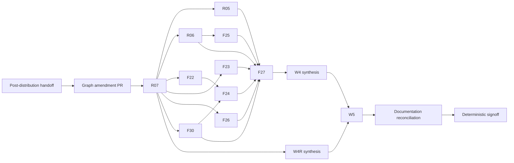

# Post-distribution ideal-base orchestration plan

Recorded: 2026-07-27

Status: `active` (R07 governance barrier closed 2026-07-29; W4 in progress)

This is the execution handoff for the selfdev coordinator after the active
Nix-only distribution work is complete. It begins after that work merges; it
does not own, revise, or complete the current distribution diff.

## Mission

Resume the ideal-base program from the first clean `main` commit after the
Nix-only distribution transition. Repair repository governance and durable
commit accounting, close the sticky-server defect, finish W4, reconcile active
documentation with the final product, honestly disposition W5, and complete
final signoff.

The successful stop condition is the one in
[`ACCEPTANCE_STANDARD.md`](ACCEPTANCE_STANDARD.md): every mandatory node is
accepted at one fixed commit, gated nodes are accepted or explicitly
authorization-blocked, the deterministic matrix passes twice from clean state,
and independent final review finds no unresolved blocker or false claim.

## Activation Gate

Do not start this plan merely because this file exists. Start only when all of
the following are true:

- The active Nix-only distribution work has a focused commit set and an
  independent review of its final commit.
- Its topic branch has been merged into `main` through a pull request.
- Pull-request checks and post-merge push checks are complete and green.
- The canonical checkout is clean, on `main`, and agrees with GitHub `main`.
- No worker still owns or is editing the distribution paths.

Establish those facts live. Always name the fork explicitly in GitHub CLI
commands because repository auto-detection selected the optional read-only
lineage remote during the recovery audit.

```bash
git status --short --branch
git rev-parse HEAD
git worktree list --porcelain
gh pr list -R jerudnik/jcode --state open
gh run list -R jerudnik/jcode --branch main --limit 20
python3 scripts/ideal_base_railway.py check
python3 scripts/ideal_base_railway.py status
python3 scripts/ideal_base_railway.py next --json
```

If any activation condition is false, report `WAITING: distribution handoff`
with the exact unmet condition. Do not switch branches, stash, reset, commit,
or modify the concurrent distribution work on its owner's behalf.

## Decisions Already Made

The following decisions are inputs, not questions to reopen during execution:

- Repository-owned end-user distribution is Nix-only. The flake, Home Manager
  module, and public Cachix cache are the supported acquisition surfaces.
- Source builds and selfdev remain developer workflows, not alternative
  end-user distribution channels.
- There is no native iOS product now. Active Swift app, TestFlight workflow and
  setup, and active iOS product documentation must be absent after the
  distribution transition or removed by an injected repair.
- `web/jcode-mobile` remains the browser control-surface foundation. It is not
  yet called a PWA because it has no complete installability, offline, or
  secure-remote contract.
- `main` must require a pull request and successful checks. The required GitHub
  approval count is zero; independent graph review artifacts remain mandatory.
- Accepted nodes publish through merge-commit pull requests, one coherent node
  per pull request. Squash and rebase merges are not accepted for future nodes.
- Existing `archive/stash-*` tags and reviewed historical node commits must be
  preserved in the private `jerudnik/jcode-recovery-archive` repository, never
  published as release tags in the public fork.

Authorization already granted for this plan is limited to ordinary
`automation/**` branch pushes and pull requests, merge-only branch/ruleset
hardening, and private recovery-archive tag backup. It does not authorize a
public release, `v*` tag, provider request or spend, credential exposure,
production deployment, public PWA exposure, Apple work, or destructive ref
cleanup.

## Read Before Mutation

Read these current authorities completely after the activation gate passes:

- [`README.md`](README.md)
- [`BASELINE.md`](BASELINE.md)
- [`ACCEPTANCE_STANDARD.md`](ACCEPTANCE_STANDARD.md)
- [`AUDIT_COVERAGE.md`](AUDIT_COVERAGE.md)
- [`EXECUTION_PROTOCOL.md`](EXECUTION_PROTOCOL.md)
- [`WORK_GRAPH.json`](WORK_GRAPH.json)
- [`STATE.json`](STATE.json)
- [`DECISIONS.md`](DECISIONS.md)
- [`COORDINATOR_BOOTSTRAP.md`](COORDINATOR_BOOTSTRAP.md)
- [`../../BRANCHING.md`](../../BRANCHING.md)
- [`../../agent-workflows.md`](../../agent-workflows.md)
- [`../../SWARM_TASK_GRAPH.md`](../../SWARM_TASK_GRAPH.md)

Treat `docs/fork/recovery/` and `docs/fork/normalization/` as frozen historical
namespaces. Do not edit their prompts, evidence, ledgers, reviews, or checksum
manifests.

## Known Control-Plane Defect

At recovery merge `3db42db1f`, a full per-record ancestry check found that 33
of 35 accepted railway records cited reviewed commits that were not ancestors
of `main`; only W3 and F29 cited main-ancestral commits. The existing
`git_commit_reachable` implementation only runs `git cat-file -e`, so an
unreferenced local object can satisfy a check described as "reachable".

Do not convert that observation into a blanket failure or silently replace the
hashes. R07 must establish, node by node, whether each reviewed commit was
published through an equivalent main commit. Preserve the reviewed identity,
record the published identity, and reopen any node whose publication cannot be
proved.

## Graph Amendment

The first mutation after activation is one graph-amendment pull request from
the new `main`. Re-audit counts before editing. If the distribution transition
did not alter the current 6-root, 46-child, 52-record graph, the amendment
produces 7 roots, 50 children, and 57 state records.

### New root and nodes

| ID | Parent | Kind | Contract |
| --- | --- | --- | --- |
| `W4R` | root | implement | Recovery/governance barrier that must close alongside W4 before W5. |
| `R07` | W4R | implement | Enforce reviewed publication, repair commit accounting, ratify private archives, and make governance self-checking. |
| `R06` | W4 | implement | Repair sticky-server process-group signaling and unchecked server detachment. |
| `F30` | W4 | verify | Independently verify the landed Nix-only and native-iOS retirement; inject fixes for every gap. |
| `D01` | W5 | verify | Reconcile all active Jcode documentation with the final source and support contracts without rewriting historical evidence. |

### Revised nodes

| ID | Revised contract |
| --- | --- |
| `F22` | Enforce structured security-advisory ownership, rationale, retirement condition, and expiry. Remove the retired Homebrew requirement. |
| `F24` | Prove reproducible Nix output scope and emit verifiable source/version provenance plus an SBOM. It owns no release workflow. |
| `G03` | Verify the packaged browser control surface against a deterministic local gateway fixture. It is not an Apple or PWA publication gate. |
| `G04` | Prove Windows and FreeBSD are not advertised as supported distribution surfaces; retain code only as explicitly untested compatibility code if still useful. |
| `G05` | Run an authorized disposable remote Nix/Cachix acquisition and launch smoke, with no release API or installer path. |

Update `ACCEPTANCE_STANDARD.md`, `AUDIT_COVERAGE.md`, both executable copies of
each node in `WORK_GRAPH.json`, the machine-readable audit map, and
`STATE.json`. Append a new decision to `DECISIONS.md`; do not rewrite D0xx or
other historical decisions.

Add audit item A26 for active-documentation truth and map it to D01. Extend the
final-signoff acceptance contract so source-backed active docs, safe command
evidence, valid links, and generated-instruction coherence are deterministic
requirements rather than optional polish.

Use [`D01_DOCUMENTATION_AUDIT.md`](D01_DOCUMENTATION_AUDIT.md) as the prepared
source-backed input register for A26. The graph amendment must preserve its
finding IDs in D01's evidence contract without treating the pre-handoff snapshot
as proof of the final tree.

Expected dependency changes:

- `W5` depends on both `W4` and `W4R`.
- R07 is the publication barrier for every still-pending W4 implementation.
- R06 depends on accepted R01/R04 and R07.
- F25 depends on R06 because both touch server socket/process lifecycle.
- F30 depends on accepted F20c/F21 and R07.
- F24 depends on F22 and F30 in addition to its accepted prerequisites.
- F27 depends on every W4 child, including R05, R06, and F30.
- D01 depends on completed W4, W4R, F27, F30, and R07.
- S01 depends on D01 so final deterministic signoff includes documentation
  truth, links, commands, and generated-instruction coherence.

The intended post-amendment execution shape is:



The graph-amendment pull request must pass:

```bash
python3 scripts/ideal_base_railway.py check
python3 scripts/ideal_base_railway.py status
python3 scripts/ideal_base_railway.py next --json
python3 -m unittest tests.test_ideal_base_railway
python3 scripts/check_agent_instructions.py
git diff --check
```

## R07: Governance and Durable Publication

R07 executes before another product node is accepted.

### Stable pull-request gates

Discover final workflow and job names from the post-distribution tree. Put the
required contexts in one machine-readable repository file consumed by the
governance checker. Do not duplicate volatile names across prompts and prose.

The ruleset for `main` must enforce:

- deletion protection;
- non-fast-forward protection;
- changes through pull requests;
- zero required GitHub approvals;
- required review-thread resolution;
- merge commits as the only allowed merge method;
- strict successful required checks against current `main`;
- no administrator bypass that silently turns the rule into advice.

The current candidate checks are Fork CI quality, macOS, and Linux jobs; the
Security gate; and Nix validation plus the Linux Nix package build. Re-discover
them after the distribution transition. A required context must be emitted for
every pull request. Fix conditional workflow triggers or add an always-running
summary gate before requiring a context that can otherwise be absent.

Extend `scripts/fork-health.sh` or a focused companion checker so fixtures can
prove rule shape without GitHub access and a live mode can compare the actual
ruleset. It must reject missing PR enforcement, missing required checks, an
approval count other than zero, non-merge publication methods, force-push
permission, stale rail refs, and unexpected bypass actors.

Apply the server-side rules only after the R07 pull request emits the intended
contexts. Capture sanitized ruleset JSON and the pull request merge-state proof
under `docs/fork/ideal-base/evidence/R07/`, commit that evidence to the same
branch, let checks rerun, and merge through the newly enforced merge path.

### State schema and historical mapping

Move `STATE.json` to a schema that distinguishes:

- `reviewed_commit`: the exact commit independently reviewed for the node;
- `commit`: the published commit that is an ancestor of the current branch
  head and contains the accepted result.

For future merge-only node pull requests those values can be the same branch
commit: it is an ancestor of the pull-request head before merge and remains in
`main` history after a merge commit. For historical squash or rewritten work,
retain the reviewed hash and map it to the real published main commit.

For every completed legacy node, record:

- node ID and reviewed commit;
- pull request or integration commit when one exists;
- published main commit;
- path-limited tree or patch-equivalence method;
- evidence and review references;
- confidence and any unresolved mismatch.

Change the validator from object-existence semantics to ancestor-of-`HEAD`
semantics for published commits. Tests must reject a valid but non-ancestral
commit. Ensure any CI job running this gate has enough Git history for the
answer to be meaningful. If a node has no defensible published mapping, set it
to a non-complete state, inject a repair/re-verification node, and let root
consistency expose the reopened work.

### Private archive ratification

Before deleting or pruning any local ref, preserve:

- every `archive/stash-*` tag exactly as it exists;
- every legacy `reviewed_commit` that is not main-ancestral;
- a manifest mapping node/tag names to full object IDs and subjects.

Use private names such as `archive/ideal-base-reviewed/<node-id>` for new tags.
Push only the explicit archive tag refs to `recovery-archive`, verify them with
`git ls-remote`, and record redacted command output in R07 evidence. Do not move
or replace existing tags, push them to the public fork, delete archive branches,
or expose credentials.

### R07 acceptance

R07 is accepted only when:

- the ruleset API and a pull request show the intended server-side enforcement;
- every required context is present and green on the final R07 commit;
- governance fixture tests and live read-only checks pass;
- every completed state record has a proved published identity or is reopened;
- reviewed identities and existing stash tags have verified private refs;
- an independent reviewer reports no bypass, lockout, or false-durability gap.

## R06: Sticky Server Repair

The current defect is documented in
[`human-noticed-issues/STICKY_SERVER.md`](human-noticed-issues/STICKY_SERVER.md).
Revalidate line locations after the distribution merge.

Implement the smallest complete repair:

- In `spawn_server_notify`, treat `setsid()` failure as a spawn error instead
  of silently starting a server in an inherited process group.
- Preserve process-group signaling for a correctly detached server so helper
  descendants terminate with it.
- When group signaling returns `ESRCH` but the positive PID is still live,
  signal that individual process and report that fallback truthfully.
- Use the same fallback policy for graceful SIGTERM and forced SIGKILL.
- Do not turn EPERM or another error into a fallback; surface it.

Add deterministic Unix tests for both shapes:

- a normally detached group leader with a descendant, proving the descendant
  does not survive;
- a live non-group-leader child, proving group ESRCH falls back to the process
  for both termination stages.

Run focused platform, server, CLI, and lifecycle tests through
`scripts/dev_cargo.sh`, then the applicable preflight gate. Do not reload or
stop the user's live selfdev daemon as R06 evidence; a live reload remains a
separate coordinated action.

## F30: Verify the Distribution Handoff

F30 is an independent verification node, not a second implementation of the
current distribution work. It audits the exact merged result and injects a
bounded fix node for each gap.

It must prove:

- Nix/Home Manager/Cachix are the only supported end-user distribution paths;
- no tag-triggered GitHub binary publication, Homebrew, AUR, curl installer,
  PowerShell installer, release-asset acquisition, or self-overwrite path is
  active or documented as supported;
- source/selfdev update behavior is developer-only and does not overwrite a
  Nix-managed binary;
- active native iOS source, TestFlight workflow/setup, and active iOS product
  documentation are absent;
- `web/jcode-mobile` and its packaged Nix assets remain intact;
- README, branch policy, Nix docs, agent workflow docs, flake source filters,
  workflow lint lists, tests, and instruction primitives agree;
- a planted retired-distribution reference makes the policy gate fail.

If the distribution handoff intentionally retained a local developer helper,
classify and test it as a source workflow. Do not let a developer utility
reappear as an end-user installer through README or release automation.

## Remaining W4 Work

After R07, keep the ready set wide while respecting owned paths:

| Track | Work |
| --- | --- |
| Runtime | R05 multi-client contention and R06 sticky server. |
| Security | F22 structured advisory expiry policy. |
| Quality | F23 zero-growth critical-path budgets and downward targets. |
| Distribution | F30 independent Nix-only handoff verification. |
| Durable state | F26 PID/telemetry liveness, then F25 after R06. |
| Provenance | F24 after F22 and F30. |
| Integration | F27 after every W4 child is complete. |

F22 should use machine-readable advisory records with advisory ID, owner,
rationale, affected surface, expiry date, and retirement condition. CI and
preflight must fail on undocumented or expired ignores. Fixtures must inject
the current date so expiry tests are deterministic.

F24 must describe the exact reproducible Nix artifact scope, pin relevant
inputs, compare two clean builds in that declared scope, and expose source
revision, version, platform, derivation/output identity, and an SBOM without
reintroducing release assets.

F27 reviews R05, R06, F22-F26, F28-F30, their gates, and the interaction among
governance, process lifecycle, state hygiene, and Nix distribution. It injects
fix nodes instead of accepting caveats that violate an existing gate.

When all W4 children are accepted, checkpoint and merge W4 synthesis. When R07
is accepted, checkpoint and merge W4R synthesis. W5 remains blocked until both
roots are complete.

## D01: General Documentation Reconciliation

D01 is the safe documentation lane. Prepare its scope now, but do not edit
general documentation while the distribution session or a W4 implementation
owner is active. At execution time, treat every path in an active branch diff
or worker ownership declaration as reserved, even if it is not listed here.

The prepared audit input is
[`D01_DOCUMENTATION_AUDIT.md`](D01_DOCUMENTATION_AUDIT.md). D01-A must recheck
and assign every `D01-Fxx` item against the final merged source. The register is
research evidence, not an activation signal or permission to bypass graph
dependencies.

The distribution session currently owns the public installation and support
narrative, including root README/release material, branch and Nix policy,
Windows/iOS/wrapper guidance, workflow inventory, and the root instruction
primitive. D01 starts from the merged result rather than trying to merge prose
against those moving files.

### Documentation authority

Use this order when prose disagrees:

1. Current source, tests, CLI help, workflow files, flake outputs, and observed
   deterministic behavior.
2. Current product and repository contracts in generated instructions and
   their owning `.apm/instructions/*.instructions.md` primitives.
3. Maintained architecture and operator documentation.
4. Proposals and investigation documents, which may describe future behavior.
5. `docs/archive/`, `docs/fork/recovery/`, and
   `docs/fork/normalization/`, which are historical rather than current
   instructions.

Never fix a source/prose contradiction by documenting behavior the code does
not have. Inject a code-owner repair when the intended behavior is missing, or
correct the prose when the claim is stale.

### D01 sub-DAG

Expand D01 into read-first, path-disjoint workers. Researchers may inspect any
area; only one implementation worker may own a document.

| ID | Scope | Primary documents |
| --- | --- | --- |
| `D01-A` | Census and authority map | Every active top-level doc, `docs/architecture/**`, `docs/proposals/**`, archive/frozen classification, link graph. |
| `D01-B` | Public and operator truth | `README.md`, `CONTRIBUTING.md`, `OAUTH.md`, `RELEASING.md`, `docs/BRANCHING.md`, `docs/NIX.md`, `docs/agent-workflows.md`, `docs/WINDOWS.md`, `docs/WRAPPERS.md`. |
| `D01-C` | Runtime and TUI architecture | Server, lifecycle, multi-session, swarm, resume, soft-interrupt, memory, telemetry, hooks, safety, keymap, and rendering docs. |
| `D01-D` | Provider and auth reference | Credential sources, provider doctor, provider-specific references, browser-provider protocol, model catalog audit, and onboarding. |
| `D01-E` | Interaction and app surfaces | Browser/mobile interaction docs, secure access, desktop architecture/design docs, ambient mode, and PWA status boundary. |
| `D01-F` | Architecture and proposal classification | Active architecture records, proposals, superseded plans, machine-local notes links, and explicit status labels. |
| `D01-V` | Verification and synthesis | `docs/README.md` map, internal links, command/file references, generated instructions, stale-claim gates, and independent review. |

D01-A produces the exact ownership manifest before D01-B through D01-F edit.
If two scopes claim one file, serialize them in the graph instead of allowing
last-write-wins. D01-V starts only after every editing lane completes.

### Required documentation outcomes

D01 must establish all of the following:

- `docs/README.md` provides a concise current map grouped into product use,
  operator/reference, architecture, proposals, and historical material.
- Every active top-level document has a clear maintained purpose. Proposal and
  historical documents are labeled as such and are not phrased as current
  product behavior.
- Distribution, update, platform, and mobile claims agree with F30 and the
  final Nix-only support matrix.
- Runtime architecture agrees with R05/R06 and the accepted lifecycle,
  persistence, reload, and resource-bound implementations.
- Provider docs distinguish offline, credentialed, spending, and unsupported
  validation paths. No example silently authorizes a live request.
- Browser control-surface docs describe the implemented local surface honestly
  and reserve the term PWA for the deferred program's installability/security
  gates.
- Desktop documentation is retained only where it describes current code; it
  does not make desktop the default target.
- Machine-local `~/notes/...` links are either clearly identified as local PM
  references or replaced with durable repository documentation when the
  content is part of the product contract.
- No active document instructs readers to use retired rails, public binary
  releases, removed installers, Homebrew/AUR, native iOS/TestFlight, or an
  unsupported platform path.
- No historical evidence, accepted review, checksum manifest, or append-only
  decision is rewritten merely to remove stale language.

Avoid broad style-only rewrites. Preserve accurate technical detail and make
the smallest source-backed correction. Move a document only when status labels
and the docs map cannot prevent it from being mistaken for active authority;
when moving, update every inbound link in the same change.

### Documentation checks

D01 may add one focused documentation checker and fixtures if the repository
lacks a deterministic equivalent. It should verify local Markdown links,
referenced repository paths, and a narrow denylist of retired active claims
while excluding frozen evidence and historical archives from current-policy
rules. Prove each new rule non-vacuous with a planted failing fixture.

For command snippets, verify the command exists and use `--help`, parser tests,
or a hermetic fixture. Do not run provider, install, release, daemon, network,
or destructive commands merely because a document mentions them.

Run at minimum:

```bash
python3 scripts/check_agent_instructions.py
python3 scripts/docs_impact_advisory.py --base <base-revision> --head HEAD
python3 scripts/ideal_base_railway.py check
python3 -m unittest tests.test_ideal_base_railway
apm compile --validate
apm compile --dry-run
git diff --check
```

If D01 changes an instruction primitive, run `apm compile` and re-run the
instruction drift check. Generated `AGENTS.md`, `CLAUDE.md`, and client rule
surfaces remain generated and must not be edited directly.

### D01 acceptance

D01 is accepted only when:

- the census accounts for every active top-level doc and every maintained
  architecture/reference collection;
- every finding in
  [`D01_DOCUMENTATION_AUDIT.md`](D01_DOCUMENTATION_AUDIT.md) has a reviewed
  `corrected`, `superseded`, `product_repair`, or `not_reproducible`
  disposition;
- every edited claim cites current source, tests, CLI help, workflows, or
  deterministic behavior;
- internal links and referenced paths pass the deterministic checker;
- documented commands have safe existence/parser evidence;
- generated instructions match their primitives;
- the worktree contains no overlap or collateral edits from another lane;
- an independent reviewer compares the final prose to source rather than
  reviewing prose in isolation.

The D01 pull request is docs-focused. A product defect found during the audit
becomes a separately owned repair node and pull request; D01 waits for that
repair and then documents the accepted result.

## W5 and Final Signoff

Use these dispositions:

| ID | Required outcome |
| --- | --- |
| `D01` | Reconcile active documentation with final source, classify proposals/history, validate links and commands, and obtain independent source-backed review. |
| `G01` | Build/smoke aarch64 Linux or explicitly downgrade advertised support. |
| `G02` | Run provider-doctor tiers only with fresh explicit credential/network/spend authorization; otherwise record `authorization_blocked` with the exact next action. |
| `G03` | Serve packaged `web/jcode-mobile` from the Nix binary and exercise pairing, subscribe/history, send/cancel, disconnect/reconnect/resync, and stale-ack behavior against a deterministic local gateway. Call it a browser control surface, not a PWA. |
| `G04` | Prove Windows and FreeBSD are not supported distribution surfaces and no scheduled installer/release smoke remains required. |
| `G05` | With explicit network authorization, acquire a pinned fork revision through Nix in a disposable environment, verify Cachix/substituter behavior without credentials, and launch the resulting binary. Otherwise record `authorization_blocked`. |

Then execute:

1. S01 runs only after D01. It executes the complete deterministic matrix twice
   from clean state at one commit, records normalized fingerprints, validates
   active documentation/instructions, and proves zero residue.
2. S02 independently reviews that exact commit, graph coverage, evidence,
   support claims, and every gated disposition.
3. S03 synthesizes the final label and checkpoints the repository state through
   a final merge-only pull request.

No blocked external gate may be described as passing.

## Pull Request and Checkpoint Protocol

For the graph amendment and every accepted node:

1. Start from current `main` on `automation/<node>-<short-description>`.
2. Declare exact owned paths before delegation.
3. Use a small deep task graph with implementation and independent review as
   separate nodes. Run `swarm list_models` before relying on a route.
4. Commit only owned implementation/tests, then bounded evidence/review.
5. Checkpoint the node in `STATE.json` on the same branch after verification.
6. Open a pull request with explicit `-R jerudnik/jcode`.
7. Wait for every required check on the final head; do not treat skipped or
   absent checks as green.
8. Merge with a merge commit, never squash or rebase.
9. Verify the reviewed/checkpoint commit is now ancestral to GitHub `main`.
10. Delete only the merged topic branch; preserve all archive refs.

Implementation cannot review itself. Every accepted artifact names findings,
evidence, edge cases, validation, open questions, confidence, and what was not
checked. A failed or low-confidence review injects repair work and repeats.

## Stop Conditions

Stop the affected lane and surface the blocker when:

- the distribution branch or its workers are still active;
- post-merge CI is red or incomplete;
- the worktree contains overlapping edits from another owner;
- a required check can be absent on a pull request;
- a ruleset update would lock out the open R07 pull request;
- a legacy accepted commit has no defensible published equivalent;
- archive verification is incomplete;
- R06 requires touching a live daemon for proof;
- a gated action needs credentials, spend, public exposure, or destructive
  cleanup outside the authorization above.

Do not reset, force-push, weaken gates, update ratchet baselines to hide debt,
or rewrite historical evidence to make progress appear complete.

## Deferred PWA Program

PWA implementation begins only after ideal-base signoff. Preserve the current
browser surface and create a separate reviewed program for:

- manifest, icons, installability, and update behavior;
- a service worker and offline shell that never cache credentials, tokens, or
  transcript data unintentionally;
- HTTPS/WSS and secure-context behavior for remote access;
- removal of long-lived tokens from URL/query logging paths;
- CSP, dependency pinning, and elimination or integrity control of runtime CDN
  dependencies;
- explicit read-only monitoring versus control permissions;
- local-first/Tailscale operation with no required cloud service;
- browser E2E coverage for install, reconnect, background/foreground, offline,
  and upgrade paths.

Do not advertise the existing browser surface as an installable or secure
remote PWA before those gates pass.

## Pasteable Selfdev Launch Prompt

```text
Continue as the selfdev coordinator for the post-distribution ideal-base plan in
/Users/jrudnik/labs/jcode.

Read docs/fork/ideal-base/POST_DISTRIBUTION_ORCHESTRATOR_PLAN.md completely, then
read every authority in its "Read Before Mutation" section. Do not touch the
active Nix-only distribution work. First execute the plan's Activation Gate. If
the distribution pull request is not merged, its post-merge checks are not green,
the checkout is not clean on GitHub main, or workers still own distribution
paths, report `WAITING: distribution handoff` with the exact unmet condition and
make no repository mutation.

After the handoff is valid, persist through the graph amendment, R07 governance
and archive repair, R06 sticky-server fix, remaining W4 work, D01 documentation
reconciliation, W5 dispositions, and S01-S03 final signoff. Use
`swarm task_graph` with mode "deep", exact path ownership, typed artifacts,
independent review, and injected repair nodes.

Publish each accepted node through one automation/** pull request to
jerudnik/jcode. Require all checks on the final head and merge with a merge
commit, never squash/rebase. Preserve concurrent work and all archives. The
authorized external scope is limited to ordinary node branch pushes/PRs,
merge-only main ruleset hardening, and private recovery-archive tag backup. No
public release/tag, provider spend, credentials, Apple work, public PWA exposure,
or destructive cleanup is authorized.

Continue automatically until the exact stop condition in the plan is met or a
named authorization/safety blocker requires the user.
```
