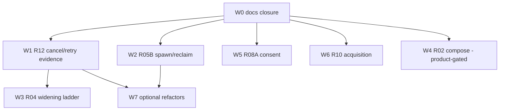

# Recovery plan: Phase 4 cross-seam architecture

- Author role: Cross-Seam Architect (Fable), Phase 4 per `ORCHESTRATOR_PROMPT.md` lines 168-184.
- Fixed coordinator commit reviewed: `e2464666d5416061627a6811eb59bd953fa5ef42` on `recovery/2026-07-15`.
- Mode: read-only synthesis of all seventeen non-deferred seam ledgers, `G4_RESULT.md`, the G5 evidence review (`reviews/2026-07-15-g5-g4-evidence-opus.md`, SHA-256 `37f094d26b196612f2171de98d52238abb72bb8b69d59b149e7bb00999db86d3`), `BASELINES.md`, `PRESCREEN.md`, `QUALITY_GATES.md`, `RESPONSIBILITIES.md`, `PROGRESS.md`, and preserved disagreement reviews.
- Status: **COORDINATOR-AUDITED PASS**, pending independent review of the fixed plan commit. This document authorizes no implementation or external action by itself. No spot-checker child was dispatched; every decisive fact cited below was reproduced locally with read-only Git/hash/source commands or is quoted from a hash-anchored ledger.
- Revision: corrected Fable v2, 2026-07-15. The byte-exact initial and corrected proposals are preserved as [`reviews/2026-07-15-phase4-fable-initial-plan.md`](./reviews/2026-07-15-phase4-fable-initial-plan.md) and [`reviews/2026-07-15-phase4-fable-corrected-plan.md`](./reviews/2026-07-15-phase4-fable-corrected-plan.md). Two bounded coordinator-audit corrections distinguish v2: (a) disposition arithmetic is fourteen retain-fork / two compose / one defer because R04 recommends `retain-fork`; (b) W1 uses the R12 invariant of one correlated terminal response per emitted provider request, permitting multiple requests on retry paths.

---

## 1. Executive decision: measured sync posture

**Decision: curated composition.** The fork remains the integration authority. Upstream is a bounded source of individually reviewed components, imported only through narrow, evidence-gated `compose`/`upstream-patch` slices. No broad sync, no merge, no replay.

### What the evidence supports

1. **The bounded pilot (G4/G5) proves the composed fork behaves correctly at fixed refs for exactly one offline composition**: one accepted Plus fixture, one symbolic `jcode-subscription` route, one compatible typed Subscribe carrying distinct runtime projections, one no-tool/no-memory turn, four correlated evidence events with deterministic replay, telemetry disabled, compaction unreachable, and trusted gates unchanged (ten steps, expected==actual exits, independently recomputed hashes). This demonstrates that the fork's cross-seam contracts (R02 -> R01/R03A -> R12 -> R06A, with R07C/R13 negative observations) are testable and hold after the prerequisite fixes. That is evidence *for the composability and testability of the retained fork*, which is the load-bearing property curated composition needs.
2. **Structural evidence forecloses ancestry-preserving replay as the default**: zero shared stable patch-IDs across 288 fork / 243 upstream non-merge commits (`PRESCREEN.md`, exact commands recorded); the curated sync `b3ed82a6b` is a single-parent squash, so absorbed upstream work is invisible to ancestry; 286/246 divergent commits and 406 both-sides files; `vendor/upstream` pinned at the merge base.
3. **Seam-by-seam authority is overwhelmingly fork-side.** Fourteen of seventeen integrated ledgers conclude `retain-fork` (R00, R01, R03A, R03B, R04, R05A, R05B, R06A, R07A, R07C, R09, R11, R12, R13). Two conclude `compose` with narrowly named upstream candidates (R02 tier/catalog; R10 draft-release finalization). One is `defer` with escalation (R08A). R04's `retain-fork` is a disposition of authority, not an approval of its previously unsafe terminal-transition path, whose fix is separately integrated and reviewed. Upstream has literally no counterpart for the fork's evidence spine (R06A/R12), control log (R05A), handshake (R03A), reload-target policy (R01 `paths.rs` upstream delta is empty), or Nix packaging (R10 checkpoint 2). There is nothing to replay *onto*.

### What the pilot does NOT prove (claim limits, preserved from G4/G5)

- It was a **behavior-composition fixture**, not a replay-versus-curated economics experiment. No replay was ever attempted, so "replay is uneconomical" is a structural inference (patch-ID emptiness, squash ancestry, retain-fork dominance), not a measured comparison. If a future seam genuinely needs bulk upstream adoption (trigger: a `compose` slice whose reviewed diff exceeds its seam's declared conflict budget), a bounded replay experiment for *that seam only* must be separately authorized before choosing replay there.
- It proves nothing about live providers, real credentials, network, a running daemon, reload, tools/MCP, memory, publication/install/update, cancellation, retry, compaction, disconnect/takeover, generic-client identity, or quality baselines. All G2 exclusions remain binding.
- It does not convert any seam's `blocked` source state (R05B swarm widening; R12 cancellation/retry/compaction; R04 lifecycle widening; R08A consent; R10 acquisition) into approval.

### Posture rules going forward

- Default disposition for untouched divergence: retain fork, leave upstream unadopted, record the negative finding.
- Every upstream import is a named `sync` slice with recorded provenance command, refs, options, and assumptions (R00 overlay obligation 2), its own commit, targeted tests, and an independent reviewer.
- `vendor/upstream` stays pinned; refreshing it requires a dated `BASELINES.md` append, never an edit.
- No slice may "use a broad merge to make the diff disappear" (orchestrator stop condition). Diff size is not an objective; semantic agreement is.

---

## 2. Cross-seam authority model and hidden shared invariants

### Authority map (resolved, no earlier conclusion erased)

| Domain | Authority | Consumers (must not re-derive truth) |
|---|---|---|
| Canonical build/source/channel identity, reload target | R01 (`RuntimeIdentityProjection`, sidecar metadata) | R03A carries it (additive, `build_hash` = compatibility token only); R04 persists it; R10 prepares candidates only |
| Wire schema, compatibility verdict, legacy additivity | R03A | R03B transports the already-decided event; generic clients must not advertise unconsumed identity (enforced since `615ab1d9a`..`6c6a4f2c8`) |
| Config provenance, credential readiness, tier entitlement, route outcome | R02 (fail-closed tier truth since `3063fe0fa`..`cb924b3ae`) | R12 records exactly R02's route identity; ambient env cannot substitute (`JCODE_TIER` regression proven) |
| Process/session/detached-task life and terminal state | R04 (marker-safe terminal persistence since `a371fe758`..`eab42e1b5`) | R05B consumes liveness for policy; R03B cleanup must not fabricate terminal outcomes |
| Assignment, spawn mode, reclaim, retry policy | R05B (**source-blocked** for swarm widening) | R05A graph transitions are preconditions R05B cannot redefine |
| Graph/control-log/replay semantics | R05A | Render (R08B) is projection, never truth |
| Turn execution and terminal evidence emission | R12 (strict no-tool/non-retry path qualified; cancellation/retry/compaction **blocked**) | R06A persists what R12 emits and is not blamed for emission defects |
| Evidence storage schema and replay | R06A | schema v1 frozen absent full review |
| Compaction policy and provider-session invalidation | R13 | complete writer census recorded; invariant 3 guarded on compaction paths |
| Tool/MCP lifecycle | R07A (fail-closed; no live exercise) | discovery/network is deferred R07B |
| Telemetry consent | R07C (single kill switch, four consent paths) | no send path bypasses `is_enabled()` (negative finding) |
| Operator intent | R08A (cancel is an intent, never an outcome) | onboarding auto-import consent **unapproved, escalated** |
| Packaging/acquisition | R10 (`compose`; remote acquisition **unapproved**) | activation/daemon decisions delegate to R01 |
| Provenance/preservation, gates, docs governance | R00 / R09 / R11 overlays, binding on every slice | — |

### Hidden shared invariants surfaced by cross-seam reading

1. **One identity, four projections** (R01/R03A/R04/R10). Closed for the reviewed paths, with two documented residuals: generic remote `/reload` still supplies `runtime_identity: None` (`server/client_api.rs:99`), and sidecar-less ad-hoc binaries use a documented lossy fallback. Both are fail-safe and explicitly non-blocking per the correction re-reviews; tracked in §4.
2. **`provider_session_id` has many writers, not two.** R13's census corrected the original invariant text. All compaction resets clear both copies; the one live divergence window is the TUI-local write at `turn.rs:724`, guarded by a named joint R12/R13 escalation trigger. Any new writer must be added to the census before merge (checklist item, §7).
3. **Terminal cardinality is only proven for non-retry paths.** R12's fixed matrix leaves cancellation (false `Ok`), before-open cancel (missing response), and retry/context-limit abandonment (orphaned requests) as known, fail-closed-labeled defects. Invariant 4 is therefore *conditionally* satisfied, which is why W1 in §3 is the first behavior workstream.
4. **Liveness authority split holds but is duplicated.** R05B has copied dead-status predicates (fixture 4 unimplemented); until W2 lands, no swarm behavior may enter any pilot or slice blast radius.
5. **Consent is not uniform.** R07C is airtight for telemetry; R08A's onboarding path treats a 60-second timeout as affirmative consent to import every pre-checked external login, at base, upstream, and fork alike. Cross-fork agreement is shared behavior, not safety. This is the single most user-hostile latent defect in the system and gets its own required workstream (W5).
6. **Acquisition integrity is not fail-closed.** R10: updater proceeds when `SHA256SUMS` is absent; `scripts/install.sh` verifies nothing and mutates shell profiles and can reload the daemon. This crosses R01 authority and is the second consent-class defect (W6).

### Ledger inconsistencies and shallow spots that must be named (not papered over)

- **R04 ledger tail is stale relative to program state.** The ledger's final section still says "a fresh independent source-fix sign-off is still required," while `PROGRESS.md` (13:03:23Z checkpoint) and `seams/README.md` record the marker fix as integrated after two independent PASS reviews (`2026-07-15-r04-marker-fix-opus-review.md` SHA-256 `7a8f2449...`, `...-fable-review.md` SHA-256 `1ec0ceb5...`). The reviews exist and pass; the ledger simply was not amended afterward. **Resolution: append-only ledger amendment in W0, not a re-review.** The Fable review's IMPORTANT follow-ups (disconnect `Ok(())` ambiguity; marker-lock liveness edge; streaming-marker partial-outcome coverage) remain visible and are carried in §4.
- **Light-ledger approval lines are stale.** R03B, R05A, R07A, R08A, R10 ledgers say "Coordinator approval: pending," yet the remaining-light-ledgers Opus review (SHA-256 `b537bc56...`) passed all five and `seams/README.md` lists them integrated. Same class of docs drift; W0 closes it.
- **R00/R09/R11 "Fable review: pending" lines.** Those ledgers were Fable-authored and could not self-approve. This Phase 4 architecture review is the named independent review; if the coordinator accepts this plan, W0 records that discharge explicitly (or records its rejection).
- **Production-size count drift 60 vs 61.** `QUALITY_GATES.md` records 60 violations at the Phase 0 head; the G0/G4 fixed-HEAD truth is 61. Both are preserved append-only and internally consistent (different HEADs), but any seam citing "60" must be read as historical. No action beyond the W0 cross-reference note.
- **R05A checkpoint-6 positive test claims were not independently re-executed** (Opus review flagged this as a verification gap, not an overclaim). The plan therefore requires the two app-core control-log integration tests to be reproduced from a warm target before any swarm-driven change (folded into W2 entry criteria).
- **No ledger blocks planning.** Every inconsistency above is a documentation-closure item or a carried follow-up, not an evidentiary hole in a disposition.

---

## 3. Required recovery workstreams, strict dependency order

Global rules for every slice: one class per slice; one writer plus one independent reviewer (Opus/Grok pair per orchestrator Phase 5); dedicated branch and worktree; targeted tests in the slice worktree before integration; R09 matrix rerun without `--update` after integration for any Rust-touching slice; ledger amendment (append-only) and `PROGRESS.md` checkpoint on completion; no stash pops, ref moves, force pushes, or prompt-file edits ever.

### W0 — Record-consistency closure

- **Class:** docs/evidence. **Owner:** R11 overlay (coordinator executes; R04/R03B/R05A/R07A/R08A/R10 ledgers touched). **Prerequisite:** none; first slice.
- **Purpose:** make the durable record agree with itself before any further source work: append the R04 marker-fix review outcome and carried follow-ups to the R04 ledger; convert the five stale "Coordinator approval: pending" lines into dated approval amendments citing the preserved Opus review; record the disposition of the R00/R09/R11 Fable-review-pending lines; add the 60-vs-61 historical note; commit `RECOVERY_PLAN.md` itself after audit.
- **Surface:** `docs/fork/recovery/**` only. **Acceptance:** every integrated ledger's own state lines match `seams/README.md` and `PROGRESS.md`; all cited hashes reproduce; `git diff --check` clean; zero deletions of prior content.
- **Tests/observations:** `shasum -a 256` over cited review files; prompt-diff hash still `8e8e6a92...`; stash count 4.
- **Stop:** any hash mismatch (becomes an R11 incident). **Rollback:** revert the single docs commit. **Commits:** one docs commit (plus one for the plan itself). **Reviewer:** spot checker (mechanical). **Later external action:** none.

### W1 — R12 truthful cancellation/retry terminal evidence

- **Class:** behavior-fix. **Owner:** R12 (R06A observes; R13 census updated if any writer changes). **Prerequisite:** W0.
- **Purpose:** close the last confirmed violations of cross-seam invariant 4: cancellation must emit a correlated non-`Ok` terminal `ProviderResponse` and `TurnFinished{Cancelled|Interrupted}`; abandoned open/context-limit retry attempts must be terminally represented or must delay request emission until non-abandoned. This is R12 ledger slice 3, unchanged.
- **Surface:** `crates/jcode-app-core/src/agent/turn_loops.rs`, `agent/turn_streaming_mpsc.rs`, `agent/evidence.rs` (+ fixtures). Reuse the existing `append_provider_error_response` helper; prefer no new abstraction.
- **Acceptance:** the governing invariant is **exactly one correlated terminal (non-`Ok` where applicable) `ProviderResponse` per emitted `ProviderRequest`, and exactly one `TurnFinished` per user turn**; retry paths may legitimately emit multiple requests. Concretely: (a) non-retry cancellation fixtures (before-open cancel, mid-stream cancel) each show exactly one request, one correlated non-`Ok` response, and one `TurnFinished{Cancelled|Interrupted}`, since that is their deterministic shape; cancelled work is never recorded `Ok`; (b) open/mid-stream context-limit retry fixtures show that every emitted request, including each abandoned attempt, either receives its own correlated non-`Ok` terminal response or has its request emission delayed until the attempt is non-abandoned, with no orphaned request and exactly one `TurnFinished` for the turn; (c) the five existing `r12_*` fixtures stay green; (d) no duplicate-response path is introduced (the ledger's negative finding must survive).
- **Tests:** the new negative fixtures plus the existing strict five; R09 matrix. **Stop:** duplicate responses, correlation mismatch, changed success-path behavior, or any need for live provider/daemon. **Rollback:** revert the isolated fix commit; the strict-path qualification is unaffected. **Commits:** one `fix`, one `test`, one ledger `docs`. **Reviewer:** Opus + Fable-class re-review on disagreement (mirror the preserved R12 review pattern). **Later external action:** none.

### W2 — R05B spawn/reclaim safety (unblocks swarm)

- **Class:** behavior-fix. **Owner:** R05B (R04 vocabulary consulted, not changed; R05A tests reproduced at entry). **Prerequisite:** W0; R04 marker fix (already integrated). May run concurrently with W1 (disjoint paths).
- **Purpose:** fix the four adjudicated defects: explicit `Visible` spawn silently falling back to headless; stale direct takeover resetting progress history; cap-fail overwriting checkpoint provenance; duplicated liveness predicates. Implement ledger fixtures 1-6.
- **Entry criterion:** reproduce `control_log_fold_tracks_maps_through_handler_sequence` and `scan_from_tail_offset_finds_artifact_once` from a warm target (closes the R05A verification gap).
- **Surface:** `crates/jcode-app-core/src/server/{comm_control,comm_session,swarm*}.rs`, `crates/jcode-plan` (read-mostly), `tool/communicate.rs` dispatch portions.
- **Acceptance:** fixtures 1-6 pass offline (visible fail-closed with labeled `Auto` fallback; history append-only across takeover/reclaim/cap-fail; one liveness authority; bounded churn-to-abort session count; R04-to-R05B dead-PID chain with exactly one requeue). **Stop:** R04 status vocabulary needs changing (hand off), durable schema crosses R06A, or proof needs a live daemon/terminal. **Rollback:** revert per-fix commit; ledger stays `blocked`. **Commits:** ledger slices 1, 2, 4 as separate `fix` commits; slice 3 (single liveness authority) as a separate `refactor` commit after the fixes pin behavior; one `docs` commit with per-file R09 attribution. **Reviewer:** Grok (incident-quantified seam) plus Sol/Fable sign-off refresh. **Later external action:** none; swarm-driven *pilots* still need separate authorization.

### W3 — R04 lifecycle-widening fixture ladder

- **Class:** behavior-fix (fixture-dominant). **Owner:** R04 (joint R01/R03A for item 7; R12 contract for wait-semantics). **Prerequisite:** W1 (wait-like results interact with R12 evidence semantics); not concurrent with W2 if `swarm.rs`/`comm_session.rs` overlap emerges (check paths at branch time; if overlapping, serialize).
- **Purpose:** execute the R04 widening contract items 1-8 (orphan-from-reload, post-reload cancel, graceful-shutdown bounds, `resumable interrupted wait` contract, recovery-intent single delivery, joint restart-projection fixture) plus the two carried Fable IMPORTANT follow-ups: give `cleanup_client_connection` a distinguishable outcome for terminal-persistence failure, and document/bound the marker-lock liveness edge.
- **Acceptance:** all eight widening observables pass in isolated fixtures; disconnect cleanup callers can distinguish full terminal persistence from partial cleanup. **Stop:** any fixture needs a live daemon/real signal, or R03A/R05B/R12 policy would change. **Rollback:** revert the widening slice; strict-pilot posture unaffected. **Commits:** separate `fix` and `test` commits per contract cluster; ledger `docs`. **Reviewer:** Sol + Fable (the pair whose FAIL created the contract). **Later external action:** a lifecycle-widened *pilot* (reload/resume/cancel) requires separate gate authorization.

### W4 — R02 upstream compose, product-gated

- **Class:** sync (with a separate refactor commit if `catalog_routes` composition is approved). **Owner:** R02. **Prerequisite:** W0 plus a recorded product decision on accepted tiers/labels/floors (currently absent, which is why this sits after the pure fixes; it may execute any time the product truth is recorded).
- **Purpose:** the only two evidence-named upstream code opportunities in the whole program besides R10: richer accepted-tier schema/labels and OpenRouter definitive-absence fallback suppression, composed without importing upstream pricing/budget constants.
- **Acceptance:** one fixture table covering every accepted wire tier; `set_model` and display filtering agree; provider identity survives the route matrix; unknown-availability behavior unchanged. **Stop (verbatim from ledger):** product truth absent, upstream and fixture differ, more than catalog + targeted tests must change. **Rollback:** revert the isolated sync commit. **Commits:** one `sync`, one `test`, optional one `refactor`, one `docs`. **Reviewer:** Opus + Fable (mirroring the tier-correction pair). **Later external action:** none.

### W5 — Onboarding import consent fail-closed (R08A/R02 joint)

- **Class:** behavior-fix, preceded by the ledger-mandated full R08A/R02 joint review (a docs/evidence sub-slice). **Owner:** R08A with R02 credential enforcement. **Prerequisite:** W0; independent of W1-W4 (disjoint paths: `jcode-tui` onboarding flow + external-auth call boundary).
- **Purpose:** remove expiry-as-consent: `decision_timed_out` must decline (or preserve state and re-prompt), never call `onboarding_finish_import_review()` to import pre-checked logins; Escape must decline; `run_external_auth_auto_import_candidates` must be unreachable without a contemporaneous explicit affirmative.
- **Acceptance:** deterministic fixtures prove timeout and Escape are fail-closed and no credential read occurs without explicit approval; existing decline-all tests stay green. **Stop:** the fix would require changing R02 credential-validation semantics beyond the call boundary, or any live credential/import is needed to test. **Rollback:** revert the isolated fix; the current (dangerous) behavior is at least known and documented. **Commits:** one review `docs`, one `fix`, one `test`, one ledger `docs`. **Reviewer:** Opus (consent framing) + spot checker. **Later external action:** none for the fix; exercising real onboarding/import stays separately gated.
- **Note:** upstream shares this defect. After the fork fix is proven, proposing it upstream is optional QoL, not recovery.

### W6 — R10 fail-closed acquisition and draft-release ordering

- **Class:** two slices, strictly separate: (a) behavior-fix — updater refuses when `SHA256SUMS` is absent/mismatched; `scripts/install.sh` verifies or is retired in favor of the verified path; activation delegates the daemon decision to R01; (b) sync — adopt upstream's draft-to-final release ordering in `.github/workflows/release.yml`. Preceded by the ledger-mandated full R10 review (docs sub-slice).
- **Owner:** R10 (R01 consulted for activation boundary). **Prerequisite:** W0; the R01 identity work is already integrated. Independent of W1-W5 (disjoint paths).
- **Acceptance:** hermetic fixture per the ledger: mismatched/missing manifest leaves `stable`/`current`/launcher/version markers unchanged; a verified asset promotes exactly one version; workflow lint/dry-run only (no tag, release, or publication). **Stop:** verification needs a real tag/GitHub action/remote artifact/credential. **Rollback:** revert per-slice commit; prior workflow preserved in history. **Commits:** one `fix`, one `test`, one `sync`, one `docs`. **Reviewer:** Grok (mechanical/workflow) + coordinator. **Later external action:** **yes** — any actual release, publication, installer execution, or updater run against real assets requires separate explicit authorization; this plan grants none.

### W7 — Optional-after-fix refactors (only when their behavior is pinned)

- **Class:** refactor, one seam per slice. Candidates, each already scoped in its ledger: R12 shared terminal-emission helper consolidation (after W1; slice 4); R03A centralized advertising-subscribe/verdict consumption (slice 5); R02 `sidecar.rs`/`provider/mod.rs` size-debt reduction (with R09 attribution). **Prerequisite:** the owning seam's fix workstream complete and green. **Acceptance:** all existing and new fixtures pass unchanged; no gate baseline movement; refactor commit contains zero behavior deltas. **Stop:** any fixture change is needed to make the refactor pass. **Reviewer:** the seam's original review pair. These are *not required for recovery completion* and may be deferred wholesale (§4).

### Dependency summary

---

## 4. Required recovery versus optional QoL/debt (R09 debt is not blanket cleanup)

**Required for recovery completion:** W0, W1, W2, W3, W5, W6. W4 is required *if and when* product truth is recorded; absent that decision it is a documented defer, and recovery can complete with the current fork-owned Plus/Flagship contract, which is fail-closed.

**Explicitly optional / deferred, each with owner, reason, evidence gap, and escalation trigger:**

| Item | Owner | Reason deferred | Evidence gap | Escalation trigger |
|---|---|---|---|---|
| R09 red debt paydown (panic 46/31, swallowed 3,074/2,987, prod-size 61, test-size 31) | Owning behavior seams per R09 attribution | Expected-red is attributed, visible, and non-blocking by design; blanket cleanup is prohibited by R09 overlay rule 2 | Per-file enumeration incomplete for most seams | Any slice touching an owned file must enumerate and not grow its entries; `--update` anywhere is an immediate incident |
| R02 residuals: denial marker lost on restart after durable-clear failure; stale secondary presentation | R02 | Reviewer-accepted non-blocking; admission stays fail-closed in-process | No restart-crossing fixture | A restart is shown to re-admit Flagship from stale cache |
| R01/R03A residuals: remote `/reload` `runtime_identity: None`; sidecar-less lossy fallback | R01 | Fail-safe, documented in correction re-reviews | No fixture for generic remote reload carrying `Some` | A reload-inclusive pilot or any consumer treating fallback as exact identity |
| R12/R13 TUI `turn.rs:724` single-copy session-id window | R12+R13 jointly | Excluded from strict fixture; benign unless persisted stale | No fixture forcing a save inside the window | Shown to persist a stale id across a save (named ledger trigger) |
| R03B WebSocket/mobile attach | R03B | No implementation exists at any fixed ref | Entire surface | Any WebSocket transport work escalates to full review first |
| R07A no-server fixture execution; R07C test-isolation defect (`~/.jcode/no_telemetry` leaking into tests) | R07A / R07C | Fail-closed posture; defect is test hygiene, not consent | Fixtures inspected, not executed / isolation fix unwritten | Any tool-enabled slice (R07A); any telemetry code change (R07C) |
| Hot-path warning/log dedup (three preserved stashes) | R02 QoL lane | Stashes are evidence, not open work (R00 finding); popping is a stop condition | Fresh implementation would be required | Only via a new evidence-backed QoL slice; never by stash replay |
| W7 refactors | Per seam | Behavior must be pinned first | — | Growth of duplicated emission/liveness logic in any new fix |
| Upstreaming the W5 consent fix | R08A | Recovery is fork-scoped | — | User request |
| Deferred seams R06B, R07B, R08B, R08C, R08D | Per `RESPONSIBILITIES.md` | Named triggers unexercised | — | Their mapped triggers |

**Deletion candidates:** none currently earns an evidence-backed `delete` slice. The preference for deletion over abstraction (§7) applies inside each fix: W2's liveness consolidation deletes duplicated predicates; W6(a) may delete the unverified curl-installer path rather than wrap it; W7's R12 helper consolidation deletes one of two emission copies. No standalone delete workstream is invented without evidence.

---

## 5. Disposition of every non-deferred responsibility

| ID | Disposition in this plan |
|---|---|
| R00 | Observe-only binding overlay. No implementation. Every slice re-runs its preservation checks (refs, 4 stashes, `vendor/upstream` pin, prompt hash `8e8e6a92...`). Retires only at Phase 6. |
| R01 | Prerequisite fixes integrated and re-reviewed; **no further required work**. Residuals deferred (§4). Consulted authority in W6. |
| R02 | Prerequisite fixes integrated. Required-conditional W4 (product-gated sync); joint W5 boundary; residuals deferred. |
| R03A | Prerequisite fixes integrated; **no further required work**. Optional W7 refactor. Protocol-bump governance rule binds any future wire change. |
| R03B | Observe-only. Fixtures pass (20/20, 1/1). WebSocket deferred with full-review trigger. W0 approval-line closure. |
| R04 | Marker fix integrated + independently PASS-reviewed. Required W3 widening ladder + carried follow-ups. W0 ledger closure. |
| R05A | Observe-only `retain-fork`. Its two app-core integration tests are W2's entry criterion. No source change authorized. |
| R05B | Required W2. Remains `blocked` for all swarm exercise until W2 passes and is signed off. |
| R06A | Observe-only. Storage round trip proven in the pilot; schema v1 frozen; escalates on any schema/version change. |
| R07A | Observe-only fail-closed. No tool/MCP exercise anywhere in this plan. Fixture execution deferred (§4). |
| R07C | Observe-only. Telemetry stays disabled in every fixture; entry/exit checks reused from the pilot. Test-isolation QoL deferred. |
| R08A | Required W5 (consent fix after joint full review). No-UI boundary otherwise unchanged. |
| R09 | Binding overlay, observe-and-enforce. Runs after every Rust-touching slice; no `--update`; debt moves only via owning-seam remediation. Not a workstream. |
| R10 | Required W6 (fail-closed acquisition fix + draft-release sync), after full R10 review. No release/install/update execution authorized. |
| R11 | Overlay executing W0 and every ledger amendment; append-only discipline is itself an acceptance criterion of every slice. |
| R12 | Strict path qualified; required W1 closes the remaining terminal-evidence defects; optional W7 refactor after. |
| R13 | Observe-only. Census complete; joint escalation trigger with R12 monitored in W1 (any writer change updates the census in the same slice). |

---

## 6. Concurrency, path-overlap, and integration cadence

- **At most two full slices in flight**, and only when their file surfaces are provably disjoint (verified by comparing planned paths before branch creation; on any overlap, serialize). Approved concurrent pairs: W1+W2, W5+W6, W1+W5, W2+W6. Never concurrent: W2+W3 (potential `swarm.rs`/`comm_session.rs` overlap), anything + W0 (W0 completes first).
- Each slice: dedicated branch (`recovery/fix-<seam>-<date>`) and worktree; the writer touches only its declared surface; the seam ledger is amended only by that slice's writer; the coordinator alone edits `RESPONSIBILITIES.md`/`PROGRESS.md` and the recovery branch.
- **Integration cadence:** coordinator integrates one completed slice at a time onto `recovery/2026-07-15`: clean-tree check, cherry-pick, targeted tests of that slice, full R09 matrix (no `--update`), doc validation, `PROGRESS.md` checkpoint. Abort the cherry-pick on conflict and reconcile deliberately. After each *pair* of integrated fix slices, run the combined focused suites named in the evidence README (build-support, protocol, R02 subscription filters, R04/R12 fixtures) as a cross-seam regression floor.
- **Commit hygiene:** sync, fix, refactor, QoL, and docs are always separate commits, even inside one workstream (see per-workstream commit boundaries). A slice that discovers it must mix classes stops and reports.
- Builds: a coordinated no-reload `selfdev` build may validate integrated TUI-affecting slices (W5 touches TUI). **Reload, daemon activation, debug-socket testing against a live daemon, publication, or any network action requires separate explicit authorization** and is not granted by this plan.

---

## 7. Architecture-gate acceptance checklist and immediate blockers

A slice (and ultimately Phase 6) passes only if all hold. Low confidence cannot pass; "medium" findings must either be raised by a decisive check or explicitly carried as a named deferred risk.

1. Fixed refs and merge base reproduce; preservation projection intact (branch, sole dirty prompt path with hash `8e8e6a92...`, 4 stashes, `vendor/upstream` at `631935dd1`, no active build).
2. The slice has exactly one class, one writer, one independent reviewer, disjoint paths from any concurrent slice.
3. Acceptance fixtures are deterministic, offline, disposable-`JCODE_HOME`, no credential/daemon/network; zero-match test filters are recorded as errors, never passes (established program norm).
4. R09: 17 classifier tests green; warning/wildcard green; four expected-red ratchets remain red unless genuinely remediated; no `--update`; new debt enumerated to the owning seam.
5. No new `provider_session_id` writer/reset site outside the R13 census, no new identity writer outside R01, no wire change without R03A protocol-bump governance, no terminal-state writer outside the R04 census.
6. Preference order honored: delete duplicated mechanism > reuse existing standard mechanism > extend existing type > new abstraction (new abstractions require the reviewer to agree no simpler option existed).
7. Ledger amended append-only with commands, results, and honest failure history; disagreement preserved, never collapsed.
8. Claim limits restated: no slice's PASS is represented as approving adjacent excluded behavior.

**Immediate blockers at plan time:**

- **B1:** W4 blocked on a recorded product entitlement decision (owner: user/coordinator; not an agent decision).
- **B2:** W5 and W6 blocked on their ledger-mandated full reviews before source change (scheduled as their first sub-slices).
- **B3:** Any pilot widening (live provider, daemon, reload, tools, swarm) blocked on a new G-series authorization; nothing here reopens it.
- No blocker prevents starting W0 immediately, then W1/W2.

---

## 8. Preserved claim limits and user-controlled invariants

- G4/G5 prove exactly the bounded fixture question and nothing adjacent; every exclusion list in `G4_RESULT.md`, the G2 amendment, and the G5 review remains binding verbatim.
- The user's `ORCHESTRATOR_PROMPT.md` working-tree edit stays untouched and unadopted; diff SHA-256 `8e8e6a92dad180b3925bc0b2a3b7b951bc6a6f5c9e4f8a57c9f522d03ad85c00`; only the user may change it.
- The four stashes are preserved evidence; popping or replaying any is a stop condition and provenance violation.
- All existing worktrees and branches are preserved; no history rewrite, force push, branch deletion, or `main` movement.
- Prior conclusions, failed sign-offs (R04 Sol/Fable FAILs, R12 Fable FAIL, R01/R03A Grok FAIL and Fable provider failure), and correction chains remain the audit trail; this plan supersedes nothing by deletion.

---

## 9. Findings, evidence, validation, open questions, confidence, unchecked

**Findings (summary):** the recovery program has produced a coherent, hash-anchored authority model with fourteen retain-fork, two compose, one defer dispositions; the bounded pilot validates composability of the retained system, not any sync mechanism; six required workstreams remain (one docs closure, four behavior-fix families, one compose/fix pair), all bounded by existing ledger slices; the two highest-severity open behavior defects are R12 cancellation evidence falsity and R08A expiry-as-consent.

**Evidence:** all seventeen seam ledgers at `e2464666d`; `G4_RESULT.md` and independently recomputed G5 review; `PRESCREEN.md` patch-ID emptiness; `QUALITY_GATES.md` and G0 amendment; `evidence/README.md` manifests (`41ece482...`, `eadb5441...`, `b4692dc0...`, `f1fa86fd...`); preserved review corpus in `reviews/`.

**Validation performed (read-only):** reproduced HEAD and branch; confirmed R04 fix chain (`a371fe758`, `eab42e1b5`) and R12 fix chain (`2ef1041f9`) are ancestors of the fixed commit; confirmed exactly one standalone `PILOT_OBSERVATION` in the preserved pilot log; confirmed 4 stashes and `vendor/upstream` = `631935dd1...`; confirmed generic `/reload` `runtime_identity: None` at `server/client_api.rs:99` and the three `append_provider_error_response` sites in `turn_streaming_mpsc.rs`; cross-checked ledger state lines against `seams/README.md` and `PROGRESS.md` (source of the W0 inconsistencies).

**Open questions:** (1) product entitlement truth for W4; (2) whether W2 and W3 surfaces overlap in `comm_session.rs` (decided mechanically at branch time); (3) whether the coordinator accepts this review as discharging the R00/R09/R11 Fable-pending lines; (4) whether `scripts/install.sh` should be fixed or deleted in W6(a) (reviewer decision; deletion preferred if the verified path covers its users).

**Confidence:** high for the sync-posture decision, authority model, and workstream set (directly ledger-derived, adversarially reviewed inputs); medium for W3/W5 effort bounds (fixture-heavy, interactive surfaces); the plan passes its own gate because every low-confidence area is carried as a named blocker or defer, not assumed.

**What I did not check:** I ran no Cargo/Nix build or test and executed no fixture; pass counts are taken from preserved manifest-verified logs. I did not re-read the full opus/grok per-seam review files beyond adjudicated ledger content and the named disagreement records. I did not audit `.rerere-cache`, the desktop crate, deferred seams (R06B/R07B/R08B/C/D), the `b3ed82a6b` squash content itself, upstream's 132 R09-keyword commits, or the live daemon state. I did not verify the immutable build artifact hash (`fd6297d9...`) on disk. I spawned no child agent.

---

## 10. Coordinator architecture audit

The coordinator audited every workstream against the current ledger rollups, checked all seventeen responsibility IDs are represented, reconciled the disposition arithmetic, and compared W1 directly with the R12 per-request terminal-cardinality invariant. The initial Fable proposal was not accepted as written because it omitted R04 from its retain-fork count and overstated retry paths as exactly one request. The corrected Fable v2 changes only those claims plus its revision note; both versions remain preserved above.

Coordinator verdict: **PASS**, pending independent review of the fixed plan commit. The selected posture is curated composition, not broad replay or sync. W0 is the first executable workstream only after this fixed plan passes independent review. W4 remains blocked on product entitlement truth; W5 and W6 begin with their mandated full reviews; every live provider, credential, network, daemon/reload, publication/install/update, tool/MCP, memory, swarm exercise, cancellation-inclusive pilot, retry-inclusive pilot, or other external/widened action remains separately gated.

Coordinator validation performed: exact v1/v2 SHA-256 and byte preservation; mechanical 17-seam coverage; disposition count `14 + 2 + 1 = 17`; W0-W7 uniqueness and class checks; direct comparison with the R12 current rollup; prompt diff SHA-256 `8e8e6a92dad180b3925bc0b2a3b7b951bc6a6f5c9e4f8a57c9f522d03ad85c00`; four stashes; sole dirty path remains the prompt. No source, build, test, daemon, network, credential, or external action was used for this audit.

## 11. Independent architecture-gate review amendment

Independent Anthropic Opus review of fixed plan commit `76ead5607032ef9e574979a779f6fddc60607b23` returned **PASS** with high confidence and no blocking findings. The byte-exact artifact is [`reviews/2026-07-15-phase4-plan-opus-review.md`](./reviews/2026-07-15-phase4-plan-opus-review.md), size `19,552` bytes, SHA-256 `3f2d31cb5fb9ead893ed8b1e4ce451072757cc5d0206236833dac1b3a886fe92`.

The reviewer independently recomputed the plan and Fable artifact hashes, verified the exact bounded correction history, derived fourteen retain-fork/two compose/one defer directly from all seventeen ledgers, audited W0-W7 and every blocker, checked the R12 per-request terminal-cardinality invariant, and confirmed preservation state. It ran no Cargo/Nix build or test and exercised no external action.

Architecture gate verdict: **PASS**. The plan is now the approved dependency and scope authority for bounded Phase 5 remediation. This grants only W0 record-consistency closure as the immediate next slice. Every later workstream remains subject to its own prerequisites, branch/worktree isolation, independent review, tests, stop conditions, rollback, and external-action gates.

## 12. W0 R04 follow-up correction amendment

W0 found one additional append-only inconsistency in the approved plan: section 2 stated that all three R04 Fable follow-ups were carried, but W3 explicitly enumerated only disconnect outcome clarity and marker-lock liveness. W3 acceptance is therefore clarified to include the third preserved follow-up: deterministic streaming-marker partial-outcome fixtures for replaced-active/unchanged-streaming, unchanged-active/replaced-streaming, and both-replaced cases, with exact `SessionPidMarkerRemoval` booleans and file survival/removal assertions.

This is a record-consistency correction, not new behavior authority. It does not widen the strict pilot, alter R04 ownership, or authorize a live lifecycle test. The W0 independent mechanical review must verify this amendment against Fable review SHA-256 `1ec0ceb5c333da18c814ba96a9392fd6fad398b6e3df9b00aafd0c1ee902f73d`.

## 13. W0 independent gate closure amendment

Independent Anthropic Opus mechanical review of fixed W0 commit `11a78a858f14a2722f67efdaefc3025360dc19c6` returned **PASS** with high confidence and no blocking findings. The byte-preserved review is [`reviews/2026-07-15-w0-opus-review.md`](reviews/2026-07-15-w0-opus-review.md), SHA-256 `bd662db1792edcfed7276aed3203fd173f047daa58747ca8bcbabca290999fd3`.

The reviewer confirmed 13 intended docs paths, 83 insertions and zero deletions, all five cited review hashes, all nine ledger closures, the historical 60/61 count split, the bounded W3 streaming-marker correction, and unchanged prompt/stash preservation. W0 is complete. This closure grants no source, pilot, live, credentialed, networked, release, or external-action authority; W1/W2 require their own explicit authorization and gates.

## 14. W4 product-decision amendment

The W4 product gate is resolved by an explicit non-adoption decision. Upstream's
five-tier jcode subscription schema, prices, budgets, and model floors are not
fork product truth and will not be synchronized during recovery. The current
two-tier handling remains only as temporary fail-closed compatibility while a
future fork-owned model-capability and entitlement seam is designed.

Accordingly:

- W4's tier-catalog `sync` is replaced by an append-only non-adoption record.
- Unknown tier values remain fail-closed under the already integrated R02
  correction.
- No new model access or UI promise is coupled to upstream tier names.
- The OpenRouter route half begins with a reconciliation fixture against
  current HEAD. If provider identity and definitive-absence suppression are
  already composed, tests and documentation close the work without source
  churn.
- The future naming of requested, resolved, observed, fallback, and error
  values is deferred to
  [`docs/proposals/observability-field-naming.md`](../../proposals/observability-field-naming.md)
  before another public or durable schema expansion.

This closes immediate blocker B1 without authorizing a subscription redesign,
live provider exercise, telemetry policy implementation, payment behavior, or
any other external action.

## 15. Phase 5 execution and Phase 6 coordinator-audit amendment

The plan-time workstream and blocker statements above remain preserved as
history. This amendment is the current execution rollup and supersedes only
their active-status meaning.

- W0 record consistency is complete.
- W1/R12 truthful cancellation, retry, and closed error-class evidence is
  integrated and post-integration validated.
- W2/R05B spawn/reclaim safety is integrated after the preserved scope failure,
  low-friction wire/replay rollback, fresh correctness and scope PASS reviews,
  and post-integration validation. Live swarm use remains separately gated.
- W3/R04 lifecycle widening and all three carried follow-ups are integrated and
  post-integration validated with the authoritative 14-fixture matrix. Live
  daemon/reload exercise remains separately gated.
- W4/R02 is closed as evidence-only route composition plus explicit
  non-adoption of upstream commercial tier truth. It changes no Rust.
- W5/R08A closes expiry-as-consent with a net-zero production swap and a
  mutation-discriminating regression. The earlier contradictory PASS remains
  preserved as an evidence failure.
- W6/R10 fail-closes acquisition and composes draft-before-publication ordering.
  No live release, installer, updater, signing, or publication was exercised.
- W7 remains optional and deferred wholesale. No refactor is required for
  recovery completion.

The coordinator's accepted Phase 6 audit ran at source head
`51168d16e9c708ae4afff09a6fc6402642d17782`. The evidence package is
[`evidence/2026-07-16-phase6-final-audit/`](evidence/2026-07-16-phase6-final-audit/),
whose `SHA256SUMS` SHA-256 is
`9af58f1563f266066edd6da9208983da62eeb0b1997ec78f9c26318221dcd2a3`.
Its 62 real expected-exit checks are encoded across 76 physical manifest lines
and have zero mismatches: 48 build-support tests, 81 protocol tests, 38 R02
subscription tests, 4 R02 provider-filter tests, 14 exact R04 fixtures, 11 R12
fixtures, affected checks for six packages, and all R09 and preservation guards
matched. The 17 classifier tests, dependency boundary, wildcard, warning, shell
syntax, and diff checks passed. Panic `31 -> 48`, swallowed-error `2987 ->
3074`, production-size, and test-size remained visible expected-red exit `1`;
no baseline update was used.

Authority reconciliation found no Phase 5 protocol diff from approved source
head `6c6a4f2c8`, kept `PROTOCOL_VERSION = 1`, added no
`provider_session_id` assignment, and added no production runtime-identity
writer outside R01. The new runtime-identity assignment tokens are test-only;
terminal-token additions are test-only or test-name-only. All 17 seam ledgers
exist and all 17 recovery evidence manifests verify.

The disposition arithmetic remains fourteen `retain-fork`, two `compose`, and
one broader `defer`. The R08A disposition remains the broader no-UI defer even
though W5 closes its named dangerous-consent defect. Section 4 remains the
authoritative deferred-risk register: every item has an owner, reason, evidence
gap, and escalation trigger. Plan-time B1 and B2 are closed. B3 remains binding
for every live or externally visible widening.

Coordinator Phase 6 verdict: **PASS as a review candidate**. Final completion
still requires the independent spot check, independent architecture and
maintainability review, and joint Sol/Fable sign-off required by the recovery
orchestrator.

## 16. Independent Phase 6 spot-check amendment

Independent Opus review of candidate commit
`4f96772b6f018d303d1da3f1438e3a290c2a5210` returned **PASS** with zero
IMPORTANT or CRITICAL findings and no material overclaim. The byte-exact report
is [`reviews/2026-07-16-phase6-spot-check-opus.md`](reviews/2026-07-16-phase6-spot-check-opus.md),
SHA-256 `092dbf4ec862b23b8d778f029772b46b434202e816622bd1f71c4bfa1f759dcc`.

The reviewer independently verified all 17 recovery manifests, all 88 members
of the Phase 6 package manifest, 62 accepted raw hashes, 14 invalid-attempt raw
hashes, fixed refs and preservation, protocol v1, test-only identity additions,
zero new provider-session assignments, sampled W1-W6 and overlay evidence, the
deferred-risk register, and honest failed/superseded history.

Its sole LOW finding was labeling the TSV's 76 physical lines as 76 checks. The
driver actually ran 62 checks; 14 multi-line embedded commands account for the
extra physical lines. Active wording and package metadata now state that exact
shape without changing any command, result, or raw transcript. The corrected
package `SHA256SUMS` SHA-256 is
`ca8ff5b9f3b6c09dc0ff05de9b3c1c426fc2373706eeeca26cad87126f2e14d8`.

The first attempt to commit the coordinator candidate encountered a local
`.git/index.lock` race from overlapping identical coordinator invocations. No
commit or ref moved. After confirming no live Git process, the stale lock alone
was removed and the already staged path-scoped candidate was committed once.
This process failure is preserved here rather than omitted.

The spot-check gate is closed. Independent architecture/maintainability review
and joint Sol/Fable sign-off remain required.

## 17. Independent architecture and maintainability review amendment

Independent Fable architecture review of corrected head
`6cbed3a95450a2b22637c63145b31fb5aeda0d87`, informed by the committed Opus
spot audit, returned **PASS** with zero IMPORTANT or CRITICAL findings. The
byte-exact report is
[`reviews/2026-07-16-phase6-architecture-fable.md`](reviews/2026-07-16-phase6-architecture-fable.md),
SHA-256 `3fa06d1109c5fc56c9cf1bc73dcea540cff084b5ef4fcc1a0a8dcd48e3910865`.

The Architect verified the complete Phase 5 production/test diff, the corrected
62-check package, protocol and durable-schema stability, authority separation,
security improvements, liveness structure, explicit outcome types, sampled
ledger/code agreement, and all deferred-risk fields. It found five LOW
maintainability items and no material mismatch:

1. W1's duplicated provider-evidence blocks make the optional W7 R12 helper
   consolidation ripe now.
2. `TurnInterruptedError` crosses the agent/server boundary only through its
   display string when a consumer wants to distinguish it.
3. The post-reload cancellation race can label a dead member `failed` rather
   than `stopped`; reclaim semantics remain identical and pre-W1 false
   completion is eliminated.
4. `ClassifiedEvidenceError` does not expose its inner error through
   `Error::source`; current retry-after consumers still receive the unwrapped
   `StreamError` path.
5. `append_progress_provenance` preserves history but has no explicit length
   cap for repeated direct takeovers.

### W7 architecture defer after trigger observation

| Item | Owner | Reason deferred after Phase 6 | Evidence gap | Escalation trigger |
|---|---|---|---|---|
| Provider-evidence helper consolidation and typed interruption predicate | R12, consulting R04/R05B consumers | Behavior is pinned by 11 R12 fixtures; changing source after the final accepted audit would reopen the completed remediation and review chain for a non-correctness cleanup | No unchanged-behavior helper-extraction fixture and no typed cross-module interruption predicate fixture | Before the next R12-adjacent source change, or immediately if a third emission copy or a consumer needing typed interruption appears |
| Cancelled detached-turn display status normalization | R04/R05B jointly | Current `failed`/`stopped` outcomes are both terminal for the single liveness authority; issue is presentation/observability only | No deterministic `NO_LOCAL_TASK` race fixture that distinguishes final display labels | Any UI/operator logic starts treating `failed` and `stopped` differently, or the next lifecycle/swarm source slice |
| `ClassifiedEvidenceError::source` preservation | R12 | Current rate-limit/retry-after path remains unwrapped and correct; the missing chain is latent maintainability debt | No wrapped-`StreamError` source-chain/downcast fixture | Any wrapped error must carry retry/rate-limit metadata, or the W7 R12 helper slice |
| Bounded progress-provenance retention | R05B with R05A schema observation | Unlimited direct-takeover growth is possible but no current correctness or liveness failure is evidenced; arbitrary truncation during recovery would risk erasing the history W2 restored | No repeated-takeover size-bound fixture or product limit for retained provenance | `checkpoint_summary` exceeds 2 KiB in evidence, any plan persistence/broadcast pressure appears, or the next R05A/R05B plan mutation |

The original W7 trigger is therefore recorded as **observed and ripe**, not
dormant. Recovery completion does not require performing this optional refactor:
the findings are LOW, current behavior is pinned and fail-safe, the debt is
visible, and widening source now would violate the bounded final-audit cadence.
The table above makes the next permissible source change the hard scheduling
boundary.

Architecture gate verdict: **PASS**. Only joint Sol/Fable sign-off remains.

## 18. Joint sign-off and recovery closure amendment

Fresh Sol and Fable final signers reviewed the completed seam ledgers and this
recovery plan together at fixed committed head
`17586246afb11cd54e1db12a0beec05fd29a0612`. Both returned **PASS** with zero
unresolved IMPORTANT or CRITICAL findings and no material overclaim:

- [`reviews/2026-07-16-phase6-final-signoff-sol.md`](reviews/2026-07-16-phase6-final-signoff-sol.md),
  SHA-256 `228f5937dd7eafa6570ed857b3a8db43a1ed43c0a3c9ad6dcaf6e2d29ef8ebe4`;
- [`reviews/2026-07-16-phase6-final-signoff-fable.md`](reviews/2026-07-16-phase6-final-signoff-fable.md),
  SHA-256 `7da9ca6810bde9db1035b68e1d2a46f3c0966c6610db7c19553acc96cacc13d3`.

The signers independently accepted all nine Phase 6 completion criteria,
reproduced the corrected audit and preservation state, endorsed the W7
architecture defer as binding at the next adjacent source change, and
recommended retirement of R00, R09, and R11 after report preservation.

### Final recovery status

- Phase 5 implementation head: `51168d16e9c708ae4afff09a6fc6402642d17782`.
- Joint-signoff head: `17586246afb11cd54e1db12a0beec05fd29a0612`.
- Coordinator offline audit: 62/62 real expected-exit checks matched; the TSV
  has 76 physical lines because 14 commands contain continuation lines.
- Evidence integrity: all 17 recovery manifests verify with zero failures.
- Independent gates: Opus spot PASS, Fable architecture PASS, Sol final PASS,
  fresh Fable final PASS; zero unresolved IMPORTANT/CRITICAL findings.
- Protocol and durable replay shape: unchanged; `PROTOCOL_VERSION = 1`.
- Preservation: `vendor/upstream` pinned, four stashes untouched, and only the
  user-controlled recovery-prompt edit remains dirty with SHA-256
  `8e8e6a92dad180b3925bc0b2a3b7b951bc6a6f5c9e4f8a57c9f522d03ad85c00`.
- Trusted quality gates: green checks remain green; inherited R09 panic,
  swallowed-error, production-size, and test-size debt remains visible as
  expected-red and was not rebaselined.
- External/live claim boundary: no live daemon/reload, provider, credential,
  network, tool/MCP, swarm, installer/updater, release, publication, signing,
  profile mutation, remote builder, or Nix invocation is claimed as validated.

R00, R09, and R11 are retired as **special Phase 6 overlays** by append-only
ledger amendments. Their durable preservation, quality, and documentation rules
continue under normal repository governance. R08A remains the one broader
defer; W7 and all other residuals remain owned, evidence-gapped, and
trigger-bound in sections 4 and 17.

Phase 6 recovery is **complete**. No further recovery source slice is open.
