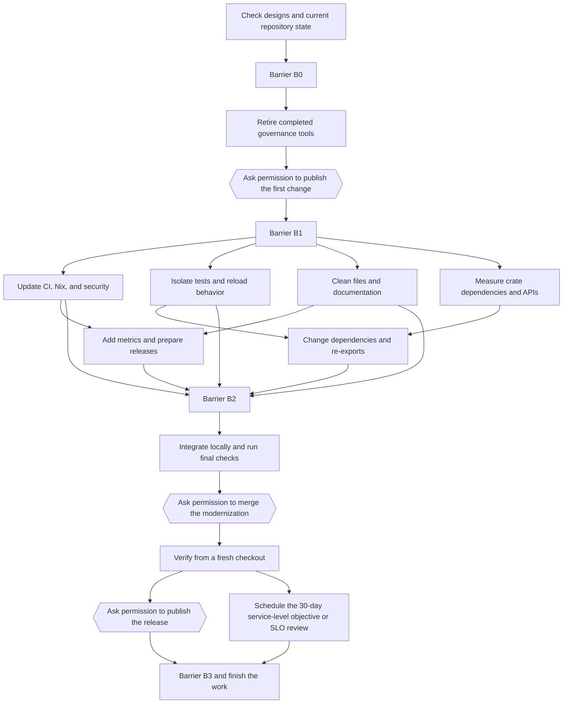

# Modernization plan after ideal-base cleanup

Recorded: 2026-08-07

An audit found cleanup work in CI, tests, crate APIs, scripts, security, and
releases. This directory turns that work into 52 tasks with dependencies. A
script checks the task list and prepares it for the swarm scheduler. Three tasks
stop and ask the user for permission before any publish, merge, or release. The
glossary at `../GLOSSARY.md` explains existing technical names that have no
ordinary replacement.

This plan is executable and can resume after an interruption. It does not add a
second scheduler or a separate progress database.

- `TASK_GRAPH.json` is the reviewed DAG. A DAG is a task list with no
  dependency loops. Its dependencies set the order of work.
- `validate_graph.py` checks the DAG and converts it to input for the built-in
  swarm task graph.
- The built-in swarm task graph assigns work, limits concurrency, tracks
  progress, collects reports, retries failed work, and adds missing work.
- Git commit trailers record completed tasks. A trailer is a `Key: value` line
  at the end of a commit message. Phase joins also use
  `Modernization-Barrier:` trailers to record that every task in a phase
  finished.

The plan has 52 nodes and four barriers. A barrier is a point where every task
from the previous phase must finish before the next phase starts. Worker
concurrency starts at 6 and must never exceed 8. The `waves` command also shows
how many tasks can run at the same time, so a high concurrency setting cannot
hide a mostly serial graph.

## Outcome

The work leaves Jcode smaller, faster, and easier to recover:

- Use normal pull requests instead of active tools for a completed cleanup
  program.
- Require one `PR Gate` check and keep small `pr`, `main`, `scheduled`, and
  `release` workflows.
- Stop normal tests from using the real `~/.jcode`, changing the process-wide
  environment, or finding reload targets from the surrounding machine.
- Replace the root, TUI, app-core, and base wildcard re-export chain with clear
  crate APIs.
- Pin actions by SHA, add gitleaks and Dependabot, keep one advisory ignore
  source, and produce a software bill of materials (SBOM) and a provenance
  record that names the exact source revision.
- Keep one official release identity for the independent fork, distributed only
  through Nix.
- Report CI, coverage, performance, and release results without committing
  generated metrics to `main`.
- Remove at least 25 percent of script lines unless the plan explains every
  exception that remains.

## Task order



`TASK_GRAPH.json` defines the exact dependencies. The diagram only shows the
main flow.

## Before starting

The audit used `github/main` at commit `3eec62045`. Start with `M00`, which
checks every assumption again. Stop and update the graph if the official `main`
branch, live GitHub rules, workflow layout, completed ideal-base work, or
baseline measurements have changed enough to invalidate the plan.

```bash
python3 docs/modernization/validate_graph.py validate
python3 docs/modernization/validate_graph.py waves
python3 docs/modernization/validate_graph.py seed > /tmp/modernization-swarm-seed.json
```

The generated JSON contains exact argument objects for `swarm task_graph` and
`swarm run_plan`. Each task includes its acceptance checks, stop condition,
owned paths, mutexes, worker hints, and permission warnings. Workers do not need
extra instructions from the coordinator.

Use `seed` for a complete run with little coordinator input. Dependencies keep
the work moving until an `H*` task stops for user permission, then the
coordinator resumes it. Use `next` to resume with more control. It emits only
tasks that can run now. If normal work and a permission task are both ready,
`next` emits the normal work first and leaves the permission task for the next
wave. Do not replace either command with a shell dispatcher.

## Swarm steps

1. For a new run, generate `seed`. Pass its `task_graph` object to
   `swarm task_graph`.
2. Pass its `run_plan` object to `swarm run_plan`. Raise concurrency only when
   measurements show that work does not overlap. Never raise it above 8.
3. Finish every node with the typed artifact named in `artifact_schema`. A typed
   artifact is the structured worker report with these required fields:
   - findings;
   - evidence;
   - edge cases considered;
   - validation;
   - open questions;
   - confidence;
   - what was not checked.
4. Address every low-confidence result with `swarm inject_gap` before a deep
   verification task can finish.
5. Use `swarm expand_node` on composite node `A25` to create three to five
   separate hotspot tasks. Do not give its broad write scope to one worker.
6. After failed verification, add one focused `fix` node that depends on the
   failed implementation. Then run the same verification again. After two
   failures of the same kind, change the assumption or method instead of trying
   the same thing again.
7. At each barrier, use `swarm await_members`, combine the worker reports, stop
   workers that are no longer needed, and make one limited barrier commit.
8. A complete run stops when an `H*` worker reports that it needs permission.
   Ask the user in the original session, then resume that node. With `next`, a
   nonempty `authorization_nodes` array means stop before `run_plan`. The warning
   inside each worker task provides a second check.

`.jcode/swarm-prompt.md` sets all model routing. Run `swarm list_models` before
choosing a model other than the default. Values in `worker_profile` guide prompts
and reports, but they do not choose models. One `run_plan` call applies one model
and effort level to every worker it creates. Use a capable general model for the
complete `seed`, or run waves with the same worker profile when specialized
routing is worth the extra coordination.

Every generated node states how it runs. An `ATOMIC` node is one limited task:
finish it after its acceptance checks pass, or stop when its stop condition
occurs. Do not split it just to use more agents. A `COMPOSITE` node may expand
into the smallest set of separate child tasks. `M00` starts with three or four
read-only checks. `A25` creates three to five separate hotspot tasks.

Concurrency is a limit, not a target. Some checks and architecture changes must
run in order. Use `waves` to tell the difference between an idle scheduler and a
small number of ready tasks. Change dependencies only when file ownership,
acceptance checks, and the flow of results remain accurate.

## Commit and resume steps

Every completed implementation or barrier commit should include trailers like
these:

```text
Modernization-Node: P20
Modernization-Node: P21
Modernization-Barrier: B1
```

If a completed node or barrier is intentionally reverted, record the newest
state with these trailers:

```text
Modernization-Node-Reverted: P20
Modernization-Barrier-Reverted: B1
```

The script reads commits from newest to oldest. The newest completion or
reversion trailer wins. A later implementation trailer can mark the node
complete again. The validator rejects a commit that marks the same node or
barrier both complete and reverted.

Only an integration or barrier node may put several node trailers in one commit.
A normal leaf commit changes only that node's owned paths.

Read the saved completion trailers and generate the next task list with:

```bash
python3 docs/modernization/validate_graph.py status
python3 docs/modernization/validate_graph.py next
```

Use `--completed NODE_ID` only to recover work that has not been committed but
has been verified on its own. After a commit, its Git trailer is the saved
record.

Read-only design and verification leaves may stay uncommitted during a phase.
Pass each ID with a separate `--completed` argument when generating the next
wave. Include those IDs in the phase's implementation and barrier trailers when
you make the limited barrier commit.

The helper only reads state. It does not assign workers, complete nodes, change
Git, query GitHub, or schedule work.

## File ownership and concurrency

`owned_paths` lists the files a node may change. `mutexes` prevent two nodes from
using the same shared resource when path patterns are broad or file ownership is
not enough. The validator rejects nodes that share a mutex unless a dependency
orders them.

Follow these rules:

- Only one active implementation node may own a path.
- Never reset or overwrite another worktree or the user's changes.
- In a shared worktree, stage only the leaf's declared paths and commit with its
  node trailer. Do not run `git add -A`, `git add .`, or `git commit -a`.
- If an index lock, hook, or uncertain path pattern makes a shared worktree
  unsafe, report that the node is blocked. Run it in order or start it in an
  isolated worktree. Do not force past the conflict.
- Run read-only nodes beside writers only when they do not inspect unfinished
  changes.
- Run broad Cargo and Nix checks at join nodes. At leaves, run the smallest check
  that can prove the change wrong.
- `A25` is the only composite node that may expand while changing files.
- `I30` is the only node that owns the full repository. It runs after all
  implementation verification joins. Its `"**"` ownership is the only planned
  exception to narrow file ownership. No other writer may run beside it.

The validator checks dependency closure, mutex order, exact path conflicts, and
simple fixed-prefix `path/**` conflicts. A glob is a path pattern that can match
more than one file. The validator cannot compare every possible glob. The
coordinator must review broad or uncertain globs before starting work.

## Tasks that need user permission

These nodes always stop and ask the user before changing an external system:

| Node | External change |
|---|---|
| `H10` | Push and merge the governance cleanup, then change the live GitHub rules |
| `H30` | Push the reviewed branch, open the modernization PR, switch the live rules to a passing `PR Gate`, and merge; restore the old rules if the merge fails |
| `H31` | Create the first official fork tag and a metadata-only GitHub Release |

This plan does not grant permission. The user must approve each change when the
node runs. If a live change cannot happen as one operation with a way to restore
the previous state, restore that previous state.

The graph uses `v1.0.0` as the first official fork release by default. Before
`H31`, the operator may choose a version name prefixed for the fork. If that
happens, update version checks, the changelog, documentation, and the release
candidate before creating the tag.

## How nodes are checked

Every node has acceptance checks and a stop condition. Stop when the stop
condition occurs.

Main join checks:

- `V10`: review the completed governance cleanup.
- `V20`: check PR and `main` routing, matching local commands, Nix revision
  behavior, and security test cases.
- `V21`: run deterministic tests while ordinary Jcode sessions remain active.
- `V22`: check cleanup work and documentation links.
- `V23`: test metrics and rehearse the release without publishing.
- `V24`: check dependencies, wildcard exports, compile time, and public APIs.
- `F30`: run every local and Nix check, then test a clean install.
- `F31`: independently review the exact integration commit and try to find
  failures.
- `V30`: verify the merged work from a fresh checkout.
- `V31`: verify the tagged install and rollback.

Do not let an automatic retry hide the first failure. Treat a surprising result
as evidence that the setup or an assumption may be wrong.

## Starting measurements and targets

The audit recorded:

- 46 workspace crates and 45 crate manifests;
- 4 production Rust files longer than 1,200 lines;
- 22 wildcard public re-exports;
- 11 workflows and, before PR Gate consolidation, 3 required check names;
- 64 shell scripts and 63 Python scripts under `scripts/`;
- about 24,684 script lines and 42,030 test lines;
- about 24.4 mean runner-hours per day from a limited sample of 22 runs;
- about 18 runner-minutes for documentation changes after merge;
- no official fork release tag, with old `v0` tags outside the history of
  `main`.

Targets:

- Require one PR result named `PR Gate`.
- Keep four main workflows: PR, `main`, scheduled, and release.
- Write nothing to the real `~/.jcode` during normal tests.
- Pass repeated lifecycle tests while ordinary sessions are running.
- Keep the Nix executable derivation, or build identity, unchanged for
  documentation-only revisions, while provenance records the exact revision.
- Use no GitHub Action reference that can change without review.
- Keep one `cargo-audit` ignore source.
- Remove at least 25 percent of script lines unless every exception is
  documented.
- Add no production file longer than 1,200 lines.
- Cause no compile-time slowdown that the results do not explain.
- Publish metadata-only GitHub Releases and use Nix and Cachix as the only binary
  channel.
- Schedule a 30-day SLO review after publication.

## Finish the work

`B3` is complete only when:

- The modernization PR and approved release are published and independently
  checked.
- This file contains the before-and-after measurements and remaining limits.
- The 30-day review exists and makes no external change without new user
  permission.
- All owned workers, branches, and worktrees are removed.
- No old live swarm task graph remains.
