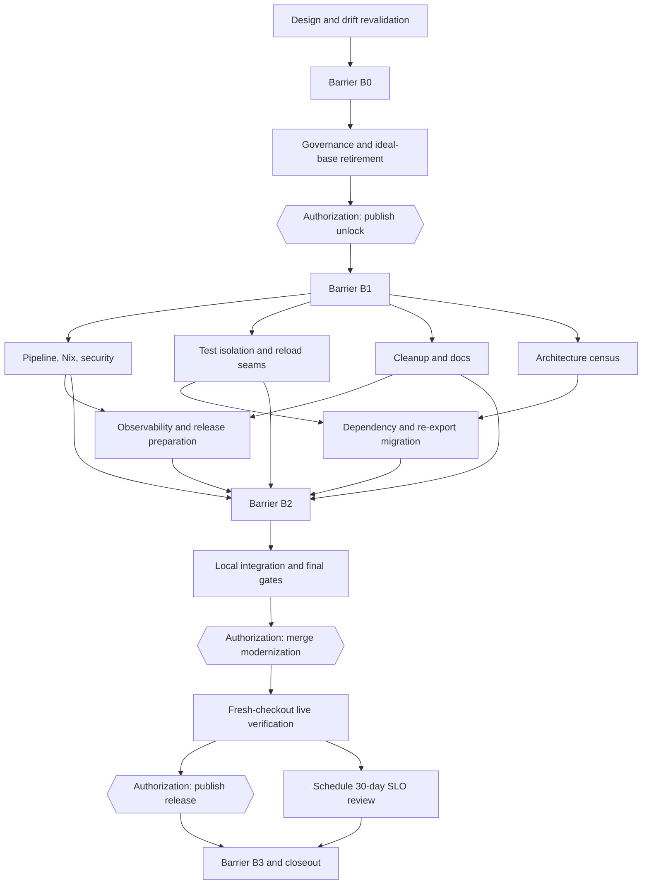

# Post-Ideal-Base Modernization

Recorded: 2026-08-07

In plain terms: an audit found cleanup work (simpler CI, safer tests, clearer
crate boundaries, smaller scripts). This directory holds that work as a list of
52 tasks with dependencies, plus a script that checks the list and feeds it to
the swarm scheduler. Three tasks stop and ask the user for permission before
anything is published, merged, or released. Unfamiliar terms are defined in
`../GLOSSARY.md`.

This directory converts the repository audit into an executable, restartable plan. It does **not** create a second scheduler or mutable program ledger.

- `TASK_GRAPH.json` is the reviewed desired-state DAG.
- `validate_graph.py` validates structure and projects the DAG into native swarm task-graph input.
- The native swarm task graph owns live assignment, concurrency, progress, typed artifacts, retries, and gap injection.
- Git commits carrying `Modernization-Node:` trailers provide restart hints. Phase joins also carry `Modernization-Barrier:` trailers.

The plan contains 52 nodes and four phase barriers. Default worker concurrency is 6 and must never exceed 8. `waves` also reports the static ready-frontier width so a high concurrency setting cannot disguise a serial graph.

## Outcome

The target is a smaller, faster, more recoverable Jcode repository with:

- normal PR governance instead of an active completed-program railway;
- one required PR gate and thin `pr`, `main`, `scheduled`, and `release` workflows;
- no normal-test dependency on real `~/.jcode`, process-global environment mutation, or ambient reload discovery;
- explicit crate surfaces instead of the root/TUI/app-core/base wildcard re-export spine;
- SHA-pinned actions, gitleaks, Dependabot, one advisory ignore source, SBOM, and provenance;
- one authoritative Nix-only fork release identity;
- CI, coverage, performance, and release feedback loops that do not churn main;
- at least 25 percent fewer script lines unless every retained exception is justified.

## Execution map



`TASK_GRAPH.json` is authoritative for exact dependencies. The diagram is intentionally coarse.

## Before execution

The audit that produced this graph was grounded on authoritative `github/main` at `3eec62045`. Execution must begin with `M00`, which rechecks every premise. The result that proves the plan wrong is material drift in authoritative main, live rulesets, workflow topology, completed ideal-base status, or baseline metrics. If found, stop and amend the graph before mutation.

```bash
python3 docs/modernization/validate_graph.py validate
python3 docs/modernization/validate_graph.py waves
python3 docs/modernization/validate_graph.py seed > /tmp/modernization-swarm-seed.json
```

The JSON contains exact `task_graph` and `run_plan` argument objects. Projected node content includes acceptance, falsification, owned paths, mutexes, worker-profile hints, and manual-gate warnings, so a worker does not need hidden coordinator context.

`seed` contains the complete desired graph and is the low-intervention default. Native dependencies run it until an `H*` node reports blocked, then wake the coordinator for the required authorization. `next` is the restart and maximum-control projection: it emits only currently runnable nodes; when authorization and ordinary work are both ready, it emits the ordinary work first and leaves the gate for the next wave. Do not translate either projection into a shell-driven dispatcher.

## Native swarm protocol

1. On a new run, generate `seed` and run `swarm task_graph` with the emitted `task_graph` object.
2. Run `swarm run_plan` with the emitted `run_plan` object. Increase concurrency only for demonstrated disjoint work and never above 8.
3. Workers must complete nodes with the typed artifact declared in `artifact_schema`:
   - findings;
   - evidence;
   - edge cases considered;
   - validation;
   - open questions;
   - confidence;
   - what was not checked.
4. Any low-confidence result must be addressed with `swarm inject_gap` before a deep verification gate can close.
5. Composite node `A25` must use `swarm expand_node` to create three to five disjoint hotspot children. Do not perform its broad write scope as one worker task.
6. Failed verification creates one focused `fix` node depending on the failed implementation, followed by the same verification. Two failures of the same kind require a changed premise or approach, not another retry.
7. At phase barriers, use `swarm await_members`, synthesize the reports, stop unneeded workers, and make a bounded barrier commit.
8. A full run stops when an `H*` worker reports blocked. Obtain fresh user authorization in the originating session, then resume that node. When using `next`, a non-empty `authorization_nodes` array is an earlier stop: do not call `run_plan` until authorization is granted. The embedded worker warning is defense in depth.

Routing follows `.jcode/swarm-prompt.md`, the repository's sole routing authority. Run `swarm list_models` before pinning a non-default model. The graph's `worker_profile` values are prompt and reporting hints, not model selectors: one `run_plan` invocation applies one `model` and `effort` to every worker it creates. Use a capable general route for the complete `seed`, or drive profile-homogeneous waves when route specialization is worth the extra coordination.

Every projected node declares an execution shape. Normal reviewed leaves are `ATOMIC`: finish the bounded node once acceptance is proved or falsification triggers, and do not split it merely to consume the agent budget. Nodes marked `expandable` are `COMPOSITE` and must create the smallest sufficient disjoint child set. `M00` deliberately opens with three to four read-only drift checks; `A25` creates three to five disjoint hotspot children.

Concurrency is a ceiling, not a target. The static graph still contains necessary serial gates and architecture migrations. Use the `waves` summary to distinguish scheduler starvation from a narrow ready frontier, and widen dependencies only when ownership, acceptance, and dataflow remain honest.

## Commit and resume protocol

Every completed implementation or barrier commit should carry trailers like:

```text
Modernization-Node: P20
Modernization-Node: P21
Modernization-Barrier: B1
```

If a completed node or barrier is deliberately reverted, record the newest state with:

```text
Modernization-Node-Reverted: P20
Modernization-Barrier-Reverted: B1
```

The projector processes commits newest-first, so the latest applicable completion or reversion trailer wins. A later reimplementation trailer can complete the node again; conflicting completion and reversion trailers in one commit are rejected.

A commit may contain multiple node trailers only at an explicit integration or barrier node. Normal leaf commits stay bounded to one node's owned paths.

Read durable hints and produce the next native task-graph seed with:

```bash
python3 docs/modernization/validate_graph.py status
python3 docs/modernization/validate_graph.py next
```

Use `--completed NODE_ID` only when recovering uncommitted-but-independently-verified work. The Git trailer is the durable record after committing.

Read-only design and verification leaves may remain live-only inside a phase. Pass their ids with repeated `--completed` arguments while projecting the next wave, then include them with the phase's implementation and barrier trailers in the bounded barrier commit.

The helper is intentionally read-only. It does not assign workers, mark nodes complete, mutate Git, query GitHub, or schedule work.

## Ownership and concurrency

`owned_paths` state the intended mutation boundary. `mutexes` state resource-level exclusion when path globs are broader or semantic ownership matters. The validator rejects same-mutex nodes unless dependencies order them.

Rules:

- Only one active implementation node may own a path.
- Other worktrees and user changes are never reset or overwritten.
- In a shared worktree, a leaf stages only its declared paths and commits with its node trailer. `git add -A`, `git add .`, and `git commit -a` are forbidden.
- If an index lock, hook, or uncertain glob makes shared-worktree execution unsafe, report blocked and serialize the node or respawn it in an isolated worktree. Do not push through the conflict.
- Read-only nodes may run beside writers only when they do not inspect an unstable intermediate state.
- Broad Cargo and Nix checks run at join nodes. Leaves run the smallest check that can falsify their change.
- `A25` is the only intentionally expandable composite mutation node.
- `I30` is the only full-repository integration owner and runs after all implementation verification joins. Its `"**"` ownership is the sole deliberate exception to narrow path ownership, and no other writer may run beside it.

The validator proves dependency closure, mutex ordering, exact-path collisions, and simple fixed-prefix `path/**` collisions. It does not solve arbitrary glob intersection, so broad or uncertain globs require human/coordinator ownership review before launch.

## External-write gates

The following nodes always stop for explicit user authorization:

| Node | External effect |
|---|---|
| `H10` | Push and merge the governance-retirement unlock; mutate the live GitHub ruleset |
| `H30` | Push the reviewed branch, open the modernization PR, atomically cut the live ruleset to a green `PR Gate`, and merge; restore prior rules if merge fails |
| `H31` | Create the first authoritative fork tag and metadata-only GitHub Release |

Do not infer authorization from this plan. The user must approve at execution time. If the live mutation cannot be performed atomically with a rollback path, restore the previous live state.

The graph defaults the first authoritative fork release to `v1.0.0`. The operator may choose a fork-prefixed namespace before `H31`; if so, update version checks, changelog, documentation, and the release candidate consistently before tagging.

## Validation strategy

Each node includes explicit acceptance and falsification criteria. The falsification result is the stop condition.

Core join gates:

- `V10`: retirement and governance desired-state review;
- `V20`: PR/main workflow routing, command parity, Nix revision behavior, and security fixtures;
- `V21`: deterministic tests while ordinary Jcode sessions remain active;
- `V22`: cleanup and documentation integrity;
- `V23`: observability and release dry run;
- `V24`: dependency graph, wildcard-export, compile-time, and API review;
- `F30`: full local/Nix gate and clean install smoke;
- `F31`: independent adversarial review of the exact integration commit;
- `V30`: fresh-checkout verification after merge;
- `V31`: tagged install and rollback verification.

No automatic retry may hide a first failure. A surprising result is a finding about the setup or premise, not noise.

## Baseline and targets

The audit baseline recorded:

- 46 workspace crates and 45 crate manifests;
- 4 production Rust files above 1,200 lines;
- 22 wildcard public re-exports;
- 11 workflows and 3 required contexts;
- 64 shell scripts plus 63 Python scripts under `scripts/`;
- roughly 24,684 script lines and 42,030 test lines;
- mean runner-hours/day around 24.4 from a 22-run bounded sample;
- post-merge docs cost around 18 runner-minutes;
- no authoritative fork-era release tag, with historical v0 tags outside main ancestry.

Targets:

- one required PR context produced by `PR Gate`;
- four primary workflows: PR, main, scheduled, and release;
- zero normal-test writes to real `~/.jcode`;
- deterministic lifecycle rounds with live ordinary sessions running;
- docs-only executable derivation unchanged while exact revision remains in provenance;
- no mutable GitHub Action references;
- one cargo-audit ignore source;
- at least 25 percent script-line reduction unless retained exceptions are documented;
- no new production file above 1,200 lines;
- no unexplained compile-time regression;
- metadata-only GitHub Releases and Nix/Cachix as the sole binary channel;
- 30-day SLO review scheduled after publication.

## Closeout

`B3` is complete only when:

- the modernization PR and approved release are published and independently verified;
- before/after metrics and remaining limitations are written here;
- the 30-day review exists and performs no external write without fresh authorization;
- owned workers, branches, and worktrees are cleaned up;
- no stale live swarm task graph remains.
