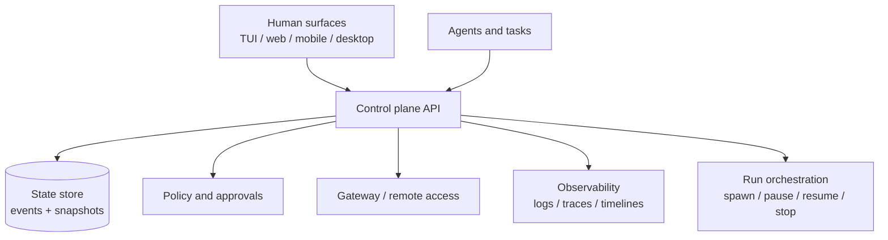

# Control plane layer proposal

This folder is a shared working area for exploring a jcode control plane layer.

## Working hypothesis

Jcode needs a control plane that sits above individual terminal sessions, browser/mobile surfaces, background agents, and server/gateway processes. The control plane should make running work observable, steerable, and recoverable without forcing every interaction through one foreground TUI.

## Scope

The proposal should cover:

- Session and agent inventory across local, remote, mobile, and web surfaces.
- Task/run state: queued, running, blocked, waiting for approval, failed, done.
- Human control affordances: inspect, pause, resume, retry, reassign, stop, approve, and annotate.
- Machine control APIs that jcode can call from the TUI, server, gateway, and future surfaces.
- Event and audit history for safety, debugging, and handoff.
- Boundary lines between jcode-owned behavior and host configuration owned by 4nix.

## Non-goals for the first pass

- Replacing the TUI.
- Building a full project-management system.
- Requiring a cloud service for local-first workflows.
- Hiding destructive actions behind automation without explicit approval.

## Candidate architecture

The first implementation can be local-first: a small server or library inside jcode owns event ingestion, normalized run state, and control commands. Remote or mobile access can layer on later through the gateway work.

## Open questions

- What is the smallest useful control-plane state model?
- Which controls must be synchronous versus event-driven?
- How should permissions differ for local TUI, mobile, web, and background agents?
- What should be durable across reloads, machine sleep, and network disconnects?
- What belongs in jcode versus 4nix host policy?

## Observation logs

- [Human UI/UX observations](human-ui-ux-observations.md) for John's notes.
- [Jcode integration observations](jcode-integration-observations.md) for implementation and architecture notes.

## Next step

Collect concrete observations before over-designing. Each note should ideally include the context, observed friction or opportunity, and the control-plane implication.
