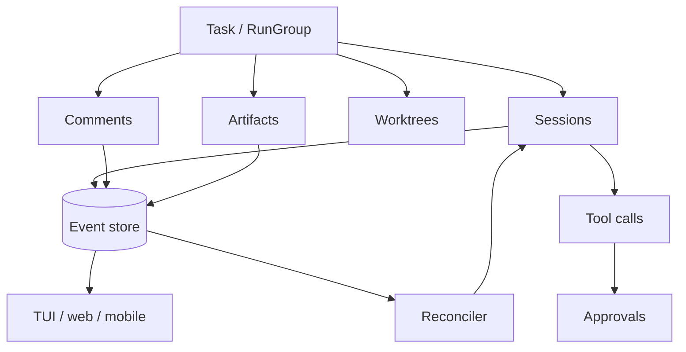

# HumanLayer research notes for control-plane design

## Purpose

This note captures a few public HumanLayer/CodeLayer/Agent Control Plane patterns that are relevant to jcode's control-plane exploration. It is not a full product teardown. The goal is to map transferable ideas into jcode vocabulary.

## Sources

- HumanLayer product site: <https://www.humanlayer.dev/>
- HumanLayer public repo notice and legacy SDK docs: <https://github.com/humanlayer/humanlayer>
- Legacy SDK overview: <https://github.com/humanlayer/humanlayer/blob/main/humanlayer.md>
- HumanLayer Agent Control Plane: <https://github.com/humanlayer/agentcontrolplane>
- DeepWiki CodeLayer architecture pages:
  - <https://deepwiki.com/humanlayer/humanlayer/1.2-system-architecture>
  - <https://deepwiki.com/humanlayer/humanlayer/2.1-hld-daemon>
  - <https://deepwiki.com/humanlayer/humanlayer/4.2-approval-workflow-and-mcp-integration>
  - <https://deepwiki.com/humanlayer/humanlayer/4.3-data-storage-and-persistence>
  - <https://deepwiki.com/humanlayer/humanlayer/4.4-event-bus-and-real-time-updates>
  - <https://deepwiki.com/humanlayer/humanlayer/3.8-session-forking-and-continuation>
- DeepWiki Agent Control Plane overview: <https://deepwiki.com/humanlayer/agentcontrolplane>

Caveat: the public `humanlayer/humanlayer` README says that repository is largely deprecated and points to the rebuilt product. The DeepWiki pages still document useful CodeLayer-era architecture patterns.

## Key findings

### 1. Daemon-centered local orchestration

HumanLayer's CodeLayer architecture centers on `hld`, a local daemon that supervises Claude Code sessions. The daemon is responsible for launching sessions, monitoring process state, streaming events, handling approvals, and persisting state.

Transferable jcode idea: a control plane should not be just a UI. It likely needs a durable local daemon or daemon-like library that owns run state and exposes it consistently to TUI, web, mobile, and background workers.

### 2. CodeLayer database as durable run memory

The CodeLayer daemon uses SQLite for sessions, conversation events, approvals, MCP server config, file snapshots, user settings, raw events, and schema migrations.

Transferable jcode idea: jcode should treat session/task state as durable data, not transient terminal state. A small local database or event log could normalize `bg`, `swarm`, `schedule`, session search, approvals, and future mobile/server surfaces.

Candidate jcode tables/entities:

- `tasks`
- `runs`
- `actors`
- `events`
- `tool_calls`
- `approvals`
- `artifacts`
- `comments`
- `file_snapshots`

### 3. Event bus and real-time subscriptions

CodeLayer uses an internal event bus and Server-Sent Events for live updates to clients. Public docs call out status changes, conversation updates, approval creation/resolution, and settings changes.

Transferable jcode idea: the control plane should expose a live event stream. The TUI, mobile UI, browser UI, and CLI commands should all observe the same state transitions instead of each inventing its own polling and display model.

### 4. Deterministic workflow phases

HumanLayer markets a structured workflow with phases: Questions, Research, Design, Structure, Plan, Implement. The point is to force the agent to surface uncertainty, gather context, produce reviewable design artifacts, and plan before implementation.

Transferable jcode idea: jcode could support optional task workflows with explicit phase state and artifacts. This can remain lightweight, but the important part is that the agent should have named checkpoints where humans can inspect and redirect before code changes grow large.

### 5. Units of analysis: task, session, artifact, worktree

HumanLayer groups sessions, artifacts, and worktrees under a task. That gives long-running work a stable container beyond any one chat thread.

Transferable jcode idea: jcode should make `Task` or `RunGroup` a first-class control-plane unit. A single task might own multiple sessions, subagents, background commands, artifacts, test outputs, and branches/worktrees.

### 6. Intermediate artifacts as rails

HumanLayer emphasizes artifacts such as research docs, design docs, structure outlines, plans, summaries, and mockups. These artifacts are the interface for collaboration and agent steering, not just side effects.

Transferable jcode idea: side panels, proposal docs, plans, and generated summaries should become structured artifacts attached to a task/run. Agents can update them, humans can comment on them, and later agents can consume them as trusted context.

### 7. Commenting interface as a control surface

HumanLayer's site highlights inline comments on design documents. It says comments and decisions feed back into agents. This is a critical distinction: the document is not disconnected from execution. It is an active steering surface.

Transferable jcode idea: a control plane could treat comments/annotations on artifacts as events. A human comment could become a pending instruction, a resolved decision, or a blocker that the agent must address before moving phases.

### 8. Humans as tools and deterministic approvals

The legacy HumanLayer SDK docs describe `require_approval` and `human_as_tool`. The CodeLayer docs describe MCP approval integration where Claude can call a `request_permission` tool and approval decisions are persisted as pending/approved/denied records.

Transferable jcode idea: jcode should represent human input as a first-class tool/result path, especially for risky operations. Approval should be enforced structurally in tool execution rather than only through prompt instructions.

Useful categories:

- human approval for destructive or externally visible actions
- human answer as a tool result
- human review comments as artifact events
- human assignment/reassignment of work

### 9. Agent Control Plane as Kubernetes-like architecture

HumanLayer's Agent Control Plane is an alpha Kubernetes-native orchestrator. It models LLMs, Agents, Tasks, ToolCalls, MCPServers, and ContactChannels as Custom Resource Definitions. Controllers reconcile desired state, checkpoint context at tool-call boundaries, and allow workflows to survive interruptions.

Transferable jcode idea: jcode does not need Kubernetes locally, but the CRD/controller pattern is useful:

- define durable resource types
- keep desired state separate from observed state
- reconcile until actual state matches desired state
- persist tool-call boundaries as checkpoints
- make status and events observable

This maps well to background agents, long-running tasks, and mobile/web control surfaces.

## Mapping to jcode control-plane concepts

| HumanLayer concept | jcode equivalent to explore |
|---|---|
| HLD daemon | local jcode control-plane daemon or embedded server |
| SQLite session DB | local event store / run database |
| Task | task/run group spanning sessions and artifacts |
| Session | jcode TUI/server/swarm/background session |
| Artifact | side-panel page, proposal doc, plan, summary, test output |
| Inline comment | annotation event or human steering input |
| Approval record | structured tool approval with pending/approved/denied state |
| Human as tool | human response request/result in tool pipeline |
| MCP tool approval | jcode tool policy plus approval gate |
| ACP CRDs | local resource model for Task, Run, Actor, ToolCall, Approval |
| Controller reconcile loop | background manager that advances queued/running/waiting work |

## Design implication for jcode

The most important lesson is not to copy HumanLayer's product surface. The useful pattern is to make agent work explicit and durable:

If jcode adopts only a small slice first, the highest-value starting point is a read-only task/run inventory backed by durable events. After that, add structured approvals and artifact comments as active control-plane inputs.
